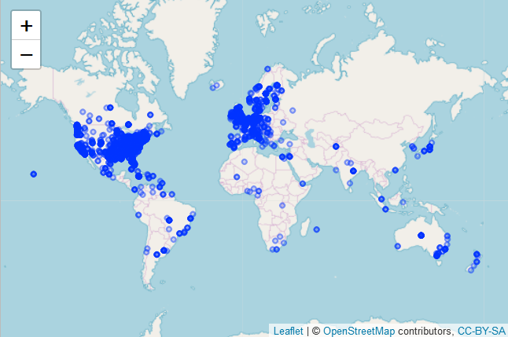

## Activity 4. Work with the `singer` data

The `singer_location` data frame in the `singer` package contains geographical information stored in two different formats: 1. as a (dirty!) variable named `city`; 2. as a latitude / longitude pair (stored in `latitude`, `longitude` respectively). The function `revgeocode` from the `ggmap` library allows you to retrieve some information for a pair (vector) of longitude, latitude (warning: notice the order in which you need to pass lat and long). Read its manual page.

All packages for solving this homework:

```{r call packages, warning = FALSE}
suppressPackageStartupMessages(library(singer))
suppressPackageStartupMessages(library(ggmap))
suppressPackageStartupMessages(library(readr))
suppressPackageStartupMessages(library(dplyr))
suppressPackageStartupMessages(library(tidyr))
suppressPackageStartupMessages(library(stringr))
suppressPackageStartupMessages(library(ggplot2))
suppressPackageStartupMessages(library(purrr))
suppressPackageStartupMessages(library(leaflet))
suppressPackageStartupMessages(library(kableExtra))
knitr::opts_chunk$set(echo = TRUE)
```

First, we are going to familiarize with the structure and data contained in `singer_locations`data frame:

```{r exploring singer_locations}
dim(singer_locations)
summary(singer_locations)

str(singer_locations$latitude)
str(singer_locations$longitude)

#This line has the purpose to check if observations of NA in longitude and 
#latitude matches
sum(is.na(singer_locations$latitude)&is.na(singer_locations$longitude))
```

We can observe this data frame is comprised by 10,100 observations *(rows)* and 14 variables *(columns)*, among which are **city**, **latitude** and **longitude**. Furthermore, we could appreciate that these last two variables are of type numeric and have 5968 *NA* in the same 5968 observations. 

1. Use `purrr` to map latitude and longitude into human readable information on the band's origin places. Notice that `revgeocode(... , output = "more")` outputs a data frame, while `revgeocode(... , output = "address")` returns a string: you have the option of dealing with nested data frames.  
You will need to pay attention to two things:  
    *  Not all of the track have a latitude and longitude: what can we do with the missing information? (_filtering_, ...)
    *  Not all of the time we make a research through `revgeocode()` we get a result. What can we do to avoid those errors to bite us? (look at _possibly()_ in `purrr`...)

First, in order to keep only observations that has information about both latitude and longitude, we can filter the data frame:

```{r singer_flitering}
singer_locations_flitered <- singer_locations %>% 
                              filter(!is.na(longitude) & !is.na(latitude))
```

Now, we can obtain the *human readable* corresponding addresses. 
**Note:** In order to have access to the API provided by google was necessary to generate a key in this [link](http://code.google.com/apis/maps/documentation/geocoding/) and then to register the generated key by command `register_google()`.

Furthermore, as there are many records (4,132), I ran this chunk and saved the information in a external csv file in order to avoid re-run again when render the md file and instead of that just import the file **readable_address.csv**. This was possible since I set the *output parameter* of `revgeocode()` to `address`, so I just produced one address by row.

```{r revgeocode}
#This code was commented in order to show it without run it.

#readable_adress <- map2(singer_locations_flitered$longitude,
#                           singer_locations_flitered$latitude,c) %>% 
#                     map(
#                      possibly(revgeocode,"address",
#                                "Not found")
#                      ) %>%  
#                    unlist()

#write.csv(data.frame(singer_locations_flitered,readable_adress),"readable_address.csv")
```

2. Try to check wether the place in `city` corresponds to the information you retrieved.

To chek is the place in **city** corresponds with the information provided by API, I built the following function called `coincidence_city`

```{r function coincidence_city}
#In order to use this functions the inputs are:

#x is the list of addresses provided by google API
#y is the list of provided cities by singer_locations data frame

coincidence_city <- function(x,y){
  my_pattern <- str_c(str_replace_all(unlist(str_split(y, "[\\-|?,;+]+"))," ",""),
                      collapse = "|")
  length(str_subset(x, pattern = my_pattern))
  }
```

Then, we can run that function using the command `map2`

```{r city_matches}
#Now, we can just import the generated csv file:
singer_locations_csv <- read.csv("readable_address.csv", header = TRUE, sep =",")
attach(singer_locations_csv)
result <- map2_dbl(readable_adress,city, coincidence_city)
paste("Percentage of coincidence:",round((sum(result)/length(result))*100,2),"%")
```

As we can see, using our function to compare addresses and cities, the 72.8% of the records has cities that corresponds to the addresses provided by google API. However, it is important to note this function could be improved by adding codification for city given by the API. For example, in record 4 cities don't match because **Pennsylvania** is codified as **PA**, so the name doesn't match.

```{r Pennsylvania}
#Adress provided by API
readable_adress[4]

#City on data frame
city[4]
```

3. If you still have time, you can go visual: give a look to the library [`leaflet`](https://rstudio.github.io/leaflet) and plot some information about the bands. A snippet of code is provided below.  

```
singer_locations %>%  
  leaflet()  %>%   
  addTiles() %>%  
  addCircles(popup = ~artist_name)
```
As md files can't render interactive plots, it is necessary to run the following code in an R session in oorder to produce the plot which is illustrated in the following image:

```{r leaflet plot}
#singer_locations_csv %>%  
#  leaflet()  %>%   
#  addTiles() %>%  
#  addCircles(popup = ~artist_name)
```




## Activity 3. Work with the candy data

In 2015, we explored a dataset based on a [Halloween candy survey](https://github.com/jennybc/candy) (but it included many other odd and interesting questions). Work on something from [this homework from 2015](references/2015_hw.md). It is good practice on basic
data ingest, exploration, character data cleanup, and wrangling.

### Your mission
Bring the Candy Survey data – or part of it – to a ready-to-analyze state and complete some exploratory / analytical task.

Some example tasks:

Easy: Examining how joy/despair scores change with age

Medium: Comparing the joy/despair values of different types of candy (Chocolate vs. “true candy” like Nerds/Starburst)

Medium: Looking for predictors of candy preference (i.e. in the non-candy fields, or perhaps looking at correlations between candy preferences).

Hard: Looking for ‘structure’ in the data. For example, are there classes of individuals with similar candy preference profiles?

#### Sections of the Assignment
Examining the raw data and choosing a task
Familiarize yourself with the raw data if you haven’t already. Based on the information available, formulate a task you want to complete and explain what it is. Make it fairly specific, like the tasks above.

```{r displaying candy survey data}
#Read the data
data <- read_csv("CANDY-HIERARCHY-2015 SURVEY-Responses.csv",
                col_types = cols(
                  Timestamp = col_datetime("%m/%d/%Y %H:%M:%S")
                ))

data[1:6,1:6] %>% kable() 
```

Now, we are going to perform a brief exploration of this data.

```{r exploring candy survey data}
#Exploring data frame
dim(data)
head(names(data),n=10)
summary(data[2:6])
str(data[2:6])
```

We can observe this data frame has 5,658 observations *(rows)* and 124 variables *(columns)*. The type of data is character, even the age is has character format.

#### Wrangling
Based on the task you chose, get the data in a workable format. This will likely involve all kinds of fun dropping columns, using regex to clean text and headers, some tidyr for gathering, etc. Divide each step by a unique heading in your document. By the end, you will likely want things in tidy data format so you can easily use dplyr/ggplot for your analysis/exploration.

We are going to start by cleaning the data about age:

```{r clean age, warning = FALSE}
clean_age_tmp <- data %>%
                  mutate(id = sprintf("ID%04d", row_number())) %>%
                  select(id,
                         age = starts_with("How"),
                         everything())

clean_age_data <- clean_age_tmp %>%
                      mutate(age_nchar = str_length(age) , 
                             age_num = as.numeric(ifelse(age_nchar > 2, NA, age))) %>% 
                      filter(is.na(age_num)==FALSE) %>% 
                      select(id,
                             age_num,
                             everything()) 

clean_age_data %>% 
  ggplot(aes(age_num)) +
  geom_line(aes(y = ..density..),colour = "#061A40", stat = 'density') +  
  geom_histogram(aes(y = ..density..), alpha = 0.55, fill="#061A40") +
  ggtitle("Age distribution of surveyed people") +
  xlab("Age") 
```

It is possible to know the distribution of the age of people that answered the survey. The most of people has between 25 and 30 years roughly, while there are some observations for people with ages greater than 75. 


Now, let's see and example of the analysis of association between age the opinion about a candy for an specific candy **Buttefinger**.

```{r substracting candy}
candy_tmp <- clean_age_data[,c(2,which(str_detect(names(clean_age_data),"^\\[")==TRUE))]

#Butterfinger
butter_finger <- candy_tmp[,c(1,2)]

data.frame(table(butter_finger)) %>% 
  rename(Opinion = X.Butterfinger.) %>% 
  ggplot(aes(Freq,age_num,colour=Opinion)) +
  geom_point(alpha=0.75) +
  ggtitle("Opinion of Butterfinger by age") +
  ylab("Age") +
  xlab("Opinion") +
  scale_y_discrete(breaks = seq(5,80,5))
```

The last graph shows that most of people between 25 and 50 years enjoy this candy instead of despair it.


#### Exploring/Analyzing
Now that your data us ready to analyze, complete the task you set out to complete! This will also be multipart, so again divide things up logically. Perhaps you will start with some basic exploration + tables to get a sense of the data, and then move onto dplyr and plotting.

We can group the candies by the some flavores that are indicated in its name by using regular expressions:

```{r function count_by_flavor}
#Substracting the characters '[' and ']' of the name of candies
new_names <- str_replace(
  str_replace(names(candy_tmp),pattern = "\\[",replacement = ""),
  pattern = "\\]", replacement = "")

#Changing the names of variables
candy_tmp <- candy_tmp %>% 
  `names<-`((new_names))

#Creating a function to count the preference by flavour
count_by_flavor <- function(vector){
  
  #Consider the candies that include mint, peanut or chocolate in its name
  mint <- str_subset(names(vector), pattern = "[M|m]int")
  peanut <- str_subset(names(vector), pattern = "[P|p]eanut")
  chocolate <- str_subset(names(vector), pattern = "[C|c]hoco.")

  #Count the number of joy and despair by each flavour
  table_mint <- table(unlist(vector[which(names(vector)%in%mint)]))
  mint_joy <- ifelse(is.na(table_mint['JOY']),0,table_mint['JOY'])
  mint_despair <- ifelse(is.na(table_mint['DESPAIR']),0,table_mint['DESPAIR'])
  
  table_peanut <- table(unlist(vector[which(names(vector)%in%peanut)]))
  peanut_joy <- ifelse(is.na(table_peanut['JOY']),0,table_peanut['JOY'])
  peanut_dispair <- ifelse(is.na(table_peanut['DESPAIR']),0,table_peanut['DESPAIR'])

  table_chocolate <- table(unlist(vector[which(names(vector)%in%chocolate)]))
  chocolate_joy <- ifelse(is.na(table_chocolate['JOY']),0,table_chocolate['JOY'])
  chocolate_dispair <- ifelse(is.na(table_chocolate['DESPAIR']),0,table_chocolate['DESPAIR'])
  
  #Result will be a list
  list(mint = unname(mint_joy - mint_despair),
       peanut = unname(peanut_joy - peanut_dispair),
       chocolate = unname(chocolate_joy - chocolate_dispair),
       age = as.numeric(vector[1]))
}
```

Now, we can use the functions `apply` function to sample the opinion by age about the flavours that we defined prevously applying the function `count_by_flavor`

```{r apply function, warning = FALSE}
#declaring a list
flavor_sample <- list()

#Taking a sample by age and calculating the preference by flavour
n <- 350
set.seed(548)
flavor_sample <- apply(candy_tmp[sample(1:dim(candy_tmp),n,replace = FALSE),],1,count_by_flavor)

#Show the result
flavor_sample[1:2]
```

As we obtained a `list`as a result, we can take advantage of the library `purrr` to show these results on the following graphs:

```{r using purrr}
#Counting the opinion about the three flavors

count_mint <- cbind(unlist(map(flavor_sample,function(x)x['age'])),
                    unlist(map(flavor_sample,function(x)x['mint'])))

count_peanut <- cbind(unlist(map(flavor_sample,function(x)x['age'])),
                    unlist(map(flavor_sample,function(x)x['peanut'])))

count_chocolate <- cbind(unlist(map(flavor_sample,function(x)x['age'])),
                    unlist(map(flavor_sample,function(x)x['chocolate'])))

```

```{r mint_opinion}
result_mint <- tibble(age = names(tapply(count_mint[,2],count_mint[,1],mean)),
                      opinion = tapply(count_mint[,2],count_mint[,1],mean))

result_mint %>% 
  mutate(age = sort(age)) %>% 
  ggplot(aes(opinion,age)) +
  geom_point() +
  geom_vline(xintercept = 0) +
  ggtitle("Opinion of flavor mint by age in the sample") +
  xlab("Opinion (joy-despair)") +
  ylab("Age")
```

> There is not a clear pattern between the age and the opinion about mint flavor, however it is possible to observe the most of people tends to feel despair instead of joy since the most of the counts of opinion are negative values.

```{r peanut_opinion}
result_peanut <- tibble(age = names(tapply(count_peanut[,2],count_peanut[,1],mean)),
                      opinion = tapply(count_peanut[,2],count_peanut[,1],mean))

result_peanut %>% 
  mutate(age = sort(age)) %>% 
  ggplot(aes(opinion,age)) +
  geom_point() +
  geom_vline(xintercept = 0) +
  ggtitle("Opinion of flavor peanut by age in the sample") +
  xlab("Opinion (joy-despair)") +
  ylab("Age")
```

> Although most of people feel joy about this flavor, the uounger people feels despair about it.

```{r chocolate_opinion}
result_chocolate <- tibble(age = names(tapply(count_chocolate[,2],count_chocolate[,1],mean)),
                      opinion = tapply(count_chocolate[,2],count_chocolate[,1],mean))

result_chocolate %>% 
  mutate(age = sort(age)) %>% 
  ggplot(aes(opinion,age)) +
  geom_point() +
  geom_vline(xintercept = 0) +
  ggtitle("Opinion of flavor chocolate by age in the sample") +
  xlab("Opinion (joy-despair)") +
  ylab("Age")
```

> Most of people feels joy about chocolate flavor regardless the age.
