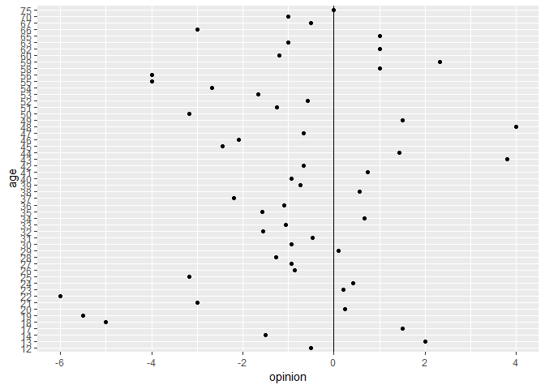
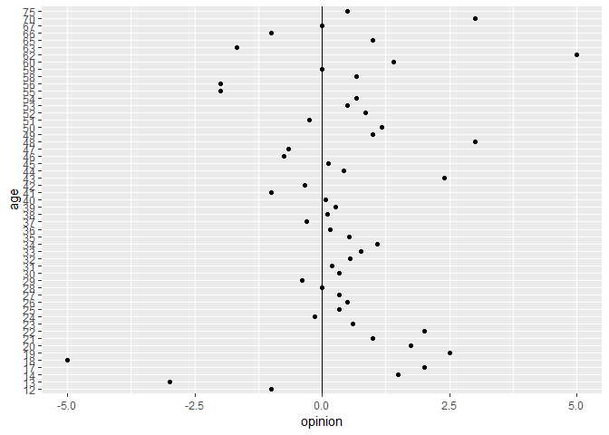

Homework 06: Data wrangling wrap up
================
Cecilia Leon

-   [4. Work with the `singer` data](#work-with-the-singer-data)
-   [3. Work with the candy data](#work-with-the-candy-data)
    -   [Your mission](#your-mission)

4. Work with the `singer` data
------------------------------

The `singer_location` dataframe in the `singer` package contains geographical information stored in two different formats: 1. as a (dirty!) variable named `city`; 2. as a latitude / longitude pair (stored in `latitude`, `longitude` respectively). The function `revgeocode` from the `ggmap` library allows you to retrieve some information for a pair (vector) of longitude, latitude (warning: notice the order in which you need to pass lat and long). Read its manual page.

``` r
suppressPackageStartupMessages(library(singer))
suppressPackageStartupMessages(library(ggmap))
suppressPackageStartupMessages(library(readr))
suppressPackageStartupMessages(library(dplyr))
suppressPackageStartupMessages(library(tidyr))
suppressPackageStartupMessages(library(stringr))
suppressPackageStartupMessages(library(ggplot2))
knitr::opts_chunk$set(echo = TRUE)
```

First, we are going to familiarize with the structure and data contained in `singer_locations`dataframe:

``` r
dim(singer_locations)
```

    ## [1] 10100    14

``` r
summary(singer_locations)
```

    ##    track_id            title             song_id         
    ##  Length:10100       Length:10100       Length:10100      
    ##  Class :character   Class :character   Class :character  
    ##  Mode  :character   Mode  :character   Mode  :character  
    ##                                                          
    ##                                                          
    ##                                                          
    ##                                                          
    ##    release           artist_id         artist_name             year     
    ##  Length:10100       Length:10100       Length:10100       Min.   :   0  
    ##  Class :character   Class :character   Class :character   1st Qu.:1994  
    ##  Mode  :character   Mode  :character   Mode  :character   Median :2002  
    ##                                                           Mean   :1979  
    ##                                                           3rd Qu.:2006  
    ##                                                           Max.   :2010  
    ##                                                                         
    ##     duration         artist_hotttnesss artist_familiarity    latitude     
    ##  Min.   :   0.6004   Min.   :0.0000    Min.   :0.0000     Min.   :-45.87  
    ##  1st Qu.: 184.0518   1st Qu.:0.3644    1st Qu.:0.5164     1st Qu.: 35.15  
    ##  Median : 231.3791   Median :0.4098    Median :0.5960     Median : 40.72  
    ##  Mean   : 248.3994   Mean   :0.4149    Mean   :0.5976     Mean   : 40.05  
    ##  3rd Qu.: 288.4567   3rd Qu.:0.4673    3rd Qu.:0.6781     3rd Qu.: 50.88  
    ##  Max.   :2149.3285   Max.   :1.0213    Max.   :1.0000     Max.   : 69.65  
    ##                                                           NA's   :5968    
    ##    longitude            name               city          
    ##  Min.   :-155.434   Length:10100       Length:10100      
    ##  1st Qu.: -90.200   Class :character   Class :character  
    ##  Median : -74.727   Mode  :character   Mode  :character  
    ##  Mean   : -53.632                                        
    ##  3rd Qu.:  -1.465                                        
    ##  Max.   : 175.471                                        
    ##  NA's   :5968

``` r
str(singer_locations$latitude)
```

    ##  num [1:10100] NA 41.9 40.7 NA 42.3 ...

``` r
str(singer_locations$longitude)
```

    ##  num [1:10100] NA -87.6 -74 NA -83 ...

``` r
#This line has the purpose to check if observations of NA in longitude and latitude matches.
sum(is.na(singer_locations$latitude)&is.na(singer_locations$longitude))
```

    ## [1] 5968

We can observe this dataframe is comprised by 10,100 observations *(rows)* and 14 variables *(columns)*, among which are **city**, **latitude** and **longitude**. Furthermore we could appreciate that these last two variables have are of type numeric and have 5968 *NA* in the same 5968 obsercations.

1.  Use `purrr` to map latitude and longitude into human readable information on the band's origin places. Notice that `revgeocode(... , output = "more")` outputs a dataframe, while `revgeocode(... , output = "address")` returns a string: you have the option of dealing with nested dataframes.
    You will need to pay attention to two things:
    -   Not all of the track have a latitude and longitude: what can we do with the missing information? (*filtering*, ...)
    -   Not all of the time we make a research through `revgeocode()` we get a result. What can we do to avoid those errors to bite us? (look at *possibly()* in `purrr`...)

2.  Try to check wether the place in `city` corresponds to the information you retrieved.

3.  If you still have time, you can go visual: give a look to the library [`leaflet`](https://rstudio.github.io/leaflet) and plot some information about the bands. A snippet of code is provided below.

<!-- -->

    singer_locations %>%  
      leaflet()  %>%   
      addTiles() %>%  
      addCircles(popup = ~artist_name)

3. Work with the candy data
---------------------------

In 2015, we explored a dataset based on a [Halloween candy survey](https://github.com/jennybc/candy) (but it included many other odd and interesting questions). Work on something from [this homework from 2015](references/2015_hw.md). It is good practice on basic data ingest, exploration, character data cleanup, and wrangling.

### Your mission

Bring the Candy Survey data – or part of it – to a ready-to-analyze state and complete some exploratory / analytical task.

Some example tasks:

Easy: Examining how joy/despair scores change with age

Medium: Comparing the joy/despair values of different types of candy (Chocolate vs. “true candy” like Nerds/Starburst)

Medium: Looking for predictors of candy preference (i.e. in the non-candy fields, or perhaps looking at correlations between candy preferences).

Hard: Looking for ‘structure’ in the data. For example, are there classes of individuals with similar candy preference profiles?

#### Sections of the Assignment

Examining the raw data and choosing a task Familiarize yourself with the raw data if you haven’t already. Based on the information available, formulate a task you want to complete and explain what it is. Make it fairly specific, like the tasks above.

``` r
#Read the data
data <- read_csv("CANDY-HIERARCHY-2015 SURVEY-Responses.csv",
                col_types = cols(
                  Timestamp = col_datetime("%m/%d/%Y %H:%M:%S")
                ))
data
```

    ## # A tibble: 5,658 x 124
    ##    Timestamp           `How old are yo~ `Are you going ~ `[Butterfinger]`
    ##    <dttm>              <chr>            <chr>            <chr>           
    ##  1 2015-10-23 08:46:20 35               No               JOY             
    ##  2 2015-10-23 08:46:52 41               No               JOY             
    ##  3 2015-10-23 08:47:34 33               No               DESPAIR         
    ##  4 2015-10-23 08:47:59 31               No               JOY             
    ##  5 2015-10-23 08:48:12 30               No               <NA>            
    ##  6 2015-10-23 08:49:07 38               No               JOY             
    ##  7 2015-10-23 08:50:09 48               No               JOY             
    ##  8 2015-10-23 08:52:14 39               No               DESPAIR         
    ##  9 2015-10-23 08:52:22 9E+22            Yes              DESPAIR         
    ## 10 2015-10-23 08:53:31 54               No               JOY             
    ## # ... with 5,648 more rows, and 120 more variables: `[100 Grand
    ## #   Bar]` <chr>, `[Anonymous brown globs that come in black and orange
    ## #   wrappers]` <chr>, `[Any full-sized candy bar]` <chr>, `[Black
    ## #   Jacks]` <chr>, `[Bonkers]` <chr>, `[Bottle Caps]` <chr>, `[Box’o’
    ## #   Raisins]` <chr>, `[Brach products (not including candy corn)]` <chr>,
    ## #   `[Bubble Gum]` <chr>, `[Cadbury Creme Eggs]` <chr>, `[Candy
    ## #   Corn]` <chr>, `[Vials of pure high fructose corn syrup, for
    ## #   main-lining into your vein]` <chr>, `[Candy that is clearly just the
    ## #   stuff given out for free at restaurants]` <chr>, `[Cash, or other
    ## #   forms of legal tender]` <chr>, `[Chiclets]` <chr>,
    ## #   `[Caramellos]` <chr>, `[Snickers]` <chr>, `[Dark Chocolate
    ## #   Hershey]` <chr>, `[Dental paraphenalia]` <chr>, `[Dots]` <chr>,
    ## #   `[Fuzzy Peaches]` <chr>, `[Generic Brand Acetaminophen]` <chr>, `[Glow
    ## #   sticks]` <chr>, `[Broken glow stick]` <chr>, `[Goo Goo
    ## #   Clusters]` <chr>, `[Good N' Plenty]` <chr>, `[Gum from baseball
    ## #   cards]` <chr>, `[Gummy Bears straight up]` <chr>, `[Creepy Religious
    ## #   comics/Chick Tracts]` <chr>, `[Healthy Fruit]` <chr>, `[Heath
    ## #   Bar]` <chr>, `[Hershey’s Kissables]` <chr>, `[Hershey’s Milk
    ## #   Chocolate]` <chr>, `[Hugs (actual physical hugs)]` <chr>, `[Jolly
    ## #   Rancher (bad flavor)]` <chr>, `[Jolly Ranchers (good flavor)]` <chr>,
    ## #   `[Kale smoothie]` <chr>, `[Kinder Happy Hippo]` <chr>, `[Kit
    ## #   Kat]` <chr>, `[Hard Candy]` <chr>, `[Lapel Pins]` <chr>,
    ## #   `[LemonHeads]` <chr>, `[Licorice]` <chr>, `[Licorice (not
    ## #   black)]` <chr>, `[Lindt Truffle]` <chr>, `[Lollipops]` <chr>,
    ## #   `[Mars]` <chr>, `[Mary Janes]` <chr>, `[Maynards]` <chr>, `[Milk
    ## #   Duds]` <chr>, `[LaffyTaffy]` <chr>, `[Minibags of chips]` <chr>,
    ## #   `[JoyJoy (Mit Iodine)]` <chr>, `[Reggie Jackson Bar]` <chr>, `[Pixy
    ## #   Stix]` <chr>, `[Nerds]` <chr>, `[Nestle Crunch]` <chr>,
    ## #   `[Now'n'Laters]` <chr>, `[Pencils]` <chr>, `[Milky Way]` <chr>,
    ## #   `[Reese’s Peanut Butter Cups]` <chr>, `[Tolberone something or
    ## #   other]` <chr>, `[Runts]` <chr>, `[Junior Mints]` <chr>, `[Senior
    ## #   Mints]` <chr>, `[Mint Kisses]` <chr>, `[Mint Juleps]` <chr>, `[Mint
    ## #   Leaves]` <chr>, `[Peanut M&M’s]` <chr>, `[Regular M&Ms]` <chr>, `[Mint
    ## #   M&Ms]` <chr>, `[Ribbon candy]` <chr>, `[Rolos]` <chr>,
    ## #   `[Skittles]` <chr>, `[Smarties (American)]` <chr>, `[Smarties
    ## #   (Commonwealth)]` <chr>, `[Chick-o-Sticks (we don’t know what that
    ## #   is)]` <chr>, `[Spotted Dick]` <chr>, `[Starburst]` <chr>, `[Swedish
    ## #   Fish]` <chr>, `[Sweetums]` <chr>, `[Those odd marshmallow circus
    ## #   peanut things]` <chr>, `[Three Musketeers]` <chr>, `[Peterson Brand
    ## #   Sidewalk Chalk]` <chr>, `[Peanut Butter Bars]` <chr>, `[Peanut Butter
    ## #   Jars]` <chr>, `[Trail Mix]` <chr>, `[Twix]` <chr>, `[Vicodin]` <chr>,
    ## #   `[White Bread]` <chr>, `[Whole Wheat anything]` <chr>, `[York
    ## #   Peppermint Patties]` <chr>, `Please leave any remarks or comments
    ## #   regarding your choices.` <chr>, `Please list any items not included
    ## #   above that give you JOY.` <chr>, `Please list any items not included
    ## #   above that give you DESPAIR.` <chr>, `Guess the number of mints in my
    ## #   hand.` <chr>, `Betty or Veronica?` <chr>, `Check all that apply: "I
    ## #   cried tears of sadness at the end of ____________"` <chr>, `"That
    ## #   dress* that went viral early this year - when I first saw it, it was
    ## #   ________"` <chr>, `Fill in the blank: "Taylor Swift is a force for
    ## #   ___________"` <chr>, ...

``` r
#Exploring dataframe
dim(data)
```

    ## [1] 5658  124

``` r
head(names(data),n=10)
```

    ##  [1] "Timestamp"                                                     
    ##  [2] "How old are you?"                                              
    ##  [3] "Are you going actually going trick or treating yourself?"      
    ##  [4] "[Butterfinger]"                                                
    ##  [5] "[100 Grand Bar]"                                               
    ##  [6] "[Anonymous brown globs that come in black and orange wrappers]"
    ##  [7] "[Any full-sized candy bar]"                                    
    ##  [8] "[Black Jacks]"                                                 
    ##  [9] "[Bonkers]"                                                     
    ## [10] "[Bottle Caps]"

``` r
summary(data[2:6])
```

    ##  How old are you?  
    ##  Length:5658       
    ##  Class :character  
    ##  Mode  :character  
    ##  Are you going actually going trick or treating yourself?
    ##  Length:5658                                             
    ##  Class :character                                        
    ##  Mode  :character                                        
    ##  [Butterfinger]     [100 Grand Bar]   
    ##  Length:5658        Length:5658       
    ##  Class :character   Class :character  
    ##  Mode  :character   Mode  :character  
    ##  [Anonymous brown globs that come in black and orange wrappers]
    ##  Length:5658                                                   
    ##  Class :character                                              
    ##  Mode  :character

``` r
str(data[2:6])
```

    ## Classes 'tbl_df', 'tbl' and 'data.frame':    5658 obs. of  5 variables:
    ##  $ How old are you?                                              : chr  "35" "41" "33" "31" ...
    ##  $ Are you going actually going trick or treating yourself?      : chr  "No" "No" "No" "No" ...
    ##  $ [Butterfinger]                                                : chr  "JOY" "JOY" "DESPAIR" "JOY" ...
    ##  $ [100 Grand Bar]                                               : chr  NA "JOY" "DESPAIR" "JOY" ...
    ##  $ [Anonymous brown globs that come in black and orange wrappers]: chr  "DESPAIR" "DESPAIR" "DESPAIR" "DESPAIR" ...

We can observe this data frame has 5,658 observations *(rows)* and 124 variables *(columns)*. The type of data is character, even the age is has character format.

#### Wrangling

Based on the task you chose, get the data in a workable format. This will likely involve all kinds of fun dropping columns, using regex to clean text and headers, some tidyr for gathering, etc. Divide each step by a unique heading in your document. By the end, you will likely want things in tidy data format so you can easily use dplyr/ggplot for your analysis/exploration.

We are going to start by cleaning the data about age

``` r
clean_age_tmp <- data %>%
                  mutate(id = sprintf("ID%04d", row_number())) %>%
                  select(id,
                         age = starts_with("How"),
                         everything())

clean_age_data <- clean_age_tmp %>%
                      mutate(age_nchar = str_length(age) , 
                             age_num = as.numeric(ifelse(age_nchar > 2, NA, age))) %>% 
                      filter(is.na(age_num)==FALSE) %>% 
                      select(id,
                             age_num,
                             everything()) 
```

    ## Warning in evalq(as.numeric(ifelse(age_nchar > 2, NA, age)),
    ## <environment>): NAs introducidos por coerción

``` r
clean_age_data %>% 
  ggplot(aes(age_num)) +
  geom_line(aes(y = ..density..),colour = "#061A40", stat = 'density') +  
  geom_histogram(aes(y = ..density..), alpha = 0.55, fill="#061A40") +
  ggtitle("Age distribution of surveyed people") +
  xlab("Age") 
```

    ## `stat_bin()` using `bins = 30`. Pick better value with `binwidth`.


It is possible to know the distribution of the age of people that answered the survey. The most of people has between 25 and 30 years roughly, while there are some observations for people with ages greater than 75.

Now, let's see and example of the analysis of association between age the opinio about a candy for an specific candy.

``` r
candy_tmp <- clean_age_data[,c(2,which(str_detect(names(clean_age_data),"^\\[")==TRUE))]

#[Butterfinger]
butter_finger <- candy_tmp[,c(1,2)]

data.frame(table(butter_finger)) %>% 
  rename(Opinion = X.Butterfinger.) %>% 
  ggplot(aes(Freq,age_num,colour=Opinion)) +
  geom_point(alpha=0.75) +
  ggtitle("Opinion of Butterfinger by age") +
  ylab("Age") +
  xlab("Opinion") +
  scale_y_discrete(breaks = seq(5,80,5))
```


The last graph shows that most of people between 25 and 50 years enjoy this candy instead of despair it.

#### Exploring/Analyzing

Now that your data us ready to analyze, complete the task you set out to complete! This will also be multipart, so again divide things up logically. Perhaps you will start with some basic exploration + tables to get a sense of the data, and then move onto dplyr and plotting.

We can group ththe cadies by the some flavores that are indicated in its name by useing regular expressions:

``` r
#Substracting the characters '[' and ']' of the name of candies
new_names <- str_replace(
  str_replace(names(candy_tmp),pattern = "\\[",replacement = ""),
  pattern = "\\]", replacement = "")

#Changing the names of variables
candy_tmp <- candy_tmp %>% 
  `names<-`((new_names))

#Creating a function to count the preference by flavour
count_by_flavor <- function(vector){
  
  #Consider the candies that include mint, peanut or chocolate in its name
  mint <- str_subset(names(vector), pattern = "[M|m]int")
  peanut <- str_subset(names(vector), pattern = "[P|p]eanut")
  chocolate <- str_subset(names(vector), pattern = "[C|c]hoco.")

  #Count the number of joy and despair by each flavour
  table_mint <- table(unlist(vector[which(names(vector)%in%mint)]))
  mint_joy <- ifelse(is.na(table_mint['JOY']),0,table_mint['JOY'])
  mint_despair <- ifelse(is.na(table_mint['DESPAIR']),0,table_mint['DESPAIR'])
  
  table_peanut <- table(unlist(vector[which(names(vector)%in%peanut)]))
  peanut_joy <- ifelse(is.na(table_peanut['JOY']),0,table_peanut['JOY'])
  peanut_dispair <- ifelse(is.na(table_peanut['DESPAIR']),0,table_peanut['DESPAIR'])

  table_chocolate <- table(unlist(vector[which(names(vector)%in%chocolate)]))
  chocolate_joy <- ifelse(is.na(table_chocolate['JOY']),0,table_chocolate['JOY'])
  chocolate_dispair <- ifelse(is.na(table_chocolate['DESPAIR']),0,table_chocolate['DESPAIR'])
  
  #Result will be a list
  list(mint = unname(mint_joy - mint_despair),
       peanut = unname(peanut_joy - peanut_dispair),
       chocolate = unname(chocolate_joy - chocolate_dispair),
       age = as.numeric(vector[1]))
}
```

Now, we can use the functions `apply` function to sample the opinion by age about the flavours that we defined prevously applying the function `count_by_flavor`

``` r
#declaring a list
flavor_sample <- list()

#Taking a sample by age and calculating the preference by flavour
n <- 350
set.seed(548)
flavor_sample <- apply(candy_tmp[sample(1:dim(candy_tmp),n,replace = FALSE),],1,count_by_flavor)

#Show the result
flavor_sample[1:5]
```

    ## [[1]]
    ## [[1]]$mint
    ## [1] 0
    ## 
    ## [[1]]$peanut
    ## [1] 0
    ## 
    ## [[1]]$chocolate
    ## [1] 0
    ## 
    ## [[1]]$age
    ## [1] 51
    ## 
    ## 
    ## [[2]]
    ## [[2]]$mint
    ## [1] -4
    ## 
    ## [[2]]$peanut
    ## [1] -2
    ## 
    ## [[2]]$chocolate
    ## [1] 1
    ## 
    ## [[2]]$age
    ## [1] 35
    ## 
    ## 
    ## [[3]]
    ## [[3]]$mint
    ## [1] 3
    ## 
    ## [[3]]$peanut
    ## [1] -1
    ## 
    ## [[3]]$chocolate
    ## [1] 3
    ## 
    ## [[3]]$age
    ## [1] 37
    ## 
    ## 
    ## [[4]]
    ## [[4]]$mint
    ## [1] -1
    ## 
    ## [[4]]$peanut
    ## [1] -1
    ## 
    ## [[4]]$chocolate
    ## [1] -1
    ## 
    ## [[4]]$age
    ## [1] 46
    ## 
    ## 
    ## [[5]]
    ## [[5]]$mint
    ## [1] -3
    ## 
    ## [[5]]$peanut
    ## [1] -3
    ## 
    ## [[5]]$chocolate
    ## [1] 0
    ## 
    ## [[5]]$age
    ## [1] 40

As we obtained a `list`as a result, we can take advantage of the library `purrr` to show the this result on the following graph:

``` r
#Counting the opinion abput mint flavor
library(purrr)
count_mint <- cbind(unlist(map(flavor_sample,function(x)x['age'])),
                    unlist(map(flavor_sample,function(x)x['mint'])))

count_peanut <- cbind(unlist(map(flavor_sample,function(x)x['age'])),
                    unlist(map(flavor_sample,function(x)x['peanut'])))

count_chocolate <- cbind(unlist(map(flavor_sample,function(x)x['age'])),
                    unlist(map(flavor_sample,function(x)x['chocolate'])))
```

``` r
result_mint <- tibble(age = names(tapply(count_mint[,2],count_mint[,1],mean)),
                      opinion = tapply(count_mint[,2],count_mint[,1],mean))


result_mint %>% 
  mutate(age = sort(age)) %>% 
  ggplot(aes(opinion,age)) +
  geom_point() +
  geom_vline(xintercept = 0)
```



``` r
result_peanut <- tibble(age = names(tapply(count_peanut[,2],count_peanut[,1],mean)),
                      opinion = tapply(count_peanut[,2],count_peanut[,1],mean))

result_peanut %>% 
  mutate(age = sort(age)) %>% 
  ggplot(aes(opinion,age)) +
  geom_point() +
  geom_vline(xintercept = 0)
```


``` r
result_chocolate <- tibble(age = names(tapply(count_chocolate[,2],count_chocolate[,1],mean)),
                      opinion = tapply(count_chocolate[,2],count_chocolate[,1],mean))

result_chocolate %>% 
  mutate(age = sort(age)) %>% 
  ggplot(aes(opinion,age)) +
  geom_point() +
  geom_vline(xintercept = 0)
```


