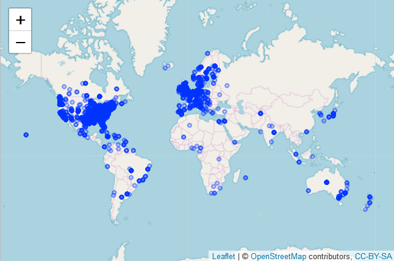

Homework 06: Data wrangling wrap up
================
Cecilia Leon

-   [4. Work with the `singer` data](#work-with-the-singer-data)
-   [3. Work with the candy data](#work-with-the-candy-data)
    -   [Your mission](#your-mission)

4. Work with the `singer` data
------------------------------

The `singer_location` dataframe in the `singer` package contains geographical information stored in two different formats: 1. as a (dirty!) variable named `city`; 2. as a latitude / longitude pair (stored in `latitude`, `longitude` respectively). The function `revgeocode` from the `ggmap` library allows you to retrieve some information for a pair (vector) of longitude, latitude (warning: notice the order in which you need to pass lat and long). Read its manual page.

``` r
suppressPackageStartupMessages(library(singer))
suppressPackageStartupMessages(library(ggmap))
suppressPackageStartupMessages(library(readr))
suppressPackageStartupMessages(library(dplyr))
suppressPackageStartupMessages(library(tidyr))
suppressPackageStartupMessages(library(stringr))
suppressPackageStartupMessages(library(ggplot2))
suppressPackageStartupMessages(library(purrr))
suppressPackageStartupMessages(library(leaflet))
suppressPackageStartupMessages(library(kableExtra))
knitr::opts_chunk$set(echo = TRUE)
```

First, we are going to familiarize with the structure and data contained in `singer_locations`dataframe:

``` r
dim(singer_locations)
```

    ## [1] 10100    14

``` r
summary(singer_locations)
```

    ##    track_id            title             song_id         
    ##  Length:10100       Length:10100       Length:10100      
    ##  Class :character   Class :character   Class :character  
    ##  Mode  :character   Mode  :character   Mode  :character  
    ##                                                          
    ##                                                          
    ##                                                          
    ##                                                          
    ##    release           artist_id         artist_name             year     
    ##  Length:10100       Length:10100       Length:10100       Min.   :   0  
    ##  Class :character   Class :character   Class :character   1st Qu.:1994  
    ##  Mode  :character   Mode  :character   Mode  :character   Median :2002  
    ##                                                           Mean   :1979  
    ##                                                           3rd Qu.:2006  
    ##                                                           Max.   :2010  
    ##                                                                         
    ##     duration         artist_hotttnesss artist_familiarity    latitude     
    ##  Min.   :   0.6004   Min.   :0.0000    Min.   :0.0000     Min.   :-45.87  
    ##  1st Qu.: 184.0518   1st Qu.:0.3644    1st Qu.:0.5164     1st Qu.: 35.15  
    ##  Median : 231.3791   Median :0.4098    Median :0.5960     Median : 40.72  
    ##  Mean   : 248.3994   Mean   :0.4149    Mean   :0.5976     Mean   : 40.05  
    ##  3rd Qu.: 288.4567   3rd Qu.:0.4673    3rd Qu.:0.6781     3rd Qu.: 50.88  
    ##  Max.   :2149.3285   Max.   :1.0213    Max.   :1.0000     Max.   : 69.65  
    ##                                                           NA's   :5968    
    ##    longitude            name               city          
    ##  Min.   :-155.434   Length:10100       Length:10100      
    ##  1st Qu.: -90.200   Class :character   Class :character  
    ##  Median : -74.727   Mode  :character   Mode  :character  
    ##  Mean   : -53.632                                        
    ##  3rd Qu.:  -1.465                                        
    ##  Max.   : 175.471                                        
    ##  NA's   :5968

``` r
str(singer_locations$latitude)
```

    ##  num [1:10100] NA 41.9 40.7 NA 42.3 ...

``` r
str(singer_locations$longitude)
```

    ##  num [1:10100] NA -87.6 -74 NA -83 ...

``` r
#This line has the purpose to check if observations of NA in longitude and 
#latitude matches
sum(is.na(singer_locations$latitude)&is.na(singer_locations$longitude))
```

    ## [1] 5968

We can observe this dataframe is comprised by 10,100 observations *(rows)* and 14 variables *(columns)*, among which are **city**, **latitude** and **longitude**. Furthermore we could appreciate that these last two variables are of type numeric and have 5968 *NA* in the same 5968 observations.

1.  Use `purrr` to map latitude and longitude into human readable information on the band's origin places. Notice that `revgeocode(... , output = "more")` outputs a dataframe, while `revgeocode(... , output = "address")` returns a string: you have the option of dealing with nested dataframes.
    You will need to pay attention to two things:
    -   Not all of the track have a latitude and longitude: what can we do with the missing information? (*filtering*, ...)
    -   Not all of the time we make a research through `revgeocode()` we get a result. What can we do to avoid those errors to bite us? (look at *possibly()* in `purrr`...)

First, in order to keep only observations that has information about both latitude and longitude, we can filter the dataframe:

``` r
singer_locations_flitered <- singer_locations %>% 
                              filter(!is.na(longitude) & !is.na(latitude))
```

Now, we can obtain the *human readable* corresponding addresses. **Note:** In order to have access to the API provided by google was necessary to generate a key in this [link](http://code.google.com/apis/maps/documentation/geocoding/) and then register the generated key by command `register_google()`.

Furthermore, as there are many records (4,132), I ran this chunk and save the information in a external csv file in order to avoid re-run again when render the md file and instead of that just import the file **readable\_address.csv**. This was possible since I set the *output parameter* of `revgeocode()` to `address`, so I just produced one address by row.

``` r
#This code was commented in order to show it without run it.

#readable_adress <- map2(singer_locations_flitered$longitude,
#                           singer_locations_flitered$latitude,c) %>% 
#                     map(
#                      possibly(revgeocode,"address",
#                                "Not found")
#                      ) %>%  
#                    unlist()

#write.csv(data.frame(singer_locations_flitered,readable_adress),"readable_address.csv")
```

1.  Try to check wether the place in `city` corresponds to the information you retrieved.

To chek is the place in **city** corresponds with the information provided by API, I built the following function called `coincidence_city`

``` r
#In order to use this functions the inputs are:

#x is the list of addresses provided by google API
#y is the list of provided cities by singer_locations dataframe

coincidence_city <- function(x,y){
  my_pattern <- str_c(str_replace_all(unlist(str_split(y, "[\\-|?,;+]+"))," ",""),
                      collapse = "|")
  length(str_subset(x, pattern = my_pattern))
  }
```

Then, we can run that function using the command `map2`

``` r
#Now, we can just import the generated csv file:
singer_locations_csv <- read.csv("readable_address.csv", header = TRUE, sep =",")
attach(singer_locations_csv)
result <- map2_dbl(readable_adress,city, coincidence_city)
paste("Percentage of coincidence:",round((sum(result)/length(result))*100,2),"%")
```

    ## [1] "Percentage of coincidence: 72.8 %"

As we can see, using our function to compare addresses and cities, the 72.8% of the records has cities that corresponds to the addresses provided by google API. However, it is important to note this function could be improved by adding codification for city given by the API. For example, in record 4 cities don't match because **Pennsylvania** is codified as **PA**, so the name doesn't match.

``` r
#Adress provided by API
readable_adress[4]
```

    ## [1] Z. H. Confair Memorial Hwy, Howard, PA 16841, USA
    ## 980 Levels: -, Trestel, France ...

``` r
#City on dataframe
city[4]
```

    ## [1] Pennsylvania
    ## 1316 Levels: ?, Illinois <U+FFFD>ebro, Sweden ... Zurich, Switzerland

1.  If you still have time, you can go visual: give a look to the library [`leaflet`](https://rstudio.github.io/leaflet) and plot some information about the bands. A snippet of code is provided below.

<!-- -->

    singer_locations %>%  
      leaflet()  %>%   
      addTiles() %>%  
      addCircles(popup = ~artist_name)

``` r
singer_locations_csv %>%  
  leaflet()  %>%   
  addTiles() %>%  
  addCircles(popup = ~artist_name)
```

    ## Assuming "longitude" and "latitude" are longitude and latitude, respectively

<!--html_preserve-->

<script type="application/json" data-for="htmlwidget-81da557b4e6a92f3424f">{"x":{"options":{"crs":{"crsClass":"L.CRS.EPSG3857","code":null,"proj4def":null,"projectedBounds":null,"options":{}}},"calls":[{"method":"addTiles","args":["//{s}.tile.openstreetmap.org/{z}/{x}/{y}.png",null,null,{"minZoom":0,"maxZoom":18,"tileSize":256,"subdomains":"abc","errorTileUrl":"","tms":false,"noWrap":false,"zoomOffset":0,"zoomReverse":false,"opacity":1,"zIndex":1,"detectRetina":false,"attribution":"&copy; <a href=\"http://openstreetmap.org\">OpenStreetMap<\/a> contributors, <a href=\"http://creativecommons.org/licenses/by-sa/2.0/\">CC-BY-SA<\/a>"}]},{"method":"addCircles","args":[[41.88415,40.71455,42.33168,40.99471,34.20034,50.7323,19.59009,34.05349,40.5725,45.51179,51.50632,42.50172,40.43831,40.71455,37.77916,40.71455,34.05349,37.27188,8.4177,47.38028,41.88415,62.19845,53.41961,42.32807,57.15382,40.36033,42.33168,53.38311,30.9742,35.48869,-35.30654,37.8695,41.26069,52.51607,51.50632,51.16418,36.16778,10.63239,37.77916,12.80095,63.82525,35.91463,52.1082,32.77815,31.19224,51.45366,43.02809,40.94757,52.88356,34.05349,45.51179,34.05349,48.13641,33.55943,31.1689,39.20916,52.51607,53.79449,42.31781,42.31256,27.94017,39.95227,39.90685,42.31256,35.83073,34.23294,41.65381,42.73383,37.77916,63.8313,38.03213,-24.9162,41.88415,51.50632,38.00335,44.04981,40.7038,41.66122,-37.0907,31.1689,13.05939,55.8578,31.3893,52.88356,40.8079,43.04181,34.05349,34.05349,40.71455,38.62774,-43.53131,57.70133,34.05349,32.83968,52.88356,48.76767,64.46794,40.23447,52.47859,38.8235,38.8991,39.95227,51.41383,-0.91754,51.44663,35.14968,35.83073,39.73926,47.16116,37.16793,38.43773,31.75916,55.77143,33.46797,51.50632,42.33168,34.05349,50.51444,37.80506,51.50632,33.54243,52.23974,40.65507,36.02078,53.38311,53.41961,40.85715,34.1532,52.94922,29.95369,31.1689,30.08615,51.16418,52.47859,31.30757,44.69559,40.71455,51.16418,33.44826,40.14323,23.62574,39.55792,40.01574,23.73606,41.66122,40.71455,46.71067,36.44815,40.19033,55.72261,52.45419,40.92926,47.60356,51.48126,41.88415,54.48303,51.27562,50.82821,39.73926,39.04928,40.23447,48.69173,46.44231,40.01574,51.16418,44.97903,34.05349,32.29869,47.60356,50.94165,43.0026,27.94653,35.14968,41.98086,47.60356,39.75911,38.62774,36.97402,51.50632,-34.60852,30.08615,59.91228,51.50632,41.68676,42.31256,35.83073,47.60356,34.05349,44.47592,30.9742,51.16418,31.1689,46.08914,27.9758,40.10216,53.4796,52.50524,31.1689,22.25769,38.26443,52.1305,33.42558,42.31256,51.50632,48.73872,34.27358,29.95369,51.16418,42.31256,39.95227,51.7562,51.50632,42.33168,32.22155,29.95369,40.65507,62.42305,40.71455,51.16418,37.5407,38.29187,32.72662,39.9833,50.87566,32.77815,49.89942,34.05349,37.16793,40.67856,41.66017,51.50632,32.78115,33.67889,42.33168,53.25804,38.4456,47.03922,27.9758,37.22626,44.97903,62.19845,53.45644,52.47859,52.88356,-24.9162,39.95227,37.90118,38.8991,41.88415,39.96196,40.72023,17.57975,48.85692,39.12026,60.17116,42.11306,-12.69524,57.77972,62.19845,-14.24292,36.16778,41.08419,38.62666,52.51607,33.46797,37.77916,60.17116,40.71455,48.75235,34.05349,51.50632,30.43977,31.1689,37.27188,39.74001,51.50632,40.71455,4.65637,50.77813,36.16778,18.01571,43.64856,49.38426,46.8132,55.84291,41.48628,51.16418,18.01571,53.34376,33.67889,45.67932,38.8991,60.20624,38.62774,21.14836,53.04702,32.71568,53.4796,38.41982,34.14723,51.50632,34.05349,33.37485,55.72261,34.26624,34.41925,52.88356,42.33168,36.16778,41.90311,53.4796,53.4796,37.4876,39.10295,51.50632,51.50632,47.60356,34.05349,47.60356,49.87269,52.88356,44.11559,34.05349,19.48498,29.29533,37.77916,62.19845,51.50632,52.47859,29.95369,44.97903,46.6621,39.95227,38.8991,-24.9162,51.91892,41.88415,55.8578,40.01574,28.02688,41.88415,47.60356,51.27172,43.65914,19.59009,30.08374,44.97903,57.04935,42.65356,44.04992,33.52029,52.51607,40.71455,18.3902,30.08615,41.88415,59.27074,50.36079,40.71455,40.01574,45.28303,25.72898,37.77916,34.47326,40.65507,43.91253,43.64856,47.60356,51.57196,59.91228,45.75342,37.59791,41.88415,44.11559,36.17191,52.0953,48.68081,38.8991,40.81469,53.40977,18.01571,53.4796,40.71455,42.99671,37.77916,50.90994,40.71455,60.17116,51.57196,40.7174,54.31392,37.77916,40.65507,51.50632,42.50382,41.90311,51.50632,40.71455,37.59791,33.74831,52.62249,37.27188,46.71067,29.95369,34.00336,34.30138,38.65555,52.47859,40.9197,41.82387,55.8578,50.94165,40.71455,40.85715,46.44231,43.64856,-34.60852,51.22208,34.05349,37.77916,36.16778,34.84802,33.58608,42.18419,47.60356,37.33847,34.05349,53.34376,37.77916,37.59791,51.43558,34.05349,41.20633,41.51776,38.8991,25.72898,44.64308,40.71455,47.60356,40.71455,53.34376,41.50471,34.05349,53.38311,39.52739,40.79195,22.81751,36.35139,48.07272,40.65507,38.8991,-20.86721,38.8991,33.62861,30.2676,23.1168,54.90012,40.8079,38.67843,41.88415,39.95227,33.52029,40.14323,37.4876,34.05349,40.8272,33.84005,40.71455,18.01571,32.35006,40.71455,34.05349,54.50125,46.00297,38.50205,37.16793,41.60299,30.58814,33.95813,29.95244,44.54187,23.62574,49.01037,48.85692,33.59233,40.73197,47.60356,55.67631,41.16338,46.91008,-23.56287,42.50382,52.409,30.33138,39.0812,48.75235,41.88415,42.79033,38.8991,46.5735,34.05349,60.17116,51.50632,40.71455,38.42068,41.88415,55.84291,38.823502,53.40977,51.50632,-12.97002,55.0503,51.73569,37.16793,33.51711,37.16793,42.73383,51.00883,35.08418,40.71455,-12.97002,34.1532,59.91228,51.50632,34.05349,37.64598,32.46222,53.38311,45.28303,28.55019,18.3902,32.7716,34.84802,39.95227,51.45238,40.71455,40.71455,37.77916,29.73391,51.43539,36.61442,31.57182,40.85715,-36.35484,21.7866,40.71455,51.16418,51.50632,32.77815,33.52306,51.50632,34.05349,40.14323,52.66097,53.41961,51.16418,35.67048,27.9758,51.50632,37.8695,51.50632,54.97938,37.8695,40.71455,38.8991,62.19845,40.71455,34.36401,41.30711,37.38769,34.05349,42.33168,21.7866,43.85549,40.76099,48.76194,53.55334,31.19224,56.65286,54.31407,41.82387,51.50632,36.34253,51.50632,32.38012,40.71455,37.27188,39.95227,40.65507,48.80216,35.66693,52.88356,63.22945,42.88544,33.91736,34.05349,51.55615,41.88415,62.19845,62.19845,32.29869,51.50632,51.32413,48.82922,51.50632,34.96578,41.88415,41.4682,-37.0907,39.90685,32.58507,51.50632,53.40977,40.71455,18.3902,43.37011,42.50018,51.77045,38.54666,52.1082,34.05349,-24.9162,48.85692,52.94922,55.72261,34.49948,27.9758,38.50205,34.07292,51.44663,50.07908,37.16793,55.75687,38.8991,42.33168,31.1689,-22.97673,52.88356,48.42831,37.16793,35.21962,49.87269,51.50632,21.7866,40.71455,34.05349,30.2676,46.98538,50.84838,37.16793,40.71455,51.50632,48.69173,38.25486,34.05349,39.31936,37.59791,64.55653,42.37522,51.50632,18.22328,49.38426,35.472,64.95014,53.4796,-34.60852,40.71455,40.71455,42.28474,56.42465,34.67747,48.85692,52.88356,27.94653,53.4796,51.50632,28.53823,40.71455,37.77916,34.05349,40.14323,51.16418,38.8991,37.16793,40.71455,42.50382,8.4177,32.51461,34.02011,16.85576,40.14323,46.71067,52.40445,39.94525,39.49974,52.0953,34.19451,33.74831,40.71455,23.0833,52.88356,19.4319,34.05349,4.86632,50.72744,34.05349,39.73926,-37.81753,41.88415,40.71455,35.78551,40.75244,40.71455,55.67631,29.95369,32.20703,40.71455,43.54456,37.77916,40.71455,53.4796,51.50632,54.31392,39.89233,51.48126,51.16418,47.60356,53.4796,35.91463,48.42831,60.17116,34.05349,34.05349,40.71455,55.8578,37.27188,44.04992,54.31392,36.16778,41.9293,37.16793,47.565,48.85692,33.52029,49.26044,42.33168,60.3907,38.8991,41.08336,56.95468,47.60356,40.65507,40.73647,55.95415,40.21787,29.76045,51.50632,40.85715,40.71455,59.33217,52.40698,54.48303,49.26044,62.19845,37.37161,40.71455,34.05349,40.71455,37.90118,33.99604,32.72662,53.40977,42.50382,33.41704,-12.97002,-24.9162,53.40977,41.3108,59.56465,36.97402,39.10644,39.7666,18.01571,45.51228,41.50471,40.71455,38.8991,47.50622,41.88415,-33.86963,48.85692,43.64856,39.95227,49.26044,39.90348,27.9758,40.11727,51.50632,34.05349,52.27252,33.46797,32.51461,42.33168,65.0103,18.11526,39.74001,41.50471,31.30627,31.96305,40.65507,40.71455,40.74568,46.20835,31.1689,36.15398,39.80105,39.95227,34.05349,34.74865,34.09834,41.22236,43.1555,38.99792,34.05349,54.97938,35.94833,39.95227,51.45238,51.50632,49.38426,29.42449,-36.36003,45.45902,59.33217,32.71568,56.65286,43.1555,34.20034,41.50471,44.15398,40.71455,30.2676,31.1689,40.1142,39.16659,59.85845,44.94382,63.82525,55.8578,32.0451,38.8991,54.155,40.71455,52.88356,52.51607,53.40977,51.45366,39.29055,-3.38791,44.04992,-22.97673,56.87968,40.71455,47.16116,40.14323,34.23497,40.71455,51.50632,52.37312,30.33138,42.50382,42.10125,52.47859,44.94382,40.71455,53.41961,39.10295,40.9197,33.45081,53.79449,43.64856,34.05349,34.05349,37.97615,32.7716,18.22328,1.36558,40.73197,38.30089,40.71455,40.92926,52.51607,34.07292,43.11092,51.50632,35.14968,51.56096,40.71455,64.55653,51.77045,42.18419,41.9293,40.73197,40.65507,40.71455,51.57196,53.19729,51.50632,40.43831,48.20254,51.16418,39.95227,30.2676,33.64132,31.19224,43.1555,52.47859,7.36529,31.1689,41.88415,34.74929,36.16778,46.71067,39.95227,40.71455,41.88415,35.08418,52.88356,51.50632,43.21183,51.45238,32.50965,59.33217,55.72261,43.04999,39.95227,38.8962,27.94653,35.14968,41.50471,52.20987,31.1689,40.65507,19.59009,34.6978,51.42721,47.60356,40.14323,45.46894,32.51461,55.67631,49.41944,53.54622,37.80506,40.71455,42.33168,51.50632,42.78668,38.8991,40.8079,40.5725,34.95063,-33.86963,45.65065,46.5735,40.73716,40.71455,51.16418,34.05349,32.71568,39.95227,42.30837,49.26044,41.88415,34.16612,51.50632,59.91228,40.5725,38.50205,46.44231,51.50632,40.8079,33.98163,34.1532,53.4796,40.85251,-34.8809,43.04181,35.21962,-36.88411,52.20987,40.14323,48.42831,53.86121,41.88415,30.19034,40.71455,31.1689,35.74595,27.9758,34.05349,34.05349,34.05349,40.65507,35.32689,39.74001,50.94224,48.85692,40.71455,53.38311,69.65102,53.34376,-14.24292,36.19524,29.76045,51.16418,33.86404,53.71673,33.63604,40.86395,40.71455,34.05349,34.05349,57.71993,38.8991,38.99792,-34.60852,62.19845,33.74831,44.04992,40.71455,41.88415,40.71455,40.71455,34.16788,34.74929,39.95227,39.83011,44.00118,42.33168,34.05349,34.05349,42.18419,43.37011,40.71455,47.60356,30.2676,39.55792,42.33168,10.49605,34.05349,40.71455,34.14723,21.7866,51.16418,54.31407,40.7038,37.77916,40.73143,44.50482,52.37312,53.41961,31.1689,34.05349,43.64856,18.01571,52.71464,40.71455,41.88415,40.85251,50.72076,35.03466,34.82353,51.50632,40.71455,52.94922,-23.6361,40.81741,52.88356,51.50632,47.25513,53.38311,35.6139,64.95014,25.72898,36.16778,29.42449,52.3833,39.35103,57.04935,62.19845,34.05349,31.55379,37.77916,31.5909,45.45902,64.95014,-41.28054,45.20475,52.94922,46.71067,40.9197,37.44466,40.19033,51.50632,30.2676,40.71455,46.8132,34.05349,53.38311,37.77916,32.74863,44.63548,40.99471,45.51179,25.72898,52.1082,40.43831,51.50632,45.51228,35.83073,46.44231,38.8991,33.95813,50.50101,36.16778,40.71455,42.30837,43.29368,51.55503,37.77916,40.11727,32.51461,34.96265,41.93825,42.7989,44.50482,29.95244,51.50632,64.55653,45.80726,51.50632,54.31392,54.90012,42.79033,37.77916,34.07292,43.26099,52.88356,54.31407,45.43825,38.8991,44.50482,35.83073,39.55792,37.20897,44.11559,25.72898,38.43773,53.4796,41.88415,29.95369,38.8991,34.05349,51.16418,40.65507,18.11526,62.19845,40.71455,56.07043,47.60356,40.71455,39.73926,53.26265,40.71455,45.51179,32.61436,40.71455,31.1689,42.50382,37.5407,-31.95302,36.17191,52.94922,43.1555,38.72567,40.71455,33.35424,42.33168,53.45644,53.93063,35.2225,40.23447,55.8578,52.88356,34.77507,51.73569,40.71455,40.65507,50.11204,47.17303,33.62861,40.14323,38.8991,36.23703,37.77916,51.50632,37.20897,-34.60852,50.55356,34.05349,37.82245,41.50471,54.31407,40.71455,32.77815,33.98897,50.72744,34.19451,61.49781,-24.9162,46.71067,39.95227,52.37312,51.16418,40.71455,59.33217,54.5958,37.77916,40.85251,51.96301,49.84769,51.80901,39.95227,51.50632,51.52328,40.71455,53.4796,49.38426,-27.46888,53.40977,27.57452,52.88356,41.20633,35.30774,35.21962,41.58979,-37.81753,44.04992,51.43558,31.57182,39.29055,37.77916,51.57196,45.51179,33.86404,52.47859,34.05349,40.7174,32.77815,44.81187,36.09962,41.88415,48.20254,51.50632,34.05349,58.97083,34.05349,39.14465,40.71455,53.4796,51.50632,56.27609,40.71455,38.62774,42.31256,51.16418,36.61442,27.9758,37.27188,42.18419,35.14968,59.56465,40.71455,29.76045,41.30711,28.53823,41.82387,27.94653,40.65507,33.17156,52.88356,34.84802,51.05563,44.64616,39.95227,37.16793,42.33168,39.95227,47.69651,35.83073,29.42449,41.88415,37.27188,42.30837,37.80506,40.01574,35.14968,51.50632,33.74831,56.95468,-14.24292,45.51228,39.90685,34.07215,53.40977,37.77916,42.39376,43.64856,51.16418,33.99604,33.62646,53.79449,40.71455,4.93461,40.71455,49.20639,32.71568,40.14323,39.75911,40.65507,37.38769,51.45238,34.05349,51.50632,18.11526,43.8586,4.86632,40.71455,39.73926,42.003,51.52328,-10.40633,33.6671,44.23153,62.19845,35.52608,19.4319,62.19845,45.49919,40.71455,35.67048,28.53823,38.91391,51.50632,49.26044,62.19845,53.40977,36.19524,53.93063,54.31392,41.88415,33.74831,41.19993,27.9758,52.23974,40.65507,14.63554,56.85147,34.05349,40.8079,25.72898,-36.88411,42.04977,48.88314,51.50632,34.03142,51.7562,50.77813,34.16788,41.30711,40.65507,42.99671,51.16418,42.33168,38.72567,60.20624,53.95333,-32.83102,35.83073,64.13738,39.33737,34.05349,39.10295,40.71455,40.4203,47.03922,41.35644,34.05349,32.71568,62.19845,40.65507,46.8132,-27.65294,52.88356,51.50632,40.71455,39.09551,40.65507,64.95014,19.4319,51.91892,51.50632,40.99471,41.04085,40.71455,38.00335,30.2676,41.88415,40.36583,18.01571,51.53487,30.06677,51.50632,34.23294,59.27074,55.8578,53.63328,69.65102,35.83073,18.01571,47.60356,35.21962,51.50632,42.31256,34.05349,41.66017,-6.17144,42.31256,40.65507,52.88356,35.74595,26.27249,34.03674,50.44332,55.67631,34.19451,39.11338,36.16778,37.27188,35.21962,35.472,37.77916,54.50125,54.31392,-24.9162,63.82525,46.71067,53.41961,51.84005,35.14968,34.05349,51.50632,34.19767,29.29533,42.33168,49.26044,62.19845,32.83968,33.66388,51.50632,51.50632,38.99792,-35.30654,41.50471,27.94653,48.85692,59.33217,42.33168,40.85251,32.77815,19.4319,51.16418,34.05349,42.58807,51.6134,40.71455,42.99671,47.60356,53.55334,18.01571,31.55379,39.95227,42.50382,-37.81753,29.95369,58.97083,51.5313,34.05349,37.28848,33.67889,54.5958,38.49809,51.51324,37.27188,48.85692,59.33217,46.71067,40.65507,33.90698,34.35919,-37.81753,37.16793,57.70133,32.67828,34.05349,51.76174,34.05349,37.77916,51.50632,48.85692,50.44332,31.1689,64.55653,42.36679,40.71455,51.50632,51.22208,42.26299,42.75836,18.11526,18.22328,51.50632,34.05349,37.87869,37.82245,37.77916,39.7666,41.88415,42.2148,54.90012,45.51228,42.33168,33.67098,49.35392,40.72023,34.05349,34.05349,59.33217,52.88356,40.82624,39.07245,32.77815,39.76691,51.45366,38.8991,51.50632,30.62981,-37.81753,47.60356,51.50632,40.40547,51.16418,-12.97002,52.47859,44.7272,42.31256,46.99703,37.77916,51.11655,36.16778,54.5958,-33.86963,52.51607,33.6671,51.50632,29.95369,32.90573,30.2676,42.31256,50.07908,45.98005,51.50632,18.4867,50.72805,53.34376,33.9814,51.27172,34.05349,53.38311,39.95227,51.50632,-24.9162,52.82812,40.65507,51.52328,39.29055,31.1689,-25.7458,51.89834,44.50482,43.64856,37.38769,39.95227,51.50632,40.65507,60.17116,40.65507,36.13702,63.58939,56.87546,32.71568,40.14323,17.57975,54.31392,32.77815,34.14632,34.28946,65.0103,49.87269,50.97768,56.46137,32.78115,50.3758,33.6671,-41.28054,55.8578,40.14323,40.71455,53.79449,42.31256,40.71455,51.50632,51.50632,27.9758,19.59009,33.95813,41.88415,34.05349,51.50632,34.05349,54.31392,32.84396,51.57306,48.85692,37.77916,40.7038,34.05349,50.7204,41.88415,40.65507,51.57198,-14.24292,51.47288,40.71455,62.19845,54.03728,37.27188,34.86738,55.67631,37.77916,40.71455,35.27958,48.20254,46.44231,30.9742,40.1142,37.77916,37.77916,40.71455,46.8132,40.71455,34.19451,56.65286,53.4796,32.77815,51.16418,33.52029,37.82245,51.22208,33.37485,34.05349,34.19451,50.84838,-37.0907,62.19845,44.11559,39.95227,37.45469,40.11727,55.8578,42.65356,47.60356,42.33168,31.57182,39.95227,53.26265,37.28731,46.58057,33.32904,51.16418,42.06546,40.71455,38.8991,51.4788,34.05349,39.98117,33.95813,35.63196,34.03142,49.10516,38.57906,39.95227,47.60356,30.83472,34.05349,36.16778,39.10644,40.01574,52.40445,51.52328,34.05349,40.71455,52.88356,29.95369,29.95369,36.97402,34.05349,40.71455,37.77916,38.72567,44.38825,52.88356,45.46894,34.05349,33.90094,38.53492,40.99471,29.76045,52.1082,40.71455,40.71455,34.05349,6.23651,34.05349,38.8991,44.94382,34.61932,42.36679,35.74812,37.80506,41.88415,44.11559,35.14968,47.60356,40.71793,38.04859,51.50632,51.50632,54.31407,47.83888,40.43831,39.55792,35.21962,42.88544,54.31392,39.95227,42.33168,-10.40633,34.6978,40.65507,63.41131,51.50632,34.05349,51.50632,52.88356,51.50632,40.65507,63.22945,18.11526,42.31256,33.6671,47.39038,40.7038,39.95227,51.45236,46.8132,41.88415,39.73926,50.50101,38.43773,6.82323,51.16418,44.04992,40.14323,19.45565,40.71455,40.4203,-25.28766,44.38825,40.71455,40.14323,37.82245,39.95227,40.65507,36.02078,51.56096,39.95227,38.62774,34.07292,32.50408,55.67631,37.77916,52.0953,53.34376,38.8991,51.50632,49.38426,40.36583,44.11559,40.14323,39.95227,38.8235,39.90685,38.8991,48.85692,53.4796,51.16418,53.79449,40.57607,50.55356,27.9758,48.39023,38.8991,38.8991,37.27188,46.8132,40.14323,40.7038,54.31407,31.3893,34.05349,35.87713,32.77815,37.77916,53.40977,38.8991,45.51179,52.94922,62.19845,34.05349,38.43773,44.7272,54.31407,52.88356,40.85715,26.65037,53.40977,39.12026,39.95227,53.79449,37.27188,34.16612,51.50632,53.34376,-35.70522,34.05349,47.60356,41.50471,48.88314,34.05349,51.4518,51.76102,37.80506,37.77916,40.4203,40.65507,51.16418,33.06474,62.19845,53.4796,40.71455,63.82525,42.10286,39.95227,40.29924,37.4876,40.71455,-14.24292,51.77045,42.50382,35.99527,34.05349,32.67828,27.94653,39.90348,41.88415,49.26044,36.17191,40.60257,51.45366,43.7427,31.1689,41.88415,40.10216,54.31407,42.33168,52.51607,43.04181,38.8991,38.28496,40.71455,42.54843,38.51213,50.50101,40.71455,53.38311,35.2225,40.71455,51.50632,46.22809,53.40977,51.45238,45.51179,53.95333,40.71455,38.4456,-25.28766,37.65863,35.91463,56.65286,32.71568,54.31392,34.16612,53.38311,20.68759,53.40977,34.05349,62.19845,53.50807,40.71455,37.4876,57.15382,40.71455,34.05349,55.8578,29.95369,23.62574,40.71455,40.65507,51.45366,27.9758,34.09834,40.8079,42.34334,52.30554,45.34481,53.50807,53.79449,38.82773,40.71455,56.46137,42.11306,51.50632,37.4876,44.00118,48.85692,38.62774,34.28946,47.65726,59.33217,51.50632,34.05349,32.74863,40.71455,43.1555,52.409,36.16778,39.73926,53.82507,37.27188,40.71455,34.05349,42.02534,39.76691,40.85715,51.50632,28.02232,40.85715,48.69173,51.16418,53.82646,34.19451,40.4203,52.82812,51.27172,40.14323,51.16418,53.41961,41.88415,40.85715,40.71455,35.14968,51.04521,41.90311,42.30837,37.64598,48.39023,36.16778,53.4796,-24.9162,59.91228,44.00118,50.82821,41.88415,40.7174,26.71438,1.32026,16.85576,30.43977,39.76691,57.70133,37.77916,-37.0907,46.5735,48.20254,40.65507,41.50471,31.1689,52.94922,33.98163,29.95369,42.31256,53.40977,30.2676,27.9758,38.8991,48.24159,40.79781,37.16793,45.06951,39.16659,34.05349,39.95227,51.50632,55.70622,40.70991,53.74319,32.77815,27.9758,35.87713,49.38426,40.71455,45.46894,37.97615,51.50632,52.51607,40.71455,29.42449,4.86632,34.05349,40.71455,23.05599,50.81877,38.8991,35.14968,43.64856,36.19524,59.33217,34.05349,42.33168,33.74831,37.27188,32.6418,37.80506,48.85692,33.46797,40.8079,45.06951,42.33168,37.77916,53.40977,38.8991,30.48657,53.40977,38.8991,42.33168,32.71568,44.11559,62.24049,-41.28054,34.05349,52.20987,51.16418,34.05349,34.01156,31.3893,18.11526,41.88415,45.51179,43.64856,32.67828,31.1689,39.96196,37.27188,30.9742,40.57607,37.27188,40.65507,35.83073,40.71455,45.51179,51.76102,40.71455,51.50632,53.40977,30.9742,47.60356,34.05349,51.50632,37.16793,40.43322,52.3833,37.27188,39.73926,39.35103,37.08288,40.65507,37.80506,41.50471,40.71455,51.50632,39.95227,30.38815,42.31256,30.2676,4.93461,38.8991,51.16418,48.39023,53.74319,51.16418,37.27188,54.31392,51.27172,51.96301,34.74243,51.50632,50.84983,40.99471,51.45366,40.71455,21.7866,39.95227,37.65863,53.38311,34.05349,-20.61711,54.22128,50.11204,51.48126,38.8235,32.38012,40.65507,55.66107,47.60356,51.19871,37.80506,31.1689,54.31392,39.96196,41.65381,51.50632,52.51607,28.55019,31.57182,39.74001,51.49615,52.88356,51.04521,40.71455,43.02809,40.43831,52.88356,64.95014,41.30711,35.91463,52.1082,38.62774,40.71455,17.15199,41.88415,42.05665,41.26069,42.32807,38.62774,34.05349,34.19451,18.11526,43.0026,36.58598,42.05665,41.88415,51.50632,18.01571,32.33112,32.33227,35.14968,34.00336,-33.86963,43.0026,36.16778,64.96394,53.26047,40.7174,44.54187,-19.59634,51.63319,40.71455,38.823502,40.8079,41.88415,37.77916,40.65507,35.78551,40.71455,36.69094,40.19033,53.40977,-33.86963,53.41961,43.55326,56.87546,35.83589,52.88356,33.10576,43.04181,51.27172,51.57196,37.5407,64.55653,38.53492,34.05349,44.7272,37.16793,10.1833,39.55792,42.98689,40.14323,43.65914,51.50632,60.17116,47.60356,33.45081,10.1833,-36.55865,42.7375,33.59233,-32.83102,40.23376,47.60356,39.09551,40.8079,50.87566,42.10125,32.22155,40.11727,38.8991,40.65507,32.08078,54.31407,26.35049,35.00476,39.95227,51.16166,33.06474,32.71568,41.19993,39.76691,51.73569,53.4796,34.24489,39.95227,43.04181,33.76672,36.61442,40.8079,34.05349,40.82186,46.71067,51.43539,38.8991,41.26069,56.27609,53.38311,53.4796,46.73237,40.23376,55.8578,25.72898,48.85692,33.86404,37.77916,38.8991,33.76672,-33.96243,40.65507,52.1082,53.38311,-6.17144,40.85251,34.05349,34.05349,52.68775,48.85692,53.86121,63.82525,36.16778,53.38311,43.29368,41.88415,41.50075,34.05349,51.16418,52.51607,51.50632,43.21183,38.62774,32.38612,-12.97002,41.88415,41.50471,40.36959,51.50632,-37.81753,35.21962,37.99696,36.30486,52.1278,34.05349,37.77916,52.88356,49.87269,39.80105,26.30116,51.50632,40.14323,45.51228,43.34348,42.31256,51.45366,50.72744,44.97903,34.95063,52.82812,40.71455,44.97903,42.98689,32.77815,43.64856,50.79283,40.73197,34.05349,37.4876,39.95227,51.16418,30.64839,48.85692,55.95415,39.73926,32.6418,64.95014,35.83073,57.70133,37.77916,64.55653,51.16166,27.9758,34.05349,54.48303,40.14323,39.73926,64.95014,39.95227,46.20835,52.88356,53.38311,54.31392,40.71455,34.05349,35.14968,35.30914,-6.17144,36.16778,53.79449,-37.90019,-37.81753,41.50471,-24.9162,64.46794,48.85692,60.17116,53.49815,48.85692,40.14323,51.16418,41.57953,42.88544,50.55356,36.16778,47.60356,40.71455,43.88979,39.74001,-14.24292,53.4796,46.99703,53.48973,40.71455,31.1689,51.50632,51.16418,44.7272,32.61436,50.77813,56.65286,40.71455,36.97402,51.16418,37.16793,48.96924,52.51607,38.8991,40.71455,41.30711,36.17191,43.0026,28.53823,40.75,39.95227,31.57182,51.50632,41.88415,47.65726,46.8132,51.50632,57.70133,30.9742,37.38769,63.96027,51.50632,40.9197,30.33138,42.50382,64.95014,35.79798,51.16418,51.61779,41.88415,-36.88411,33.35424,41.88415,53.50807,42.36679,40.14323,40.74139,51.50632,40.92926,41.50471,53.38311,41.88415,26.71438,49.26044,39.75213,51.57198,35.00476,62.19845,36.06899,51.45236,31.19224,35.67048,50.82821,62.19845,40.71455,51.50632,53.40977,41.20633,53.67763,42.2148,43.87165,40.71455,41.82387,34.05349,-36.35484,51.50632,32.61436,35.2225,40.71455,34.31109,52.1305,42.88544,38.99792,42.33168,63.96027,32.51461,34.05349,42.18419,-22.06716,41.88415,40.71455,50.56671,41.88415,44.11559,41.90311,41.50471,42.44952,52.88356,53.4796,34.05349,36.34028,13.11199,32.71568,51.91892,41.39447,34.05349,39.49974,33.44826,37.27188,40.7038,40.9197,55.17116,51.50632,51.16418,47.25513,52.47859,36.83264,34.82353,34.05349,30.4951,39.74001,37.77916,41.3108,34.05349,34.05349,36.17191,43.07295,39.49974,33.95813,34.84802,37.80506,30.2676,50.07908,46.8132,33.74831,18.01571,54.31392,52.94922,51.77045,38.19506,51.50632,63.82525,34.69934,37.77916,43.64856,42.31256,42.33168,51.16418,36.87652,34.36401,40.73197,52.51607,53.40977,20.68759,45.51179,64.95014,52.47859,35.83073,34.28946,34.05349,33.74831,34.05349,33.52029,53.74319,51.16418,44.97903,40.71455,40.71455,34.05349,59.54484,40.7174,32.22155,51.35502,51.50632,35.83589,41.51776,38.8991,39.55792,42.50382,40.71455,40.71455,39.7666,34.05349,40.43831,32.71568,59.56465,38.51213,37.77916,32.9831,54.31407,62.19845,50.72076,39.29055,40.71455,53.55334,49.38426,37.16793,43.88085,64.95014,31.1689,-33.46304,34.19451,53.4796,40.65507,34.05349,51.50632,34.05349,26.27249,36.30486,34.19451,36.83264,48.69173,37.59791,56.95468,51.50632,40.71455,-32.83102,51.50632,40.71455,33.95102,64.95014,35.83073,51.50632,40.44181,38.95217,51.42721,39.90685,42.33168,45.51228,41.50471,42.33168,53.40977,53.04702,44.15065,41.88415,60.03168,46.8132,38.62774,52.51607,37.64598,41.51776,51.50632,26.65037,52.88356,40.71455,34.05349,22.25797,52.47859,38.8235,64.95014,32.29869,34.05349,46.22809,50.94224,29.69887,40.8399,43.64856,51.43558,52.37312,45.51179,48.96924,34.14632,37.68698,41.30711,41.88415,51.50632,62.19845,32.20049,51.50632,51.05563,42.33168,40.14323,51.50632,42.14307,40.7038,41.6922,37.83721,64.55653,51.48126,38.8991,21.7866,37.92232,34.05349,34.05349,47.37706,51.50632,20.68759,51.50632,39.95227,38.8991,48.85692,37.27188,12.80095,44.7272,56.07043,53.38311,30.43977,-37.0907,36.16778,28.53823,37.77916,53.4796,34.05349,41.08419,51.50632,27.9758,27.13844,40.65507,49.38426,41.88415,37.77916,37.67119,44.64616,-12.97002,41.88415,54.31407,46.44231,32.71568,34.05349,51.4536,37.27188,30.22403,53.34376,42.31256,-37.81753,50.44138,32.61436,46.71067,47.60356,34.7519,51.43558,42.50382,51.16418,38.8235,56.67225,35.14968,30.2676,59.91228,60.17116,40.1142,37.77916,47.92408,34.03674,51.50632,38.62774,51.16418,18.11526,40.71455,29.65195,44.7272,47.60356,53.55334,40.14323,44.69559,54.31407,49.89942,34.1532,34.05349,-36.55865,40.14323,50.91552,36.34253,50.07908,31.1689,41.90311,59.33217,29.76045,39.16659,53.50807,47.60356,45.88082,49.89942,39.95227,42.32807,34.05349,40.71455,42.31256,35.83073,18.01571,29.76045,38.8991,42.33168,62.19845,42.50382,62.19845,44.81651,35.83073,36.83264,53.4796,40.72023,41.51776,51.11655,35.91463,34.05349,44.97903,53.34376,40.71557,53.34376,34.05349,40.71455,32.6418,27.9758,40.71455,43.04999,40.43831,32.77815,51.50632,50.92677,33.76672,34.05349,36.16778,51.16418,31.30757,30.2676,34.54383,27.63885,40.65507,29.18752,35.14968,40.99471,35.2225,46.44231,54.97791,53.4796,54.31407,40.71455,34.05349,52.20987,51.50632,50.77813,53.4796,40.65507,40.71455,51.50632,42.33168,57.70133,37.77916,39.95227,35.83073,-33.86963,37.80506,40.73716,41.38572,43.7427,42.33168,39.75213,51.16418,46.71067,59.33217,41.88415,29.95369,40.14323,54.31407,41.88415,37.77916,-33.86963,43.64856,62.19845,39.95227,38.8991,40.8079,37.77916,23.1168,37.77916,40.71455,32.29088,45.51228,59.54484,34.22745,34.03142,38.2589,40.71455,34.05349,40.71455,45.51179,34.96265,45.51179,48.85692,33.60651,53.45495,40.71455,51.16418,43.1555,35.83073,57.70133,35.14968,26.71438,40.71455,40.8079,51.16418,30.2676,37.16793,48.85692,35.83073,23.62574,40.99471,-45.8745,40.73197,38.8991,39.95227,36.16778,40.71455,51.50632,40.71455,40.43831,40.85715,41.50471,35.67048,39.10644,32.77815,51.48944,38.25486,32.67828,32.67828,39.74001,42.31256,36.87652,54.31407,40.71455,23.0833,34.29205,42.33168,34.74243,37.16793,36.67267,35.91463,35.78551,40.71455,42.33168,51.50632,37.8695,42.50382,32.58507,44.84879,42.3519,42.33168,28.02232,51.48126,34.05349,43.1555,41.88415,30.2676,52.47859,38.62774,34.05349,34.05349,56.27609,33.44826,44.80171,58.59232,60.17116,33.6671,55.67631,34.05349,55.8578,48.76767,33.95813,29.76045,40.85251,51.16418,55.8578,47.40223,-33.86963,49.01037,64.55653,41.88415,44.64616,51.16418,51.16418,54.31407,41.46775,4.16358,44.23153,40.71455,21.7866,37.27188,46.44231,47.60356,48.85692,49.38426,38.00335,51.50632,33.6671,-33.86963,27.10442,41.50471,31.3893,44.69559,51.16418,52.20987,52.47859,55.67631,33.74831,62.19845,37.77916,30.4951,40.71455,42.33168,61.49781,35.96049,34.26624,48.85692,37.77916,34.05349,51.50632,40.70991,53.4796,45.43825,27.9758,36.69094,62.19845,37.27188,53.86121,27.94017,38.8991,-36.88411,45.51228,39.29055,41.88415,52.50208,27.94653,28.53823,32.29088,38.00335,37.77916,34.05349,42.33168,39.73926,51.4788,40.65507,53.40977,40.85715,8.4177,44.50482,34.05349,33.6671,56.95468,-28.48322,47.60356,34.05349,39.55792,42.33168,41.50471,46.22809,52.37312,40.85251,40.14323,40.71455,10.43842,37.87869,35.21962,37.51146,51.50632,51.48126,53.38311,51.55615,41.50471,53.38311,38.99792,47.22263,34.05349,39.29055,51.52328,41.68676,40.86034,8.4177,37.16793,51.50632,48.42831,53.4796,33.98163,34.50942,30.33138,54.31392,28.53823,37.27188,18.11526,31.1689,31.1689,39.76618,52.88356,41.88415,41.50471,33.74831,-19.59634,59.33217,53.4796,23.62574,38.8991,41.88415,46.43169,34.05349,16.85576,18.11526,52.88356,34.05349,38.99792,35.48869,39.95227,53.40977,52.67403,40.71455,51.50632,40.65507,52.88356,60.3907,35.91463,45.51179,41.50471,40.99471,35.06626,40.14323,43.02809,27.53092,40.65507,51.45366,44.7272,40.14323,-34.60852,39.40008,38.8991,44.94382,29.76045,42.50382,13.11199,37.77916,39.76691,51.50632,56.65286,40.71455,34.84802,52.50208,37.27188,45.88082,34.05349,50.44332,37.08571,50.72744,54.31407,40.71455,32.77815,39.96196,-19.59634,53.82507,27.9758,32.74863,29.42449,62.30784,40.71455,38.8991,28.53823,51.73569,35.96049,53.79449,43.07062,34.09271,57.04935,44.54187,42.4931,49.38426,46.71067,39.29055,52.93372,31.1689,51.50632,34.67747,37.6383,39.74001,39.29055,52.47859,34.14906,39.95227,57.15382,32.3457,43.06478,52.2824,52.93372,31.1689,40.74641,37.80506,52.51607,48.43434,35.91463,22.41125,30.2676,49.89942,28.53823,32.51461,41.50471,55.67631,40.65507,45.28303,35.14968,53.48973,27.9758,32.74863,34.56398,39.12026,50.83935,50.87566,44.11559,52.88356,44.69415,38.97306,35.21962,51.50632,36.16778,38.62774,51.50632,34.05349,38.43773,41.50471,-14.24292,34.28084,41.66122,51.50632,60.3907,51.27172,7.37884,45.46894,52.67383,33.74831,34.05349,48.85692,-24.9162,51.63319,51.50632,52.47859,34.05349,40.14323,50.95308,50.72076,6.47279,-29.85572,34.05349,40.71455,33.99363,46.44231,18.01571,46.8132,39.10644,59.91228,38.72567,34.05349,32.77815,53.4796,37.8695,37.82245,51.17964,25.72898,42.50172,40.71455,34.05349,51.77045,40.23376,41.88415,33.32904,35.2225,40.8079,36.15398,44.93944,40.71455,32.67828,51.57196,54.31407,34.05349,22.41125,25.72898,34.05349,40.7038,34.05349,39.95227,-33.46765,34.05349,46.5735,54.31407,41.66017,32.5305,40.74641,34.05349,38.99792,40.71455,41.30711,50.90994,34.05349,26.27249,52.88356,39.76691,32.3457,37.77916,38.8991,-37.89306,37.80506,37.487598,53.55334,43.02809,44.7272,53.41961,37.77916,48.20254,54.89814,37.27188,30.44342,34.19451,38.99792,38.62774,52.88356,35.18657,56.65286,54.97791,53.54031,42.11306,38.8991,49.38426,36.38418,36.06899,51.5291,54.31407,51.96301,51.50632,57.15382,52.47859,49.19426,52.40698,34.82353,-31.95302,42.28782,40.65507,39.73926,51.50632,38.8991,38.8991,62.19845,43.64856,38.36601,35.74595,44.97903,44.48721,51.09084,40.99471,41.35644,40.19033,44.47592,40.4203,22.44608,42.50382,48.77465,39.80105,35.78551,44.64616,43.64856,54.31392,34.05349,48.85692,38.57906,35.67048,60.3907,42.34334,44.05747,52.88356,53.38311,54.97791,18.11526,37.77916,50.82821,19.40904,44.16104,37.27188,43.21183,46.6621,34.05349,42.33168,40.71455,38.8991,40.71455,33.62646,42.33168,36.99462,59.85845,27.9758,42.99671,51.27172,39.12026,30.2676,21.7866,40.43831,33.90698,51.50632,41.70671,30.9742,53.55334,38.62774,45.51228,23.1168,33.51711,1.36558,54.97791,47.60356,59.54484,51.50632,40.71455,45.40326,37.6383,51.50632,-24.9162,32.51461,51.50632,36.35139,38.43773,30.2676,30.33138,35.2225,42.37522,53.4796,42.39376,52.88356,57.15382,30.2676,18.11526,46.22809,37.77916,53.34376,40.71455,27.53092,35.21962,39.74001,34.1532,57.70133,52.47859,38.8991,40.71455,47.60356,33.6671,40.9197,53.93063,34.84802,52.88356,40.85715,51.50632,-34.60852,33.40417,42.33168,40.71455,41.50471,41.22236,34.05349,36.19524,43.64856,52.88356,38.8991,51.55615,39.95227,37.27188,42.37522,35.78551,41.70075,34.74929,33.52029,54.31392,40.71455,50.54388,51.50632,53.55334,31.1689,-23.56287,43.0026,40.71455,35.21962,29.42449,43.23426,40.71455,34.23294,37.77916,18.11526,51.56096,34.05349,38.91391,40.71455,35.83073,51.55615,40.36033,41.88415,39.68509,51.00883,34.05349,38.62774,51.50632,42.33168,37.77916,51.27172,40.71455,52.20987,49.38426,35.1982,55.8578,42.33168,40.65507,40.71455,52.88356,38.8991,64.95014,42.4078,35.36696,32.77815,34.05349,43.57607,40.65507,40.14323,32.71568,51.77045,35.78032,40.71455,40.71455,44.81651,42.79033,32.67828,40.65507,40.71455,45.51228,39.9275,39.95227,47.60356,37.77916,35.83589,39.29055,59.85845,45.46894,31.15509,51.50632,39.95227,46.71067,-37.81753,-9.82491,36.58598,40.71455,40.71455,32.61436,35.2225,51.16418,54.31392,38.99792,51.77045,51.16418,37.27188,50.83935,34.05349,34.41925,40.14323,54.31392,37.4876,41.08419,45.00394,62.19845,40.65507,45.26232,45.51179,40.79263,51.50632,51.50632,40.23447,53.41961,27.9758,41.88711,54.31407,40.8079,10.38706,51.50632,47.03922,40.71455,46.44231,39.80105,60.3907,43.29368,53.74319,44.08116,55.8578,62.19845,32.35006,36.06899,37.77916,33.60307,48.85692,21.51102,36.58598,62.19845,37.16793,60.20624,62.19845,41.58979,52.51607,18.01571,39.95227,-20.86721,38.8235,37.16793,39.35103,40.14323,-14.24292,40.71455,42.31256,30.44342,42.31256,40.81469,44.50482,26.71438,59.85845,42.33168,42.31256,44.48721,39.89502,34.05349,38.8991,39.95227,40.71455,34.05349,40.65507,52.88356,53.34376,51.4518,50.44332,51.39429,41.26069,-14.24292,40.71455,33.45081,34.05349,39.96196,41.68676,33.74831,55.8578,52.88356,42.31256,39.95227,38.83154,53.34376,54.31392,32.74863,34.05349,46.78796,40.43831,-24.9162,52.88356,53.38311,51.5291,49.89942,42.50382,59.33217,54.31392,36.99462,37.77916,42.33168,53.41961,49.89942,37.77916,59.33217,39.90348,32.77815,34.05349,51.48126,30.06677,34.40086,42.33168,7.36529,30.9742,51.50632,36.58598,34.19451,37.27188,51.4536,41.88415,51.63319,39.80105,53.45495,29.95369,46.71067,33.62646,33.91736,40.87931,54.31392,32.38012,42.88544,37.77916,39.95227,51.45238,40.65507,48.88314,33.46725,42.11306,53.38311,39.95227,59.33217,44.04992,55.8578,37.27188,49.26044,46.81274,36.0632,40.65507,34.05349,51.92283,29.95369,42.33168,50.24665,53.38311,33.6671,37.09145,40.71455,62.19845,34.05349,49.75725,55.67631,36.16778,40.71455,51.4536,31.4615,41.88415,56.95468,51.16418,37.33847,40.71455,64.95014,29.29533,34.16788,34.05464,-24.9162,39.96196,40.9197,51.50632,34.05349,52.94922,33.74831,51.4536,51.50632,45.44677,40.71455,43.64856,38.8991,54.31407,40.79086,54.99241,40.71455,37.77916,35.14968,36.44815,62.19845,40.60257,37.77916,40.71455,31.1689,34.05349,53.74319,-22.97673,34.05349,44.94382,51.81191,62.19845,61.49781,41.88415,47.60356,27.82007,41.65173,53.41961,40.71455,55.70622,37.77916,40.72023,30.2676,26.65037,40.71455,42.31256,40.71455,39.74001,43.64856,41.63115,53.34376,52.51607,52.88356,37.77916,56.27609,34.54383,21.51102,42.52642,30.08615,42.33168,41.82387,52.47859,40.26134,40.85715,27.9758,35.66693,47.25513,29.69887,40.15946,42.99671,53.89128,39.95227,45.51179,38.62774,39.95227,38.25486,51.50632,52.88356,-30.90555,53.38311,51.57198,53.40977,34.05349,46.71067,33.86404,40.71455,36.15398,37.33847,31.1689,-33.97778,-33.96243,34.05349,51.16418,31.1689,51.50632,43.04999,39.76618,30.2676,33.67889,56.65286,43.02809,34.60515,32.77815,42.33168,46.44231,53.40977,31.1689,40.65507,36.16778,29.78772,40.71455,37.27188,52.94922,50.0006,40.71455,41.90311,44.97903,50.79283,53.38311,51.16418,38.03213,35.69566,37.16793,57.70133,34.05349,34.05349,44.11559,41.50471,32.61436,30.38815,55.67631,21.7866,64.55653,-23.56287,37.16793,39.52739,38.91391,51.50632,31.1689,34.05349,19.05871,33.51711,51.50632,37.77916,27.94653,52.47859,33.46725,37.27188,-36.35484,40.71455,48.42831,51.56096,57.15382,53.04702,39.02675,62.19845,37.77916,40.99471,-33.86963,40.71455,46.98538,51.57198,53.95333,34.05349,51.50632,53.93063,44.13378,55.8578,51.42099,63.22945,40.71455,41.88415,42.31256,39.74696,34.05349,51.88966,63.13626,36.5478,38.95774,34.05349,41.51776,35.37096,42.33168,53.38311,51.49014,39.95227,40.1142,39.73926,48.85692,52.88356,53.89128,40.71455,51.34974,36.16778,49.38426,38.49809,34.05349,40.71455,60.17116,42.33168,40.71455,40.99471,34.05349,36.61442,51.50632,34.05349,34.05349,51.50632,37.59791,51.50632,49.38426,34.05349,45.51228,39.95227,37.80506,35.6139,55.8578,53.93063,40.71455,36.69094,26.14574,42.50382,34.05349,42.78668,52.20987,37.27188,35.88012,42.99671,52.88356,32.83709,37.27188,31.1689,34.05349,45.4215,39.95227,39.95227,34.09834,36.99353,37.77916,34.05349,49.48651,34.51042,47.60356,53.74148,40.36583,51.50632,52.88356,38.62774,38.8991,51.16418,60.03168,40.65507,34.28946,51.16418,52.37312,53.4796,33.83276,34.05349,40.71455,51.50632,35.52069,51.50632,-24.9162,31.3893,35.14968,32.74863,9.08457,46.8132,42.31256,33.9814,35.91463,62.19845,40.71455,40.01574,37.4876,51.16418,37.77916,36.16778,48.85692,32.83968,42.29589,53.89128,27.9758,37.77916,43.60698,52.37312,39.95227,51.50632,47.60356,55.8578,52.65235,53.4796,33.65711,34.05349,37.4817,42.33168,56.07043,34.05349,37.27188,40.99471,40.73197,42.33168,51.50632,51.27172,37.77916,52.45419,36.08337,52.0953,18.11526,40.71455,40.71455,55.8578,39.73926,31.30627,39.49974,37.27188,34.16788,42.31256,52.1082,42.33168,50.77813,34.05349,37.16793,40.71455,40.71455,63.96027,-34.60852,42.4553,13.11199,34.05349,54.31407,62.19845,29.76045,37.5407,-34.60852,33.41704,53.48973,19.4319,29.95369,52.51607,48.85692,31.30627,34.05349,46.71067,42.16268,42.31256,29.29533,37.82245,52.40445,41.26069,34.84802,54.99241,30.33138,40.85715,51.50632,36.74068,40.73197,36.16778,53.93063,51.50632,37.27188,27.9758,40.71455,51.1955,36.83264,40.71455,43.87165,51.50632,29.95369,32.71568,38.25486,35.30914,42.63687,32.74863,54.31392,18.11526,37.80506,37.77916,38.8991,57.15382,40.71455,47.25513,37.27188,51.50632,31.1689,-14.24292,32.67828,30.76753,53.34376],[-87.63241,-74.00712,-83.04792,-77.60454,-119.18044,7.10169,-155.43414,-118.24532,-74.154,-122.67563,-0.12714,12.88512,-79.99745,-74.00712,-122.42005,-74.00712,-118.24532,-119.27023,-80.11278,-122.23742,-87.63241,17.55142,-8.24055,-83.7336,-2.10679,-74.66429,-83.04792,-1.46454,-91.52382,-120.66906,149.12656,-122.2705,-95.93995,13.37698,-0.12714,10.45415,-86.77836,-61.41389,-122.42005,45.03352,20.26078,-79.05661,5.32986,-96.7954,29.88987,-2.59143,-83.32278,-74.08317,-1.97406,-118.24532,-122.67563,-118.24532,11.57752,-97.84835,-100.07715,-76.86731,13.37698,-1.54658,-72.63238,-71.08868,-82.32547,-75.16237,-76.65859,-71.08868,-85.97874,-102.4102,-83.53626,-84.59334,-122.42005,23.1362,-78.47753,133.39311,-87.63241,-0.12714,-79.77127,20.91079,-73.83168,-71.55587,-63.58481,-100.07715,80.24567,-4.24251,35.36124,-1.97406,-73.9454,-87.90684,-118.24532,-118.24532,-74.00712,-90.19951,172.6373,11.96689,-118.24532,-83.62758,-1.97406,9.17192,11.49407,-74.29504,-1.9086,-75.92381,-77.029,-75.16237,0.56012,119.85946,-0.32823,-90.04892,-85.97874,-89.50409,19.50496,-95.84502,-122.71242,-106.48749,-2.00702,-82.50293,-0.12714,-83.04792,-118.24532,4.42508,-122.27302,-0.12714,-90.53727,-0.88576,-73.94888,-80.38483,-1.46454,-8.24055,-73.85678,-99.28445,-1.14392,-90.07771,-100.07715,-94.10158,10.45415,-1.9086,-96.63166,10.64121,-74.00712,10.45415,-112.07577,-74.72671,-101.95625,-7.84481,-105.27924,-103.99279,-71.55587,-74.00712,1.71819,127.85017,-82.66947,13.02743,-2.14783,-74.22886,-122.32944,-3.18067,-87.63241,-3.53444,0.17898,-0.13449,-89.50409,-95.67118,-74.29504,2.29005,-93.36586,-105.27924,10.45415,-93.26493,-118.24532,-90.18049,-122.32944,6.95505,-83.7826,-82.45927,-90.04892,2.81874,-122.32944,-84.19444,-90.19951,-122.03095,-0.12714,-58.37354,-94.10158,10.74998,-0.12714,-85.97567,-71.08868,-85.97874,-122.32944,-118.24532,-73.21323,-91.52382,10.45415,-100.07715,-122.93609,-81.54106,-85.67869,-2.24881,-1.81531,-100.07715,113.9378,-85.53877,-106.65931,-94.04825,-71.08868,-0.12714,-69.0844,-88.40858,-90.07771,10.45415,-71.08868,-75.16237,-1.25949,-0.12714,-83.04792,-110.96975,-90.07771,-73.94888,6.21109,-74.00712,10.45415,-77.43365,-122.45724,-102.64505,-75.7486,0.00093,-96.7954,-97.14074,-118.24532,-95.84502,-73.41853,-86.17258,-0.12714,-79.9316,-118.00157,-83.04792,-1.90965,-76.74368,-122.89143,-81.54106,-80.41058,-93.26493,17.55142,-2.63265,-1.9086,-1.97406,133.39311,-75.16237,-122.06162,-77.029,-87.63241,-83.00298,-73.24922,-3.99883,2.34121,-93.19547,24.93258,-88.03764,-55.92844,14.17739,17.55142,-54.38783,-86.77836,-81.51406,-88.94561,13.37698,-82.50293,-122.42005,24.93258,-74.00712,-122.47122,-118.24532,-0.12714,-84.28065,-100.07715,-119.27023,-104.99226,-0.12714,-74.00712,-74.11779,6.08849,-86.77836,-76.79731,-79.38533,-84.75627,8.22395,-4.41984,-71.3055,10.45415,-76.79731,-6.24953,-118.00157,-111.03318,-77.029,24.6562,-90.19951,-100.91879,8.62929,-117.16172,-2.24881,-82.44537,-118.14426,-0.12714,-118.24532,-84.80047,13.02743,-118.4164,-119.69887,-1.97406,-83.04792,-86.77836,12.49576,-2.24881,-2.24881,139.83829,-94.58306,-0.12714,-0.12714,-122.32944,-118.24532,-122.32944,8.65016,-1.97406,-120.51484,-118.24532,-99.18169,-94.80786,-122.42005,17.55142,-0.12714,-1.9086,-90.07771,-93.26493,-122.96462,-75.16237,-77.029,133.39311,19.1343,-87.63241,-4.24251,-105.27924,1.65284,-87.63241,-122.32944,-0.39535,-70.25665,-155.43414,31.25536,-93.26493,9.91629,-71.13649,-123.08854,-86.8115,13.37698,-74.00712,-77.36692,-94.10158,-87.63241,15.21751,7.59279,-74.00712,-105.27924,18.80032,-80.23742,-122.42005,-119.05505,-73.94888,12.90542,-79.38533,-122.32944,-1.78644,10.74998,21.22327,69.86799,-87.63241,-120.51484,-115.13997,1.31388,2.50261,-77.029,-73.04185,-2.97848,-76.79731,-2.24881,-74.00712,-85.59012,-122.42005,-1.40732,-74.00712,24.93258,-1.78644,-74.04323,-2.23218,-122.42005,-73.94888,-0.12714,12.57347,12.49576,-0.12714,-74.00712,69.86799,-84.39111,1.2949,-119.27023,1.71819,-90.07771,-84.14496,-90.64208,-92.78236,-1.9086,-73.7868,-71.41199,-4.24251,6.95505,-74.00712,-73.85678,-93.36586,-79.38533,-58.37354,4.39771,-118.24532,-122.42005,-86.77836,-82.40022,-86.28641,-71.71818,-122.32944,-121.88579,-118.24532,-6.24953,-122.42005,69.86799,-2.57518,-118.24532,-73.72684,-72.75753,-77.029,-80.23742,10.93405,-74.00712,-122.32944,-74.00712,-6.24953,-81.69074,-118.24532,-1.46454,-119.81341,-73.94512,-82.7603,-82.21628,-0.77304,-73.94888,-77.029,55.45676,-77.029,-90.60738,-97.74298,-82.38859,-1.40848,-73.9454,-121.77312,-87.63241,-75.16237,-86.8115,-74.72671,139.83829,-118.24532,-73.49664,-90.29717,-74.00712,-76.79731,-90.88153,-74.00712,-118.24532,-8.18998,8.9513,-117.02258,-95.84502,-87.33715,-84.58094,-83.37325,-90.05202,10.78142,-101.95625,8.4092,2.34121,-101.85587,-74.17418,-122.32944,12.56935,-73.86084,-98.70853,-46.65466,12.57347,16.9382,-81.6558,17.1229,-122.47122,-87.63241,10.27332,-77.029,11.66351,-118.24532,24.93258,-0.12714,-74.00712,-121.42164,-87.63241,-4.41984,-75.923813,-2.97848,-0.12714,-38.50456,-8.23194,0.47791,-95.84502,-90.18043,-95.84502,-84.59334,-2.99275,-106.64864,-74.00712,-38.50456,-99.28445,10.74998,-0.12714,-118.24532,-84.77496,-96.56967,-1.46454,18.80032,-107.48486,-77.36692,-89.11774,-82.40022,-75.16237,-0.99603,-74.00712,-74.00712,-122.42005,-93.89419,-3.18447,-86.4421,-97.1495,-73.85678,146.32611,82.79476,-74.00712,10.45415,-0.12714,-96.7954,-90.27752,-0.12714,-118.24532,-74.72671,-8.63261,-8.24055,10.45415,139.74092,-81.54106,-0.12714,-122.2705,-0.12714,-1.54508,-122.2705,-74.00712,-77.029,17.55142,-74.00712,-89.51877,-72.92496,-6.00181,-118.24532,-83.04792,82.79476,-104.20258,-74.20991,1.83784,9.99245,29.88987,-3.99667,-2.23001,-71.41199,-0.12714,-85.29014,-0.12714,-86.30063,-74.00712,-119.27023,-75.16237,-73.94888,2.48633,-80.46935,-1.97406,29.33181,-78.87846,-102.33417,-118.24532,-0.25969,-87.63241,17.55142,17.55142,-90.18049,-0.12714,-1.9257,-123.48218,-0.12714,-80.07691,-87.63241,-82.17815,-63.58481,-76.65859,-89.87374,-0.12714,-2.97848,-74.00712,-77.36692,-8.39646,-70.86521,0.64255,-121.74477,5.32986,-118.24532,133.39311,2.34121,-1.14392,13.02743,-82.01486,-81.54106,-117.02258,-118.39981,-0.32823,14.43322,-95.84502,37.6151,-77.029,-83.04792,-100.07715,-43.19508,-1.97406,-123.36451,-95.84502,-80.01955,8.65016,-0.12714,82.79476,-74.00712,-118.24532,-97.74298,-122.91227,4.34968,-95.84502,-74.00712,-0.12714,2.29005,-85.7664,-118.24532,-88.45207,69.86799,12.66538,-72.51984,-0.12714,-66.42889,-84.75627,-97.52033,26.06739,-2.24881,-58.37354,-74.00712,-74.00712,-83.38348,9.67464,135.50323,2.34121,-1.97406,-82.45927,-2.24881,-0.12714,-81.37739,-74.00712,-122.42005,-118.24532,-74.72671,10.45415,-77.029,-95.84502,-74.00712,12.57347,-80.11278,-93.74727,-117.95086,-69.46854,-74.72671,1.71819,-3.98512,-75.11913,-111.54732,1.31388,-90.5651,-84.39111,-74.00712,-82.4167,-1.97406,-99.13285,-118.24532,-58.93826,1.61551,-118.24532,-89.50409,144.96715,-87.63241,-74.00712,-78.64267,-86.06808,-74.00712,12.56935,-90.07771,-90.14988,-74.00712,-80.24787,-122.42005,-74.00712,-2.24881,-0.12714,-2.23218,-74.91905,-3.18067,10.45415,-122.32944,-2.24881,-79.05661,-123.36451,24.93258,-118.24532,-118.24532,-74.00712,-4.24251,-119.27023,-123.08854,-2.23218,-86.77836,-88.7493,-95.84502,-122.62569,2.34121,-86.8115,-123.11403,-83.04792,5.33275,-77.029,16.77851,-98.30897,-122.32944,-73.94888,-114.04027,-3.20277,-74.7594,-95.36978,-0.12714,-73.85678,-74.00712,18.06243,-1.50776,-3.53444,-123.11403,17.55142,-122.03825,-74.00712,-118.24532,-74.00712,-122.06162,-117.75801,-102.64505,-2.97848,12.57347,-111.83146,-38.50456,133.39311,-2.97848,-105.59032,9.26773,-122.03095,-84.50469,-94.85607,-76.79731,-73.55439,-81.69074,-74.00712,-77.029,19.06482,-87.63241,151.20695,2.34121,-79.38533,-75.16237,-123.11403,-83.43001,-81.54106,-88.20449,-0.12714,-118.24532,8.04779,-82.50293,-93.74727,-83.04792,25.4735,-77.27348,-104.99226,-81.69074,-96.89774,-95.27023,-73.94888,-74.00712,-74.25778,6.1427,-100.07715,-95.99277,-89.6436,-75.16237,-118.24532,-92.27449,-118.32674,-111.97046,-77.61603,-105.55096,-118.24532,-1.54508,-85.02648,-75.16237,-0.99603,-0.12714,-84.75627,-98.49462,144.69832,-73.57176,18.06243,-117.16172,-3.99667,-77.61603,-119.18044,-81.69074,-94.08553,-74.00712,-97.74298,-100.07715,-88.2435,-86.53424,17.64405,-93.09332,20.26078,-4.24251,34.76971,-77.029,-7.529,-74.00712,-1.97406,13.37698,-2.97848,-2.59143,-76.6096,29.92039,-123.08854,-43.19508,14.79938,-74.00712,19.50496,-74.72671,-77.94599,-74.00712,-0.12714,4.89319,-81.6558,12.57347,-72.58929,-1.9086,-93.09332,-74.00712,-8.24055,-94.58306,-73.7868,-90.645,-1.54658,-79.38533,-118.24532,-118.24532,23.73641,-89.11774,-66.42889,103.82771,-74.17418,-77.45914,-74.00712,-74.22886,13.37698,-118.39981,-88.49816,-0.12714,-90.04892,-0.23443,-74.00712,12.66538,0.64255,-71.71818,-88.7493,-74.17418,-73.94888,-74.00712,-1.78644,-2.89373,-0.12714,-79.99745,16.3688,10.45415,-75.16237,-97.74298,-84.45014,29.88987,-77.61603,-1.9086,12.34344,-100.07715,-87.63241,-77.42105,-86.77836,1.71819,-75.16237,-74.00712,-87.63241,-106.64864,-1.97406,-0.12714,2.3584,-0.99603,-92.11905,18.06243,13.02743,-76.14739,-75.16237,-121.07887,-82.45927,-90.04892,-81.69074,0.11156,-100.07715,-73.94888,-155.43414,-87.52899,7.66379,-122.32944,-74.72671,9.18103,-93.74727,12.56935,0.23285,-113.49037,-122.27302,-74.00712,-83.04792,-0.12714,-96.92803,-77.029,-73.9454,-74.154,-89.61809,151.20695,13.76709,11.66351,-74.03097,-74.00712,10.45415,-118.24532,-117.16172,-75.16237,-87.86029,-123.11403,-87.63241,-106.02612,-0.12714,10.74998,-74.154,-117.02258,-93.36586,-0.12714,-73.9454,-117.37388,-99.28445,-2.24881,-73.13585,-56.16544,-87.90684,-80.01955,174.77042,0.11156,-74.72671,-123.36451,-2.56483,-87.63241,-82.63713,-74.00712,-100.07715,-89.53176,-81.54106,-118.24532,-118.24532,-118.24532,-73.94888,-83.80489,-104.99226,-2.64647,2.34121,-74.00712,-1.46454,18.95574,-6.24953,-54.38783,-86.51858,-95.36978,10.45415,-118.39535,-2.09579,-96.60916,-73.63078,-74.00712,-118.24532,-118.24532,12.94439,-77.029,-105.55096,-58.37354,17.55142,-84.39111,-123.08854,-74.00712,-87.63241,-74.00712,-74.00712,-111.9307,-77.42105,-75.16237,-84.89033,-71.6342,-83.04792,-118.24532,-118.24532,-71.71818,-8.39646,-74.00712,-122.32944,-97.74298,-7.84481,-83.04792,-66.89828,-118.24532,-74.00712,-118.14426,82.79476,10.45415,-2.23001,-73.83168,-122.42005,-73.99658,11.34516,4.89319,-8.24055,-100.07715,-118.24532,-79.38533,-76.79731,-2.76267,-74.00712,-87.63241,-73.13585,-3.51534,-90.05406,-89.99726,-0.12714,-74.00712,-1.14392,-46.71173,-74.21612,-1.97406,-0.12714,-122.44165,-1.46454,-88.8194,26.06739,-80.23742,-86.77836,-98.49462,8.6333,-83.38556,9.91629,17.55142,-118.24532,-90.10785,-122.42005,130.65604,-73.57176,26.06739,174.76714,5.73796,-1.14392,1.71819,-73.7868,-122.16079,-82.66947,-0.12714,-97.74298,-74.00712,8.22395,-118.24532,-1.46454,-122.42005,-97.32925,-123.10776,-77.60454,-122.67563,-80.23742,5.32986,-79.99745,-0.12714,-73.55439,-85.97874,-93.36586,-77.029,-83.37325,4.47684,-86.77836,-74.00712,-87.86029,5.37249,-0.17348,-122.42005,-88.20449,-93.74727,-90.04868,-93.38989,-8.01644,11.34516,-90.05202,-0.12714,12.66538,15.9676,-0.12714,-2.23218,-1.40848,10.27332,-122.42005,-118.39981,-79.88845,-1.97406,-2.23001,12.31849,-77.029,11.34516,-85.97874,-7.84481,-93.29156,-120.51484,-80.23742,-122.71242,-2.24881,-87.63241,-90.07771,-77.029,-118.24532,10.45415,-73.94888,-77.27348,17.55142,-74.00712,-3.44291,-122.32944,-74.00712,-89.50409,-2.13468,-74.00712,-122.67563,-86.68073,-74.00712,-100.07715,12.57347,-77.43365,115.85724,-115.13997,-1.14392,-77.61603,-9.15037,-74.00712,-81.2708,-83.04792,-2.63265,-1.20788,-80.83754,-74.29504,-4.24251,-1.97406,-96.67869,0.47791,-74.00712,-73.94888,8.68342,-122.59802,-90.60738,-74.72671,-77.029,-81.51058,-122.42005,-0.12714,-93.29156,-58.37354,9.67469,-118.24532,-85.69091,-81.69074,-2.23001,-74.00712,-96.7954,-81.07328,1.61551,-90.5651,23.76226,133.39311,1.71819,-75.16237,4.89319,10.45415,-74.00712,18.06243,-5.93494,-122.42005,-73.13585,7.61781,-99.96201,-2.47755,-75.16237,-0.12714,-0.21346,-74.00712,-2.24881,-84.75627,153.02283,-2.97848,78.30813,-1.97406,-73.72684,-83.18782,-80.01955,-93.61566,144.96715,-123.08854,-2.57518,-97.1495,-76.6096,-122.42005,-1.78644,-122.67563,-118.39535,-1.9086,-118.24532,-74.04323,-96.7954,20.46414,-80.24109,-87.63241,16.3688,-0.12714,-118.24532,5.73079,-118.24532,-89.10827,-74.00712,-2.24881,-0.12714,9.51695,-74.00712,-90.19951,-71.08868,10.45415,-86.4421,-81.54106,-119.27023,-71.71818,-90.04892,9.26773,-74.00712,-95.36978,-72.92496,-81.37739,-71.41199,-82.45927,-73.94888,-86.25025,-1.97406,-82.40022,3.72856,-63.57392,-75.16237,-95.84502,-83.04792,-75.16237,13.34577,-85.97874,-98.49462,-87.63241,-119.27023,-87.86029,-122.27302,-105.27924,-90.04892,-0.12714,-84.39111,-98.30897,-54.38783,-73.55439,-76.65859,-117.93918,-2.97848,-122.42005,-71.03237,-79.38533,10.45415,-117.75801,-80.9474,-1.54658,-74.00712,-52.33033,-74.00712,-122.90963,-117.16172,-74.72671,-84.19444,-73.94888,-6.00181,-0.99603,-118.24532,-0.12714,-77.27348,18.4295,-58.93826,-74.00712,-89.50409,-71.51346,-0.21346,-77.23871,-117.76505,-76.47933,17.55142,-98.70703,-99.13285,17.55142,-78.24499,-74.00712,139.74092,-81.37739,-94.37517,-0.12714,-123.11403,17.55142,-2.97848,-86.51858,-1.20788,-2.23218,-87.63241,-84.39111,-90.74988,-81.54106,-0.88576,-73.94888,-61.02281,-101.04893,-118.24532,-73.9454,-80.23742,174.77042,-92.90802,2.62879,-0.12714,-93.50243,-1.25949,6.08849,-111.9307,-72.92496,-73.94888,-85.59012,10.45415,-83.04792,-9.15037,24.6562,-1.08342,147.31906,-85.97874,-21.90248,-76.40529,-118.24532,-94.58306,-74.00712,-3.70577,-122.89143,-72.09647,-118.24532,-117.16172,17.55142,-73.94888,8.22395,-51.15045,-1.97406,-0.12714,-74.00712,-120.95071,-73.94888,26.06739,-99.13285,19.1343,-0.12714,-77.60454,28.98618,-74.00712,-79.77127,-97.74298,-87.63241,-74.95196,-76.79731,-0.12359,-81.86674,-0.12714,-102.4102,15.21751,-4.24251,-3.00365,18.95574,-85.97874,-76.79731,-122.32944,-80.01955,-0.12714,-71.08868,-118.24532,-86.17258,106.82782,-71.08868,-73.94888,-1.97406,-89.53176,-80.25306,-94.33942,-4.93986,12.56935,-90.5651,-94.62682,-86.77836,-119.27023,-80.01955,-97.52033,-122.42005,-8.18998,-2.23218,133.39311,20.26078,1.71819,-8.24055,-0.2751,-90.04892,-118.24532,-0.12714,-101.69814,-94.80786,-83.04792,-123.11403,17.55142,-83.62758,-117.90342,-0.12714,-0.12714,-105.55096,149.12656,-81.69074,-82.45927,2.34121,18.06243,-83.04792,-73.13585,-96.7954,-99.13285,10.45415,-118.24532,-87.82365,7.19338,-74.00712,-85.59012,-122.32944,9.99245,-76.79731,-90.10785,-75.16237,12.57347,144.96715,-90.07771,5.73079,9.93802,-118.24532,-121.94486,-118.00157,-5.93494,-98.32023,-0.26746,-119.27023,2.34121,18.06243,1.71819,-73.94888,-88.95535,-90.27585,144.96715,-95.84502,11.96689,-83.22295,-118.24532,19.46801,-118.24532,-122.42005,-0.12714,2.34121,-4.93986,-100.07715,12.66538,-71.10602,-74.00712,-0.12714,4.39771,-71.80235,-71.46421,-77.27348,-66.42889,-0.12714,-118.24532,-121.94345,-85.69091,-122.42005,-94.85607,-87.63241,-83.61658,-1.40848,-73.55439,-83.04792,-86.84567,8.13444,-73.24922,-118.24532,-118.24532,18.06243,-1.97406,-74.47995,21.84556,-96.7954,-86.14996,-2.59143,-77.029,-0.12714,-92.41952,144.96715,-122.32944,-0.12714,-79.82416,10.45415,-38.50456,-1.9086,-90.10126,-71.08868,-120.54872,-122.42005,-0.18703,-86.77836,-5.93494,151.20695,13.37698,-117.76505,-0.12714,-90.07771,-90.87988,-97.74298,-71.08868,14.43322,-60.21303,-0.12714,-69.94049,-3.71925,-6.24953,-118.21914,-0.39535,-118.24532,-1.46454,-75.16237,-0.12714,133.39311,12.07305,-73.94888,-0.21346,-76.6096,-100.07715,28.18759,-8.47277,11.34516,-79.38533,-6.00181,-75.16237,-0.12714,-73.94888,24.93258,-73.94888,-120.36289,27.11819,24.6075,-117.16172,-74.72671,-3.99883,-2.23218,-96.7954,-118.24802,-118.71766,25.4735,8.65016,11.02307,-2.96761,-79.9316,-4.13689,-117.76505,174.76714,-4.24251,-74.72671,-74.00712,-1.54658,-71.08868,-74.00712,-0.12714,-0.12714,-81.54106,-155.43414,-83.37325,-87.63241,-118.24532,-0.12714,-118.24532,-2.23218,-85.18093,-0.77619,2.34121,-122.42005,-73.83168,-118.24532,-1.88091,-87.63241,-73.94888,0.46694,-54.38783,-3.14127,-74.00712,17.55142,-2.79959,-119.27023,-91.18847,12.56935,-122.42005,-74.00712,-84.76192,16.3688,-93.36586,-91.52382,-88.2435,-122.42005,-122.42005,-74.00712,8.22395,-74.00712,-90.5651,-3.99667,-2.24881,-96.7954,10.45415,-86.8115,-85.69091,4.39771,-84.80047,-118.24532,-90.5651,4.34968,-63.58481,17.55142,-120.51484,-75.16237,-122.1779,-88.20449,-4.24251,-71.13649,-122.32944,-83.04792,-97.1495,-75.16237,-2.13468,-6.05097,0.34169,-111.78976,10.45415,-71.24891,-74.00712,-77.029,-0.62466,-118.24532,-77.12648,-83.37325,139.43394,-93.50243,-122.83019,-121.49101,-75.16237,-122.32944,-83.28092,-118.24532,-86.77836,-84.50469,-105.27924,-3.98512,-0.21346,-118.24532,-74.00712,-1.97406,-90.07771,-90.07771,-122.03095,-118.24532,-74.00712,-122.42005,-9.15037,7.54836,-1.97406,9.18103,-118.24532,-84.279,-82.68448,-77.60454,-95.36978,5.32986,-74.00712,-74.00712,-118.24532,-75.59028,-118.24532,-77.029,-93.09332,-89.96107,-71.10602,-95.36917,-122.27302,-87.63241,-120.51484,-90.04892,-122.32944,-73.59354,-84.50032,-0.12714,-0.12714,-2.23001,11.14466,-79.99745,-7.84481,-80.01955,-78.87846,-2.23218,-75.16237,-83.04792,-77.23871,-87.52899,-73.94888,10.79416,-0.12714,-118.24532,-0.12714,-1.97406,-0.12714,-73.94888,29.33181,-77.27348,-71.08868,-117.76505,0.68971,-73.83168,-75.16237,-0.12193,8.22395,-87.63241,-89.50409,4.47684,-122.71242,5.67481,10.45415,-123.08854,-74.72671,-70.70719,-74.00712,-3.70577,152.83826,7.54836,-74.00712,-74.72671,-85.69091,-75.16237,-73.94888,-80.38483,-0.23443,-75.16237,-90.19951,-118.39981,-92.12783,12.56935,-122.42005,1.31388,-6.24953,-77.029,-0.12714,-84.75627,-74.95196,-120.51484,-74.72671,-75.16237,-75.92381,-76.65859,-77.029,2.34121,-2.24881,10.45415,-1.54658,-73.99221,9.67469,-81.54106,-4.48622,-77.029,-77.029,-119.27023,8.22395,-74.72671,-73.83168,-2.23001,35.36124,-118.24532,-96.06071,-96.7954,-122.42005,-2.97848,-77.029,-122.67563,-1.14392,17.55142,-118.24532,-122.71242,-90.10126,-2.23001,-1.97406,-73.85678,-98.35131,-2.97848,-93.19547,-75.16237,-1.54658,-119.27023,-106.02612,-0.12714,-6.24953,-71.34109,-118.24532,-122.32944,-81.69074,2.62879,-118.24532,7.01062,-0.23396,-122.27302,-122.42005,-3.70577,-73.94888,10.45415,-89.59026,17.55142,-2.24881,-74.00712,20.26078,-74.44345,-75.16237,-79.54316,139.83829,-74.00712,-54.38783,0.64255,12.57347,-78.89601,-118.24532,-83.22295,-82.45927,-83.43001,-87.63241,-123.11403,-115.13997,-75.4702,-2.59143,-84.62167,-100.07715,-87.63241,-85.67869,-2.23001,-83.04792,13.37698,-87.90684,-77.029,-85.76216,-74.00712,2.38596,-89.98423,4.47684,-74.00712,-1.46454,-80.83754,-74.00712,-0.12714,7.35885,-2.97848,-0.99603,-122.67563,-1.08342,-74.00712,-76.74368,152.83826,126.7378,-79.05661,-3.99667,-117.16172,-2.23218,-106.02612,-1.46454,-103.35108,-2.97848,-118.24532,17.55142,-8.42945,-74.00712,139.83829,-2.10679,-74.00712,-118.24532,-4.24251,-90.07771,-101.95625,-74.00712,-73.94888,-2.59143,-81.54106,-118.32674,-73.9454,-72.58923,-0.70847,9.32463,-8.42945,-1.54658,-89.54034,-74.00712,-2.96761,-88.03764,-0.12714,139.83829,-71.6342,2.34121,-90.19951,-118.71766,-117.41228,18.06243,-0.12714,-118.24532,-97.32925,-74.00712,-77.61603,16.9382,-86.77836,-89.50409,-3.02075,-119.27023,-74.00712,-118.24532,-93.6202,-86.14996,-73.85678,-0.12714,-81.73295,-73.85678,2.29005,10.45415,-2.80175,-90.5651,-3.70577,12.07305,-0.39535,-74.72671,10.45415,-8.24055,-87.63241,-73.85678,-74.00712,-90.04892,-114.06317,12.49576,-87.86029,-84.77496,-4.48622,-86.77836,-2.24881,133.39311,10.74998,-71.6342,-0.13449,-87.63241,-74.04323,-80.05269,103.78871,-69.46854,-84.28065,-86.14996,11.96689,-122.42005,-63.58481,11.66351,16.3688,-73.94888,-81.69074,-100.07715,-1.14392,-117.37388,-90.07771,-71.08868,-2.97848,-97.74298,-81.54106,-77.029,-122.37238,-81.37157,-95.84502,7.7054,-86.53424,-118.24532,-75.16237,-0.12714,13.1876,-73.62279,-0.34592,-96.7954,-81.54106,-96.06071,-84.75627,-74.00712,9.18103,23.73641,-0.12714,13.37698,-74.00712,-98.49462,-58.93826,-118.24532,-74.00712,-82.30571,-0.51346,-77.029,-90.04892,-79.38533,-86.51858,18.06243,-118.24532,-83.04792,-84.39111,-119.27023,-90.36791,-122.27302,2.34121,-82.50293,-73.9454,7.7054,-83.04792,-122.42005,-2.97848,-77.029,-92.84883,-2.97848,-77.029,-83.04792,-117.16172,-120.51484,25.75129,174.76714,-118.24532,0.11156,10.45415,-118.24532,-118.49229,35.36124,-77.27348,-87.63241,-122.67563,-79.38533,-83.22295,-100.07715,-83.00298,-119.27023,-91.52382,-73.99221,-119.27023,-73.94888,-85.97874,-74.00712,-122.67563,-0.23396,-74.00712,-0.12714,-2.97848,-91.52382,-122.32944,-118.24532,-0.12714,-95.84502,18.04511,8.6333,-119.27023,-89.50409,-83.38556,-76.48023,-73.94888,-122.27302,-81.69074,-74.00712,-0.12714,-75.16237,-96.0878,-71.08868,-97.74298,-52.33033,-77.029,10.45415,-4.48622,-0.34592,10.45415,-119.27023,-2.23218,-0.39535,7.61781,-87.66771,-0.12714,5.68827,-77.60454,-2.59143,-74.00712,82.79476,-75.16237,126.7378,-1.46454,-118.24532,-54.54294,-4.62833,8.68342,-3.18067,-75.92381,-86.30063,-73.94888,-3.83957,-122.32944,0.74267,-122.27302,-100.07715,-2.23218,-83.00298,-83.53626,-0.12714,13.37698,-107.48486,-97.1495,-104.99226,-0.22942,-1.97406,-114.06317,-74.00712,-83.32278,-79.99745,-1.97406,26.06739,-72.92496,-79.05661,5.32986,-90.19951,-74.00712,-96.20941,-87.63241,-87.68659,-95.93995,-83.7336,-90.19951,-118.24532,-90.5651,-77.27348,-83.7826,-79.4172,-87.68659,-87.63241,-0.12714,-76.79731,-90.60536,-89.15311,-90.04892,-84.14496,151.20695,-83.7826,-86.77836,-19.02116,-2.512,-74.04323,10.78142,-40.77105,-0.13058,-74.00712,-75.923813,-73.9454,-87.63241,-122.42005,-73.94888,-78.64267,-74.00712,-6.13487,-82.66947,-2.97848,151.20695,-8.24055,7.01325,24.6075,-90.36802,-1.97406,-88.56116,-87.90684,-0.39535,-1.78644,-77.43365,12.66538,-82.68448,-118.24532,-90.10126,-95.84502,-61.55,-7.84481,-81.24621,-74.72671,-70.25665,-0.12714,24.93258,-122.32944,-90.645,-61.55,145.469,-84.48378,-101.85587,147.31906,-111.66851,-122.32944,-120.95071,-73.9454,0.00093,-72.58929,-110.96975,-88.20449,-77.029,-73.94888,-81.09072,-2.23001,-80.089,135.70743,-75.16237,-3.04215,-89.59026,-117.16172,-90.74988,-86.14996,0.47791,-2.24881,-85.16679,-75.16237,-87.90684,-118.1924,-86.4421,-73.9454,-118.24532,14.12208,1.71819,-3.18447,-77.029,-95.93995,9.51695,-1.46454,-2.24881,-117.00054,-111.66851,-4.24251,-80.23742,2.34121,-118.39535,-122.42005,-77.029,-118.1924,25.62326,-73.94888,5.32986,-1.46454,106.82782,-73.13585,-118.24532,-118.24532,-7.92415,2.34121,-2.56483,20.26078,-86.77836,-1.46454,5.37249,-87.63241,-99.68095,-118.24532,10.45415,13.37698,-0.12714,2.3584,-90.19951,-96.84842,-38.50456,-87.63241,-81.69074,-80.63716,-0.12714,144.96715,-80.01955,-81.71747,-86.62021,5.91344,-118.24532,-122.42005,-1.97406,8.65016,-89.6436,-98.1607,-0.12714,-74.72671,-73.55439,-3.41664,-71.08868,-2.59143,1.61551,-93.26493,-89.61809,12.07305,-74.00712,-93.26493,-81.24621,-96.7954,-79.38533,0.05033,-74.17418,-118.24532,139.83829,-75.16237,10.45415,-91.15625,2.34121,-3.20277,-89.50409,-90.36791,26.06739,-85.97874,11.96689,-122.42005,12.66538,-3.04215,-81.54106,-118.24532,-3.53444,-74.72671,-89.50409,26.06739,-75.16237,6.1427,-1.97406,-1.46454,-2.23218,-74.00712,-118.24532,-90.04892,-98.52102,106.82782,-86.77836,-1.54658,145.08084,144.96715,-81.69074,133.39311,11.49407,2.34121,24.93258,-2.51622,2.34121,-74.72671,10.45415,1.61707,-78.87846,9.67469,-86.77836,-122.32944,-74.00712,8.03889,-104.99226,-54.38783,-2.24881,-120.54872,-2.2843,-74.00712,-100.07715,-0.12714,10.45415,-90.10126,-86.68073,6.08849,-3.99667,-74.00712,-122.03095,10.45415,-95.84502,2.30472,13.37698,-77.029,-74.00712,-72.92496,-115.13997,-83.7826,-81.37739,14.52689,-75.16237,-97.1495,-0.12714,-87.63241,-117.41228,8.22395,-0.12714,11.96689,-91.52382,-6.00181,10.22442,-0.12714,-73.7868,-81.6558,12.57347,26.06739,-95.24921,10.45415,-0.00934,-87.63241,174.77042,-81.2708,-87.63241,-8.42945,-71.10602,-74.72671,-73.71186,-0.12714,-74.22886,-81.69074,-1.46454,-87.63241,-80.05269,-123.11403,-105.05326,0.46694,135.70743,17.55142,-79.7947,-0.12193,29.88987,139.74092,-0.13449,17.55142,-74.00712,-0.12714,-2.97848,-73.72684,-1.50951,-83.61658,-72.45165,-74.00712,-71.41199,-118.24532,146.32611,-0.12714,-86.68073,-80.83754,-74.00712,-94.02978,-106.65931,-78.87846,-105.55096,-83.04792,10.22442,-93.74727,-118.24532,-71.71818,-42.9212,-87.63241,-74.00712,-3.89868,-87.63241,-120.51484,12.49576,-81.69074,-83.16166,-1.97406,-2.24881,-118.24532,-90.22049,-59.59895,-117.16172,19.1343,-73.61689,-118.24532,-111.54732,-112.07577,-119.27023,-73.83168,-73.7868,-118.79489,-0.12714,10.45415,-122.44165,-1.9086,-76.29771,-89.99726,-118.24532,-91.25276,-104.99226,-122.42005,-105.59032,-118.24532,-118.24532,-115.13997,-89.38669,-111.54732,-83.37325,-82.40022,-122.27302,-97.74298,14.43322,8.22395,-84.39111,-76.79731,-2.23218,-1.14392,0.64255,-84.87869,-0.12714,20.26078,-79.88483,-122.42005,-79.38533,-71.08868,-83.04792,10.45415,-89.58828,-89.51877,-74.17418,13.37698,-2.97848,-103.35108,-122.67563,26.06739,-1.9086,-85.97874,-118.71766,-118.24532,-84.39111,-118.24532,-86.8115,-0.34592,10.45415,-93.26493,-74.00712,-74.00712,-118.24532,5.35813,-74.04323,-110.96975,-0.07929,-0.12714,-90.36802,-72.75753,-77.029,-7.84481,12.57347,-74.00712,-74.00712,-94.85607,-118.24532,-79.99745,-117.16172,9.26773,-89.98423,-122.42005,-82.8109,-2.23001,17.55142,-3.51534,-76.6096,-74.00712,9.99245,-84.75627,-95.84502,-79.73943,26.06739,-100.07715,-70.64794,-90.5651,-2.24881,-73.94888,-118.24532,-0.12714,-118.24532,-80.25306,-86.62021,-90.5651,-76.29771,2.29005,69.86799,-98.30897,-0.12714,-74.00712,147.31906,-0.12714,-74.00712,-90.76741,26.06739,-85.97874,-0.12714,-74.13107,-92.33415,7.66379,-76.65859,-83.04792,-73.55439,-81.69074,-83.04792,-2.97848,8.62929,-78.44804,-87.63241,13.70182,8.22395,-90.19951,13.37698,-84.77496,-72.75753,-0.12714,-98.35131,-1.97406,-74.00712,-118.24532,-97.86837,-1.9086,-75.92381,26.06739,-90.18049,-118.24532,7.35885,-2.64647,-98.12094,14.25185,-79.38533,-2.57518,4.89319,-122.67563,2.30472,-118.24802,-97.33558,-72.92496,-87.63241,-0.12714,17.55142,-94.35887,-0.12714,3.72856,-83.04792,-74.72671,-0.12714,-77.05462,-73.83168,1.74102,-94.35868,12.66538,-3.18067,-77.029,82.79476,-99.4099,-118.24532,-118.24532,8.53955,-0.12714,-103.35108,-0.12714,-75.16237,-77.029,2.34121,-119.27023,45.03352,-90.10126,-3.44291,-1.46454,-84.28065,-63.58481,-86.77836,-81.37739,-122.42005,-2.24881,-118.24532,-81.51406,-0.12714,-81.54106,80.86235,-73.94888,-84.75627,-87.63241,-122.42005,-122.08613,-63.57392,-38.50456,-87.63241,-2.23001,-93.36586,-117.16172,-118.24532,-0.01802,-119.27023,-93.22011,-6.24953,-71.08868,144.96715,30.52249,-86.68073,1.71819,-122.32944,-92.13055,-2.57518,12.57347,10.45415,-75.92381,12.85752,-90.04892,-97.74298,10.74998,24.93258,-88.2435,-122.42005,-97.03203,-94.33942,-0.12714,-90.19951,10.45415,-77.27348,-74.00712,-82.32318,-90.10126,-122.32944,9.99245,-74.72671,10.64121,-2.23001,-97.14074,-99.28445,-118.24532,145.469,-74.72671,0.48883,-85.29014,14.43322,-100.07715,12.49576,18.06243,-95.36978,-86.53424,-8.42945,-122.32944,-72.48411,-97.14074,-75.16237,-83.7336,-118.24532,-74.00712,-71.08868,-85.97874,-76.79731,-95.36978,-77.029,-83.04792,17.55142,12.57347,17.55142,-91.50123,-85.97874,-76.29771,-2.24881,-73.24922,-72.75753,-0.18703,-79.05661,-118.24532,-93.26493,-6.24953,-74.57466,-6.24953,-118.24532,-74.00712,-90.36791,-81.54106,-74.00712,-76.14739,-79.99745,-96.7954,-0.12714,11.26589,-118.1924,-118.24532,-86.77836,10.45415,-96.63166,-97.74298,-101.77568,-80.39422,-73.94888,-82.14039,-90.04892,-77.60454,-80.83754,-93.36586,-1.61237,-2.24881,-2.23001,-74.00712,-118.24532,0.11156,-0.12714,6.08849,-2.24881,-73.94888,-74.00712,-0.12714,-83.04792,11.96689,-122.42005,-75.16237,-85.97874,151.20695,-122.27302,-74.03097,2.17005,-84.62167,-83.04792,-105.05326,10.45415,1.71819,18.06243,-87.63241,-90.07771,-74.72671,-2.23001,-87.63241,-122.42005,151.20695,-79.38533,17.55142,-75.16237,-77.029,-73.9454,-122.42005,-82.38859,-122.42005,-74.00712,-88.49926,-73.55439,5.35813,-118.46206,-93.50243,-92.43659,-74.00712,-118.24532,-74.00712,-122.67563,-90.04868,-122.67563,2.34121,-88.65042,-3.00594,-74.00712,10.45415,-77.61603,-85.97874,11.96689,-90.04892,-80.05269,-74.00712,-73.9454,10.45415,-97.74298,-95.84502,2.34121,-85.97874,-101.95625,-77.60454,170.50385,-74.17418,-77.029,-75.16237,-86.77836,-74.00712,-0.12714,-74.00712,-79.99745,-73.85678,-81.69074,139.74092,-84.50469,-96.7954,-0.26194,-85.7664,-83.22295,-83.22295,-104.99226,-71.08868,-89.58828,-2.23001,-74.00712,-82.4167,-88.68369,-83.04792,-87.66771,-95.84502,-79.2138,-79.05661,-78.64267,-74.00712,-83.04792,-0.12714,-122.2705,12.57347,-89.87374,-74.29497,-71.14566,-83.04792,-81.73295,-3.18067,-118.24532,-77.61603,-87.63241,-97.74298,-1.9086,-90.19951,-118.24532,-118.24532,9.51695,-112.07577,-68.77077,25.80695,24.93258,-117.76505,12.56935,-118.24532,-4.24251,9.17192,-83.37325,-95.36978,-73.13585,10.45415,-4.24251,8.12927,151.20695,8.4092,12.66538,-87.63241,-63.57392,10.45415,10.45415,-2.23001,-87.06162,11.53262,-76.47933,-74.00712,82.79476,-119.27023,-93.36586,-122.32944,2.34121,-84.75627,-79.77127,-0.12714,-117.76505,151.20695,-81.33231,-81.69074,35.36124,10.64121,10.45415,0.11156,-1.9086,12.56935,-84.39111,17.55142,-122.42005,-91.25276,-74.00712,-83.04792,23.76226,-83.92091,-118.4164,2.34121,-122.42005,-118.24532,-0.12714,-73.62279,-2.24881,12.31849,-81.54106,-6.13487,17.55142,-119.27023,-2.56483,-82.32547,-77.029,174.77042,-73.55439,-76.6096,-87.63241,-0.76588,-82.45927,-81.37739,-88.49926,-79.77127,-122.42005,-118.24532,-83.04792,-89.50409,-0.62466,-73.94888,-2.97848,-73.85678,-80.11278,11.34516,-118.24532,-117.76505,-98.30897,24.67699,-122.32944,-118.24532,-7.84481,-83.04792,-81.69074,7.35885,4.89319,-73.13585,-74.72671,-74.00712,-61.41713,-121.94345,-80.01955,15.06744,-0.12714,-3.18067,-1.46454,-0.25969,-81.69074,-1.46454,-105.55096,-122.53709,-118.24532,-76.6096,-0.21346,-85.97567,-74.12374,-80.11278,-95.84502,-0.12714,-123.36451,-2.24881,-117.37388,-93.05231,-81.6558,-2.23218,-81.37739,-119.27023,-77.27348,-100.07715,-100.07715,-86.44105,-1.97406,-87.63241,-81.69074,-84.39111,-40.77105,18.06243,-2.24881,-101.95625,-77.029,-87.63241,6.9105,-118.24532,-69.46854,-77.27348,-1.97406,-118.24532,-105.55096,-120.66906,-75.16237,-2.97848,0.95091,-74.00712,-0.12714,-73.94888,-1.97406,5.33275,-79.05661,-122.67563,-81.69074,-77.60454,-78.88956,-74.72671,-83.32278,-99.502,-73.94888,-2.59143,-90.10126,-74.72671,-58.37354,-84.56264,-77.029,-93.09332,-95.36978,12.57347,-59.59895,-122.42005,-86.14996,-0.12714,-3.99667,-74.00712,-82.40022,-0.76588,-119.27023,-72.48411,-118.24532,-4.93986,-88.59583,1.61551,-2.23001,-74.00712,-96.7954,-83.00298,-40.77105,-3.02075,-81.54106,-97.32925,-98.49462,6.92775,-74.00712,-77.029,-81.37739,0.47791,-83.92091,-1.54658,-70.77212,-118.26753,9.91629,10.78142,-92.34215,-84.75627,1.71819,-76.6096,8.48002,-100.07715,-0.12714,135.50323,-120.99959,-104.99226,-76.6096,-1.9086,-78.87563,-75.16237,-2.10679,-89.32583,-82.5276,-0.64751,8.48002,-100.07715,-73.59565,-122.27302,13.37698,-4.62141,-79.05661,114.15354,-97.74298,-97.14074,-81.37739,-93.74727,-81.69074,12.56935,-73.94888,18.80032,-90.04892,-2.2843,-81.54106,-97.32925,-92.58685,-93.19547,-0.78191,0.00093,-120.51484,-1.97406,-63.59,-95.23653,-80.01955,-0.12714,-86.77836,-90.19951,-0.12714,-118.24532,-122.71242,-81.69074,-54.38783,-119.29232,-71.55587,-0.12714,5.33275,-0.39535,3.89527,9.18103,-0.65938,-84.39111,-118.24532,2.34121,133.39311,-0.13058,-0.12714,-1.9086,-118.24532,-74.72671,1.85305,-3.51534,-66.58904,31.03511,-118.24532,-74.00712,-117.97092,-93.36586,-76.79731,8.22395,-84.50469,10.74998,-9.15037,-118.24532,-96.7954,-2.24881,-122.2705,-85.69091,14.42426,-80.23742,12.88512,-74.00712,-118.24532,0.64255,-111.66851,-87.63241,-111.78976,-80.83754,-73.9454,-95.99277,-93.46787,-74.00712,-83.22295,-1.78644,-2.23001,-118.24532,114.15354,-80.23742,-118.24532,-73.83168,-118.24532,-75.16237,151.3815,-118.24532,11.66351,-2.23001,-86.17258,-92.63979,-73.59565,-118.24532,-105.55096,-74.00712,-72.92496,-1.40732,-118.24532,-80.25306,-1.97406,-86.14996,-89.32583,-122.42005,-77.029,175.47131,-122.27302,139.838287,9.99245,-83.32278,-90.10126,-8.24055,-122.42005,16.3688,-1.53179,-119.27023,-91.18687,-90.5651,-105.55096,-90.19951,-1.97406,-86.11205,-3.99667,-1.61237,-2.11233,-88.03764,-77.029,-84.75627,-85.32281,-79.7947,-0.02419,-2.23001,7.61781,-0.12714,-2.10679,-1.9086,16.60445,-1.50776,-89.99726,115.85724,-87.9523,-73.94888,-89.50409,-0.12714,-77.029,-77.029,17.55142,-79.38533,-98.76514,-89.53176,-93.26493,-71.56889,9.85314,-77.60454,-72.09647,-82.66947,-73.21323,-3.70577,69.9077,12.57347,1.99928,-89.6436,-78.64267,-63.57392,-79.38533,-2.23218,-118.24532,2.34121,-121.49101,139.74092,5.33275,-72.58923,-121.31572,-1.97406,-1.46454,-1.61237,-77.27348,-122.42005,-0.13449,-99.14977,-77.3819,-119.27023,2.3584,-122.96462,-118.24532,-83.04792,-74.00712,-77.029,-74.00712,-80.9474,-83.04792,-86.44558,17.64405,-81.54106,-85.59012,-0.39535,-93.19547,-97.74298,82.79476,-79.99745,-88.95535,-0.12714,-73.92937,-91.52382,9.99245,-90.19951,-73.55439,-82.38859,-90.18043,103.82771,-1.61237,-122.32944,5.35813,-0.12714,-74.00712,-71.88893,-120.99959,-0.12714,133.39311,-93.74727,-0.12714,-82.21628,-122.71242,-97.74298,-81.6558,-80.83754,-72.51984,-2.24881,-71.03237,-1.97406,-2.10679,-97.74298,-77.27348,7.35885,-122.42005,-6.24953,-74.00712,-99.502,-80.01955,-104.99226,-99.28445,11.96689,-1.9086,-77.029,-74.00712,-122.32944,-117.76505,-73.7868,-1.20788,-82.40022,-1.97406,-73.85678,-0.12714,-58.37354,-90.89881,-83.04792,-74.00712,-81.69074,-111.97046,-118.24532,-86.51858,-79.38533,-1.97406,-77.029,-0.25969,-75.16237,-119.27023,-72.51984,-78.64267,-86.23919,-77.42105,-86.8115,-2.23218,-74.00712,-4.14514,-0.12714,9.99245,-100.07715,-46.65466,-83.7826,-74.00712,-80.01955,-98.49462,-86.15935,-74.00712,-102.4102,-122.42005,-77.27348,-0.23443,-118.24532,-94.37517,-74.00712,-85.97874,-0.25969,-74.66429,-87.63241,-83.92817,-2.99275,-118.24532,-90.19951,-0.12714,-83.04792,-122.42005,-0.39535,-74.00712,0.11156,-84.75627,-111.6513,-4.24251,-83.04792,-73.94888,-74.00712,-1.97406,-77.029,26.06739,-71.12894,-119.01886,-96.7954,-118.24532,7.01815,-73.94888,-74.72671,-117.16172,0.64255,-87.46671,-74.00712,-74.00712,-91.50123,10.27332,-83.22295,-73.94888,-74.00712,-73.55439,-75.03055,-75.16237,-122.32944,-122.42005,-90.36802,-76.6096,17.64405,9.18103,-95.96653,-0.12714,-75.16237,1.71819,144.96715,-36.74328,-79.4172,-74.00712,-74.00712,-86.68073,-80.83754,10.45415,-2.23218,-105.55096,0.64255,10.45415,-119.27023,-0.78191,-118.24532,-119.69887,-74.72671,-2.23218,139.83829,-81.51406,-122.78217,17.55142,-73.94888,-69.01249,-122.67563,-73.80817,-0.12714,-0.12714,-74.29504,-8.24055,-81.54106,-87.83917,-2.23001,-73.9454,-75.5057,-0.12714,-122.89143,-74.00712,-93.36586,-89.6436,5.33275,5.37249,-0.34592,-103.23089,-4.24251,17.55142,-90.88153,-79.7947,-122.42005,-90.77387,2.34121,-77.80679,-79.4172,17.55142,-95.84502,24.6562,17.55142,-93.61566,13.37698,-76.79731,-75.16237,55.45676,-75.92381,-95.84502,-83.38556,-74.72671,-54.38783,-74.00712,-71.08868,-91.18687,-71.08868,-73.04185,11.34516,-80.05269,17.64405,-83.04792,-71.08868,-71.56889,-2.98868,-118.24532,-77.029,-75.16237,-74.00712,-118.24532,-73.94888,-1.97406,-6.24953,7.01062,-4.93986,-0.11175,-95.93995,-54.38783,-74.00712,-90.645,-118.24532,-83.00298,-85.97567,-84.39111,-4.24251,-1.97406,-71.08868,-75.16237,-77.28861,-6.24953,-2.23218,-97.32925,-118.24532,-92.09985,-79.99745,133.39311,-1.97406,-1.46454,-0.02419,-97.14074,12.57347,18.06243,-2.23218,-86.44558,-122.42005,-83.04792,-8.24055,-97.14074,-122.42005,18.06243,-83.43001,-96.7954,-118.24532,-3.18067,-81.86674,-97.05411,-83.04792,12.34344,-91.52382,-0.12714,-79.4172,-90.5651,-119.27023,-0.01802,-87.63241,-0.13058,-89.6436,-3.00594,-90.07771,1.71819,-80.9474,-102.33417,-73.31146,-2.23218,-86.30063,-78.87846,-122.42005,-75.16237,-0.99603,-73.94888,2.62879,-96.91393,-88.03764,-1.46454,-75.16237,18.06243,-123.08854,-4.24251,-119.27023,-123.11403,-71.21935,-94.15791,-73.94888,-118.24532,4.47845,-90.07771,-83.04792,19.00424,-1.46454,-117.76505,-94.51317,-74.00712,17.55142,-118.24532,6.63652,12.56935,-86.77836,-74.00712,-0.01802,-100.44242,-87.63241,-98.30897,10.45415,-121.88579,-74.00712,26.06739,-94.80786,-111.9307,-117.75002,133.39311,-83.00298,-73.7868,-0.12714,-118.24532,-1.14392,-84.39111,-0.01802,-0.12714,8.61523,-74.00712,-79.38533,-77.029,-2.23001,-73.96644,-7.31923,-74.00712,-122.42005,-90.04892,127.85017,17.55142,-75.4702,-122.42005,-74.00712,-100.07715,-118.24532,-0.34592,-43.19508,-118.24532,-93.09332,4.6565,17.55142,23.76226,-87.63241,-122.32944,-81.9912,-0.88132,-8.24055,-74.00712,13.1876,-122.42005,-73.24922,-97.74298,-98.35131,-74.00712,-71.08868,-74.00712,-104.99226,-79.38533,-87.48082,-6.24953,13.37698,-1.97406,-122.42005,9.51695,-101.77568,-77.80679,-71.75961,-94.10158,-83.04792,-71.41199,-1.9086,-79.71545,-73.85678,-81.54106,-80.46935,-122.44165,-98.12094,-87.63043,-85.59012,-68.43114,-75.16237,-122.67563,-90.19951,-75.16237,-85.7664,-0.12714,-1.97406,152.68011,-1.46454,0.46694,-2.97848,-118.24532,1.71819,-118.39535,-74.00712,-95.99277,-121.88579,-100.07715,22.66001,25.62326,-118.24532,10.45415,-100.07715,-0.12714,-76.14739,-86.44105,-97.74298,-118.00157,-3.99667,-83.32278,-98.38983,-96.7954,-83.04792,-93.36586,-2.97848,-100.07715,-73.94888,-86.77836,-95.82333,-74.00712,-119.27023,-1.14392,8.2723,-74.00712,12.49576,-93.26493,0.05033,-1.46454,10.45415,-78.47753,-89.40763,-95.84502,11.96689,-118.24532,-118.24532,-120.51484,-81.69074,-86.68073,-96.0878,12.56935,82.79476,12.66538,-46.65466,-95.84502,-119.81341,-94.37517,-0.12714,-100.07715,-118.24532,-70.15213,-90.18043,-0.12714,-122.42005,-82.45927,-1.9086,-96.91393,-119.27023,146.32611,-74.00712,-123.36451,-0.23443,-2.10679,8.62929,-84.21585,17.55142,-122.42005,-77.60454,151.20695,-74.00712,-122.91227,0.46694,-1.08342,-118.24532,-0.12714,-1.20788,10.01671,-4.24251,-0.20702,29.33181,-74.00712,-87.63241,-71.08868,141.26141,-118.24532,0.88943,18.8103,-82.56042,35.4317,-118.24532,-72.75753,-85.38843,-83.04792,-1.46454,-0.16248,-75.16237,-88.2435,-89.50409,2.34121,-1.97406,-68.43114,-74.00712,0.56876,-86.77836,-84.75627,-98.32023,-118.24532,-74.00712,24.93258,-83.04792,-74.00712,-77.60454,-118.24532,-86.4421,-0.12714,-118.24532,-118.24532,-0.12714,69.86799,-0.12714,-84.75627,-118.24532,-73.55439,-75.16237,-122.27302,-88.8194,-4.24251,-1.20788,-74.00712,-6.13487,-80.47753,12.57347,-118.24532,-96.92803,0.11156,-119.27023,-97.4234,-85.59012,-1.97406,-117.25543,-119.27023,-100.07715,-118.24532,-75.69189,-75.16237,-75.16237,-118.32674,-85.91403,-122.42005,-118.24532,8.46678,-89.94049,-122.32944,-1.68589,-74.95196,-0.12714,-1.97406,-90.19951,-77.029,10.45415,13.70182,-73.94888,-118.71766,10.45415,4.89319,-2.24881,-117.91572,-118.24532,-74.00712,-0.12714,-84.36354,-0.12714,133.39311,35.36124,-90.04892,-97.32925,8.67425,8.22395,-71.08868,-118.21914,-79.05661,17.55142,-74.00712,-105.27924,139.83829,10.45415,-122.42005,-86.77836,2.34121,-83.62758,-83.31015,-68.43114,-81.54106,-122.42005,-116.19341,4.89319,-75.16237,-0.12714,-122.32944,-4.24251,-2.73426,-2.24881,-85.81945,-118.24532,-82.51887,-83.04792,-3.44291,-118.24532,-119.27023,-77.60454,-74.17418,-83.04792,-0.12714,-0.39535,-122.42005,-2.14783,-87.79583,1.31388,-77.27348,-74.00712,-74.00712,-4.24251,-89.50409,-96.89774,-111.54732,-119.27023,-111.9307,-71.08868,5.32986,-83.04792,6.08849,-118.24532,-95.84502,-74.00712,-74.00712,10.22442,-58.37354,-75.06027,-59.59895,-118.24532,-2.23001,17.55142,-95.36978,-77.43365,-58.37354,-111.83146,-2.2843,-99.13285,-90.07771,13.37698,2.34121,-96.89774,-118.24532,1.71819,-71.0414,-71.08868,-94.80786,-85.69091,-3.98512,-95.93995,-82.40022,-7.31923,-81.6558,-73.85678,-0.12714,-119.78573,-74.17418,-86.77836,-1.20788,-0.12714,-119.27023,-81.54106,-74.00712,6.44268,-76.29771,-74.00712,-72.45165,-0.12714,-90.07771,-117.16172,-85.7664,-98.52102,-83.28842,-97.32925,-2.23218,-77.27348,-122.27302,-122.42005,-77.029,-2.10679,-74.00712,-122.44165,-119.27023,-0.12714,-100.07715,-54.38783,-83.22295,-92.11789,-6.24953],10,null,null,{"interactive":true,"className":"","stroke":true,"color":"#03F","weight":5,"opacity":0.5,"fill":true,"fillColor":"#03F","fillOpacity":0.2},["Gene Chandler","Paul Horn","Dorothy Ashby","Barleyjuice","Madlib","Seeed's Pharaoh Riddim Feat. General Degree","Keali'i Reichel","Little Feat","Joan Baez","31Knots","Bleep","Lucio Battisti","Ray Brown Trio / Ralph Moore","iio","Tom Lehrer","John Zorn","The Meeting Places","Deep Forest","Billy Cobham","Daphne Loves Derby","SOiL","Run Level Zero","Clannad","Tally Hall","Old Blind Dogs","Mary Chapin Carpenter","The Monitors","Markus Schulz","10 Years","Brenda Holloway","Stoneface & Terminal","Joshua Redman","Malcolm X","Reinhard Mey","Hot Chip","Kelpe","Jeremy Camp","Lord Kitchener","Cesaria Evora","Eddie Izzard","Meshuggah","Archers Of Loaf","Pussycat","Michael Martin Murphey","Aphrodite's Child","The Blue Aeroplanes","The Supremes / Four Tops","Dog Eat Dog","Emerson_ Lake & Palmer","Scarlet's Remains","Boy Eats Drum Machine","Nathan Abshire","Lali Puna","Scott Joplin","Blind Lemon Jefferson","Johnny Gill","Christopher Franke","Boyracer","Erin McKeown","Strangeways","Nasty Savage","The Jai-Alai Savant","Live","Tara MacLean","David Arkenstone","BT","Kay D. Smith","The Verve Pipe","Thee More Shallows","Callisto","Bottom Of The Hudson","INXS","Dianogah","Bronski Beat","Loner","Ceca - Svetlana Raznatovic","Joey Beltram","Six Finger Satellite","Mercedes Sosa","Chingo Bling w/ Mistah F.A.B. And Fabo of D4L","Engelbert Humperdinck","Wet Wet Wet","Keren Ann","Mark Ronson featuring Amy Winehouse","Alicia Keys","Eric Bent","The Seeds","Regenerator","Kissy Sell Out","Ann Peebles","Beat Assailant","Jens Lekman","The Honey Cone","Jason Aldean","Be Bop Deluxe","Peter Schilling","Askil Holm","Bruce Springsteen","Chicken Shack","Seventh Key","Naughty By Nature","The Delfonics","Lupen Crook","Manual","Mystery Jets","Dorsey Burnette","Brian Bromberg","Christopher O'Riley","Yonderboi","Tierney Sutton","Julie London","At The Drive-In","Eastern Lane","Millie Jackson","Status Quo","Earl Klugh","Jo Jo Gunne","Django Reinhardt","The Matches","Chris Smither","Jerry Butler","Maps","Ramblin' Jack Elliott","TIMO TOLKKI","Longpigs","Nicolai Dunger","Kings of Tomorrow","Roy Orbison","Ten Years After","The Meters","Jessie Lee Miller","Edgar Winter","Triumvirat","Electric Light Orchestra","Bob Wills","hey Negrita","God Is My Co-Pilot","Rammstein","Stevie Nicks","Bumblefoot","Bonde Do Rol","GNR","The String Cheese Incident","My Life With The Thrill Kill Kult","Six Finger Satellite","Puff Daddy & The Family","Alan Replica","Bigbang","Soulsearcher","Andreas Johnson","Ned's Atomic Dustbin","Dramarama","Supersuckers","High Contrast","Patti Smith","Francis Dunnery","Bruford","Fatboy Slim","Acumen Nation","Kansas","Bruce Springsteen","Marc Lavoine","DJ Wally","Hamster Theatre","Schneider Tm","Epic Hero","Sick Puppies","Otis Spann","Jennifer Warnes","They Live By Night","Grand Funk Railroad","Cannonball Adderley","Skillet","Kiko Veneno","Love Battery","Tommy James And The Shondells","Jimmy McCracklin","Craig's Brother","Terri Walker","Bersuit Vergarabat","Edgar Winter","Flunk","Seefeel","David Darling","On Broken Wings","Jeff Buckley","Soundgarden","Ronee Blakley","Morgan Page","Zachary Richard","SNAP!","Dangerous Toys","Broadway Calls","Bola","The Ataris","Electronic","Attrition","Bride","The Pink Fairies","Joan Osborne","The Northern Pikes","Pocket Full Of Rocks","On Broken Wings","All Saints","Bracket","Jimmie Lunceford","The Meters","Seguridad Social","Dick Dale","McCoy Tyner","The Young Knives","Echobelly","The Miracles","Linda Ronstadt","Brent Bourgeois","Telepathe","Nils Petter Molvaer","Stew","Helge Schneider","Municipal Waste","Groundation","Tanya Tucker","Alex North_ Jerry Goldsmith_ The National Philharmonic Orchestra","Ed Harcourt","HELLYEAH","Bachman-Turner Overdrive","Margo Guryan","Peter Kater","De La Soul / Yummy","Lisa Germano","Lucky Soul","Darius Rucker","The Vandals","Margaret Whiting","Lloyd Cole","Wakefield","Bikini Kill","Savatage","Far-Less","The Andrews Sisters","bathory","Rick Astley","Fine Young Cannibals","The Who","The Black Sorrows","Valencia","Mark Eitzel","Tim Buckley","Garden Variety","Two Cow Garage","LL Cool J","Tinariwen","Hugues Aufray","Bob James And Earl Klugh","The 69 Eyes","Astrud Gilberto","Vanessa Da Mata","I'm From Barcelona","The Soundtrack of Our Lives","Os Mutantes","The Fairfield Four","Rachel Sweet","Bill Laswell","2raumwohnung","Blind Willie McTell_ Ruth Willis","The Waybacks","Tiktak","JVOX","Idiot Pilot","Bread","McFly","Look Mexico","Honeybrowne","Port O'Brien","Dave Grusin","Chad & Jeremy","Eddie Palmieri","Nightfall","ATB","Los Straitjackets","Horace Andy","Polmo Polpo","Ferry Corsten","Robert Miles","Paolo Nutini","Tanya Donelly","Boney M.","Sugar Minott","Hothouse Flowers","The Aquabats","Storyhill","Kris Kross","Children Of Bodom","So Many Dynamos","Jos Alfredo Jimenez","Tim Fischer","Diamanda Galas","Happy Mondays","Seven Day Jesus","Stan Freberg","B12","Jupiter Sunrise","Doug Stone","Andreas Johnson","Andra Crouch & Solid Gospel","Nerf Herder","Keith Martin","Dungen","Rhonda Vincent","Moto Boy","Simon Webbe","The Hollies","Ex-Girl","Big Joe Turner","Razorlight","Hugh Cornwell","Pearl Jam","Dean Martin","Pearl Jam","Terry Lee Brown Junior","Saxon","Modern Talking","Kirk Fletcher","Newworldaquarium","Larry Coryell","Kevin Kern","Supreme Majesty","Brand New Heavies_ The","Emalkay","The Dixie Cups","Cloud Cult","Ralph Towner","A Life Once Lost","Collective Soul","The Black Sorrows","Voo Voo","Number One Cup","The Wake","The String Cheese Incident","DJ Cheb I Sabbah","Articles Of Faith","The Green Pajamas","Jeff Beck","Sole","Tarrus Riley","Thomas Dolby","The Andrews Sisters","MNEMIC","Piebald","Tim Hardin","Marc Broussard","Marc Miroir","Chris Caffery","Jackie Mittoo","Billie Jo Spears","Liliana Herrero","Coldworker","Desaster","Cast","Firefall","Majke","Luis Fonsi","Halou","Uphill Battle","Parts & Labor","Death SS","Puny Human","Love Battery","XTC","Darkthrone","Negura Bunget","Floyd Cramer","Big Bill Morganfield","Penta","Planet X","Brian Eno","Franoise Hardy","Go To Blazes","Leonard Cohen","Billy Fury","Sean Kingston","The Smiths","Brutal Truth","Mustard Plug","Lana Lane","Craig David","Glampire","Ari Koivunen","XTC","Christina Milian","The Meteors","The Brian Jonestown Massacre","Jackie Gleason","Atomic Hooligan","Pupo","Toby Keith","Us3","Stretch Arm Strong","Floyd Cramer","Young Jeezy","Beth Orton","Bradley Leighton","Patrick Rondat","Kingdom of Sorrow","Heavy Heavy Low Low","Eddie Boyd","Gene Clark","Black Sabbath","Marlena Shaw","Bobby Hackett_ Jack Teagarden","Wet Wet Wet","Air Liquide","Groove Collective","Bobby Darin","The Bad Plus","Martin Tielli","Bruno Sanfilippo","dEUS","La Pestilencia","Basslovers United","Los Straitjackets","Kenny G","Jeanne Pruett","The Dear Hunter","Pearl Jam","Tommy Castro","Jerry Goldsmith","Fionn Regan","One Man Army","Floyd Cramer","Tricky","Dean Martin","Dar Williams","Black Time","Benjy Ferree","Pretty Ricky","Luciano Pavarotti","Nice & Smooth","7 Year Bitch","The Silos","Fight Like Apes","Don Nix","Little Feat","The Human League","Lisahall","Willie Bobo","Arturo Sandoval","The Showdown","Electronicat","Newcleus","Hanson","Grald de Palmas","The Pietasters","Willie Kent","England Dan & John Ford Coley","Paquito D'Rivera","School Of Language","Kool Moe Dee","Warrior King","Otis Taylor","Lilys","Emmylou Harris","Bigwig","Sunship","Sylvester","Mark Whitfield","Sonny Boy Williamson","Terence Trent D'Arby","Scientist","Hank Jones","Will Downing","Rose Royce","Rory Gallagher","Paolo Meneguzzi","Kristine W","Rico Bernasconi","Mr. Pit feat. Vicky Fee","Billy Dean","Elf Power","Memphis Minnie","Pierangelo Bertoli","Lost Acapulco","Snowgoons","Richard Clayderman","Delbert McClinton","Faye Adams","Stone Gossard","Outlandish","Sonny Sharrock","Peggy Lee","Eliane Elias","Pupo","Muchy","Yellowcard","Sergio Cammariere","Idiot Pilot","Lonnie Plaxico","Povia","The Quakes","Giorgio Moroder","Willie Hutch","Apocalyptica","The Horrors","God Is My Co-Pilot","Limbeck","Donny Hathaway","Paolo Nutini","B.T. Express","Pop Levi","Laika","Olodum","Enya","Squarepusher","Stacey Q","Betty Everett","Crosby & Nash","The Verve Pipe","Raised Fist","A Hawk And A Hacksaw","Gabriela Anders","Gilberto Gil","Roy Orbison","Chrome Division","Imagination","Margo Guryan","John Michael Montgomery","Ernest Tubb","65daysofstatic","Majke","Chavela Vargas","Sound Dimension","Otis Rush","Kenny G","First Choice","Does It Offend You_ Yeah?","Mink DeVille","Mr. Vegas","Train","Big Bopper","Jem","Steve Miller Band","Hi-Five","THE CHIFFONS","Nick Cave & The Bad Seeds","In-Grid","John Brown\\'s Body","The Flower Kings","Hot Rod Circuit","Charlie Christian","Denise Lasalle","Hot Chip","Bill Withers","Joe Zangie","The Cranberries","Clannad","Mousse T. with Roachford","Shanadoo","Negative Format","Matt Willis","Operation Ivy","Talvin Singh","Eric Burdon","The Answer","Hem","Collective Soul","Black Bonzo","King Missile","Colour Revolt","Rodney Jones","El Arrebato","The BellRays","Yami Bolo","Danny Elfman","The Lillingtons","Dionne Warwick","Deportivo","Kante","Femme Fatale","Mogwai","Peter Green Splinter Group","Lightning Bolt","Plaid","Lester Flatt","The Wolfgang Press","Clarence Carter","Mariah Carey","Dave Hamilton","McCoy Tyner","Stephanie Mills","Vanessa Paradis","Britt Nicole","Bros","Happoradio","Joanie Sommers","Waylon Jennings","Willie Hutch","The Creation","Terry Callier","Fireside","The Soundtrack of Our Lives","Mississippi Sheiks","Plump DJs","Archie Bronson Outfit","Harry Manx","Battle","Blind Boy Fuller","Lonnie Plaxico","Los Enemigos","Chango Spasiuk","Live","Mr Brown","The Puppini Sisters","The Boo Radleys","Joshua Rifkin","Sound Dimension","Luz Casal","Jamie Walters","Sunscreem","Thin White Rope","Asphyx","Mighty Clouds Of Joy","Bruce Rowland","Cerrone","Tindersticks","Andreas Johnson","Rev. Gary Davis","Machinedrum","Kristine W","Mr. Bungle","Mystery Jets","Support Lesbiens","Kingspade","Regina Spektor","Todd Rundgren","The White Stripes","Tim Rogers","Milton Nascimento","Steve Porter","Hot Hot Heat","Ferrick_ Melissa","The Steep Canyon Rangers","Madness","Albert Hammond","I-TIEM","Elliot Goldenthal","Alan O'Day","Young Heart Attack","Unwound","Toots Thielemans","James Chance & the Contortions","Merauder","Natasha Bedingfield","Marc Lavoine","Lionel Hampton and his orchestra","Dropkick Murphys","Amber Pacific","Floyd Cramer","Max Pezzali","Sebadoh","Crowded House","DJ Sneak","Kittie","J.J. Cale","Thunderstone","The Smiths","Luis Alberto Spinetta","David Byrne","Martin Denny","Insane Clown Posse","Herbst9","L'Arc~en~Ciel","Zombie Zombie","The Lilac Time","Weather Report","Shayne Ward","George Michael","Backstreet Boys","Hem","Laaz Rockit","Steve Lukather","The Fever","At Vance","Marvin Gaye","Crumbsuckers","Vonda Shepard","Sam Paglia","Danilo Perez / Claus Ogerman","Faron Young","The Adicts","Osibisa","Tokyo Rose","Suprme NTM","Blonde On Blonde","Richard \"Groove\" Holmes","The Focus Group","Harold Budd And Brian Eno","John Lee Hooker","Tommy Roe","Clint Black","Mongo Santamaria","The Rubettes","Caifanes","Tiger Army","Eddy Grant","Laurent Garnier","The Coasters","Studebaker John & The Hawks","The Berzerker","The Staple Singers","Marcy Playground","Chatham County Line","Cole Porter","Men_ Women & Children","Outlandish","Anglica Maria","Elmore James","Mariah Carey","Constantines","Charming","Starpoint","808 State","Faithless","Frantic Flintstones","The June Spirit","Dave Edmunds","Thomas Anders","Tiny Vipers","Paul Young","Classic Case","Frog Eyes","OP: L Bastards","Grade 8","Great Northern","The Jason Bonham Band","Wet Wet Wet","Easy Star All-Stars","Govi","The Oppressed","Griffin House","Tar","Girls On Film","MxPx","Tahiti 80","Maria Taylor","Nickelback","The Romantics","Ralph Myerz","David Lanz","John Tesh","Chroma Key","Demon Hunter","John Patitucci","The Boy Least Likely To","Josef K","Carman","Randy Crawford / Joe Sample","Bronski Beat","THE CHIFFONS","Edwin McCain","Katatonia","Panjabi MC","Francis Dunnery","Black Mountain","HAMMERFALL","No Use For A Name","Hem","Mobb Deep featuring Ty Knitty and Gambino","The Slackers","Mark Eitzel","Stick To Your Guns","Tanya Tucker","The Boo Radleys","Klasse Kriminale","Jimmy Eat World","Ivete Sangalo","The Lucksmiths","The Swinging Blue Jeans","Teenage Bottlerocket","Mortiis","Kill Your Idols","Freekbass","Coleman Hawkins","Desmond Dekker","Duchess Says","Stiv Bators","Akron/Family","Air Miami","Elek Bacsik","The Honor System","Holly Throsby","Richard Clayderman","Apostle Of Hustle","Mario Lanza","Mother Mother","Bouncing Souls","S.Y.P.H.","Braid","T.Rex","Rocazino","Secrets Of The Moon","Millie Jackson","Faron Young","The Contours","Uusitalo","Johnny Clarke / The Aggrovators","The Fray","Beatnik Termites","Blind Willie Johnson","Bruce Channel","Everything But The Girl","Fredi","Emerson Hart","Bo Kaspers Orkester","Nic Endo","The Tractors","June Christy with the Lou Levy Sextet","Jill Scott","Linkin Park","Dale Hawkins","Murderdolls","Donny Osmond","Teddy Geiger","Marah","Wayne Wonder","Eric Burdon","Mandy Barnett","Da Youngsta's","The Cooper Temple Clause","Elvis Costello & The Attractions","Kittie","HOLLY DUNN","Mick Harvey","Maynard Ferguson","Darin","Tristeza","Appendix Out","Michael Bolton","Kankick","The Dreadful Yawns","Banner Pilot","Aventura","Timbuk 3","Bramhall","Journey","Right Said Fred","Watain","Ben Weaver","Meshuggah","Donovan","Guy Gerber","The Pietasters","Juliet Turner","Starpoint","Heatwave","Ina Deter","The Boo Radleys","Gravenhurst","Carly Simon","Khadja Nin","Tim Hardin","Geoff Muldaur","Melody Club","Pacha Massive","Pluto Project","Fever","He Is Legend","Larue","Anoushka Shankar","Bettie Serveert","Gary U.S. Bonds","Paola & Chiara","Staind","Electric Light Orchestra","Ben Weaver","Sick Of It All","Patrick Street","Big Joe Turner","Brand Nubian","Albert King","Kaiser Chiefs","Billy Talent","Lisa Lynne","Willie Hutch","Astarte","Otis Rush","Daddy Yankee","Vanessa-Mae","Whitney Houston","keller williams","Chic","Dramarama","Empty Trash","Herb Alpert And The Tijuana Brass","Jane Wiedlin","Current 93","Booker T & The MG's","4hero","Tommy Flanagan","Electrocutango","Ian Dury & The Blockheads","The Dear Hunter","Amazing Transparent Man","Whitney Houston","The Cardigans","Lost Boyz","Jack Dangers","The Legends","Loop Guru","The Marcels","Aromabar","Skaos","Paint it Black","Billie Holiday","Francisco Mrio","Aphrodite's Child","Chuck Mangione / Don Potter","Bentley Rhythm Ace","Manu Dibango","Big Mello","Destroid","Ryan Adams","Lambchop","Sting","Paint it Black","Riot","Rufus Featuring Chaka Khan","A Hawk And A Hacksaw","Five Star","Metronomy","Olivia Ruiz","Luke Slater","Mighty Sam McClain","John Dahlbck","Andreas Johnson","Brand New Sin","Lucky Dragons","Cross Country","David Sanborn","Booker T. & The M.G.'s","Joe Lovano","Tim Love Lee","Ghost of the Russian Empire","Post War Years","Edgewater","Percy Sledge","Black Messiah","Fastbacks","City","Giorgio Gaber","Faron Young","Outlandish","Erik Satie","Cadence Weapon","The Phantom Limbs","Dawn Landes","Parliament","Risn Murphy","Shawn Colvin","Marvin Gaye","Alicia Keys featuring Tony! Toni! Ton! and Jermaine Paul","Wu-Tang Clan","Rufus Thomas","Howling Bells","Enrico Rava_ Stefano Bollani_ Mark Turner_ Larry Grenadier_ Paul Motian","Giorgio Moroder","Yo La Tengo","Kelley Stoltz","Triumvirat","Dave Brubeck","Emmon","Pat Martino","Chaka Khan","Nickelback","Spitalfield","Francesca Ancarola","The Crimea","Karin Krog","The Cuff Links","Lonnie Gordon","Jos James","State Of Bengal","The Last Poets","Lighter Shade of Brown","Roy Orbison","Happy Mondays","Taking Back Sunday","Abuela Coca","Pee Wee King","Tycoon","Die! Die! Die!","The Beloved","Chris Garneau","Payola","The Railway Children","88 Fingers Louie","Haste The Day","IQ","Gorch Fock","Sleepy John Estes","S.Y.P.H.","Rose Royce","Donnie McClurkin","Debbie Davies","Cocoa Brovas","Ronnie Milsap","The Apples In Stereo","PJ Harvey","Jean-Jacques Goldman","Musetta","Gescom","Royksopp","Primordial","Democustico","Charlie Daniels","Jimmy Needham","Patenbrigade: Wolff","Pennywise","Keith Emerson","Buck Owens","Lee Ranaldo","Mani Spinx","Threshold","Ernie Halter","Millencolin","The Five Stairsteps","Dead Or Alive","Gustavo Santaolalla","Dream Evil","Young Jeezy","Govi","Norah Jones","Agoria","Bob Neuwirth","Say Hi To Your Mom","Burning Sky","Ryan Adams","Lee Morgan","Amy Grant","Venice","Dave 'Baby' Cortez","Rocazino","The Seeds","Fluttr Effect","Luz Casal","Glenn Miller","The Walkabouts","At All Cost","GNR","Yami Bolo","Franco De Vita","Black Flag","DAY26","Stan Freberg","I-TIEM","Teena Marie","N-Dubz","Meli'sa Morgan","Moby Grape","Harry Chapin","Lucio Dalla","Bettie Serveert","Mary Black","Big Mello","Speedbuggy USA","Holy Fuck","Sugar Minott","T'Pau","Timesbold","Terry Callier","Mountain","Appliance","Joe Hill Louis","North Mississippi Allstars","Lisa Miskovsky","Michal Urbaniak","Fudge Tunnel","Caetano Veloso","Dave Douglas","Immolation","Scritti Politti","Jerry Cantrell","Autechre","Carl Perkins","Lackluster","Against All Authority","Rhonda Vincent","Butthole Surfers","Heinz Rudolf Kunze","Johnny Paycheck","MNEMIC","Blue Swede","Jerry Goldsmith","Byther Smith","Csaria Evora","SEX MACHINEGUNS","Maynard Ferguson","Impaled Nazarene","The Black Seeds","Grgory Lemarchal","Bent","Sting","Don McLean","The Kingston Trio","State Of Being","The Veils","England Dan & John Ford Coley","Cibo Matto","Prisma","Abe Vigoda","Longpigs","Cold Blood","Ornette Coleman","Falling Up","Belinda Carlisle","Duran Duran Duran","Against All Authority","Jeckyll & Hyde","Syreeta / G.C. Cameron","Echobelly","Gino Vannelli","Todd Agnew","Organ","Michael Penn","Modern Skirts","Hadise","Brooke Waggoner","IQ","Chaka Khan","Paul Mauriat","Marianne Faithfull","Tom Lehrer","Braid","Faron Young","Walter Horton","Spoken","Triangulo De Amor Bizarro","Skiantos","Memphis Minnie","Alternative TV","Max Pezzali","Radikal Dub Kolektiv","Maija Vilkkumaa","Maggie Reilly","The Futureheads","Povia","Tuck & Patti","Mr. Bungle","Stan Rogers","Crazyhead","N-Dubz","Spiller","Silverchair","Forty Winks","Korby Lenker","Icon Of Coil","King's X","Penta","Betty Wright","Julie London","Jim Noir","Fruit Bats","Goatwhore","Silverchair","James Horner;Rahat Nusrat Fateh Ali Khan","Ute Lemper","Nicole Willis","Carole King","Witchcraft","Mindless Faith","Nazareth","Pearl Jam","Jesper Kyd","Acumen Nation","John Mayall","Rocco","Lifesavas","Michael Giacchino","Marc Anthony","Joe Lopez","Caparezza","Municipal Waste","End Of Fashion","Frank Klepacki","Tindersticks","Lydia Lunch","Seabound","Mariah Carey","J.B. Hutto","Suburban Knight","Rick Astley","U.K. Subs","Wilbert Harrison","Bruce Springsteen","Alex Smoke","Itchy Poopzkid","Blake Shelton","Squarepusher","Tal Farlow","Matisyahu","Tankard","Lila Mccann","Willie Kent","Pete Yorn","Blowback","Doc Watson","Janis Joplin","Pet Shop Boys","The Jordanaires & Orion","Bersuit Vergarabat","EDGUY","Year Of The Rabbit","Frank Sinatra","Mushroomhead","Peter Green Splinter Group","Charles Mingus","Secret Machines","Beneath the Massacre","Laurent Garnier","Lightnin' Hopkins","Lovex","Gammer","Sting","Pat Martino","Bettie Serveert","Haujobb","Terence Trent D'Arby","Katatonia","Van Morrison","American Music Club","Taking Back Sunday","Tanita Tikaram","Farm Fresh","EMF","Amos Lee","Robyn Hitchcock","The Clash","Martha Wainwright","Any Trouble","Meryn Cadell","Screamfeeder","Gerry & The Pacemakers","Ali Farka Tour","After The Fire","The Moldy Peaches","Scienz of Life","Tony Rice","Slipknot","JET","Cadet","Tricky","Ashlee Simpson","Chick Webb","Vince Guaraldi Trio","XTC","Heatmiser","Pennywise","Chicken Shack","Ammoncontact featuring Sach","Al DiMeola","Meat Loaf","Bata Illic","5 Royales","Mother's Finest","Pita","Quickspace","The Gun Club","Sirenia","Scarlet's Remains","Tex Williams","Spank Rock","10cc","Andy Yorke","Laid Back","The Shake","Calico System","Cathal Coughlan","Patenbrigade: Wolff","Steve Miller Band","Sticks & Stones","Loggins & Messina","Jos Gonzlez","Nights Like These","Mortiis","The Brecker Brothers","Robert Glasper","The Five Satins","LFO","Combustible Edison","Success Will Write Apocalypse Across The Sky","Stetsasonic","Jim Nabors","Dogwood","Peabo Bryson","Soulwax","Sloan","Pat Martino","Carnivore","Model 500","James Darren","Charge 69","Liberty N Justice","Sir Douglas Quintet","Jesse Saunders","Azeem","Chaka Khan","Keyshia Cole / Amina","Firefall","Dorsey Burnette","Girlschool","ARRESTED DEVELOPMENT","Mercan Dede","Hardrive","The High Dials","Live","A Love Ends Suicide","Ringo Starr","Weasel Walter","Chick Corea;London Philharmonic Orchestra","Visage","Ulla Meinecke","A Static Lullaby","K. Sparks","The Pigeon Detectives","Jay-Jay Johanson","Birli Lagrne","Elmer Bernstein","Townsend_ Devin","Abra Moore","Symphony X","Tommy James & The Shondells","Jeru The Damaja","Narco","The Cooper Temple Clause","Steve Jablonsky","Plump DJs","Luciano","Dubioza kolektiv","Eddy Grant","KaiserCartel","Jelly Roll Kings","Duke Robillard","The Clash","Silkk The Shocker Featuring Master P/Mia X","Atreyu","Arrogant Worms","Siena Root","Cassettes Won't Listen","Abraham Laboriel","Just Luis","Janie Fricke","Larue","Nobuo Uematsu","Sizzla","Pat Metheny","Judge Jules","The Salteens","Bloodbound","Carcass","The Charlie Daniels Band","Hank Marvin","Afroman","1900s_ The","The-Dream","Suzy Bogguss","Her Space Holiday","Peter Murphy","Most Precious Blood","Princess Lover","Tom Cochrane","STEEL PROPHET","Alicia Keys","Eat","The Mint Chicks","Modern Life Is War","Jacques Higelin","This Mortal Coil","Glen Campbell","Jonny Greenwood","ATB","Jordan Rudess","The Carpenters","Oakley Hall","Mustard Plug","Kelpe","Alice Cooper","Seabound","Children Of Bodom","Shed Seven","Sickboy","Harlan T. Bobo","The Sugarcubes","Tone Depth","Lisa Lynne","Big Joe Turner","Marion Meadows","Rosendo","Sleater-kinney","Animal Collective","The 5th Dimension","Waking Ashland","Sofia Karlsson","Mae West","Stendeck","Vassar Clements","Duncan Browne","Pet Shop Boys","Mariah Carey","Terry Riley","Barbez!","Impaled Nazarene","Mexican Institute of Sound","Vader","Honeyroot","Rachelle Ferrell","Subsky","Dive","Slo Burn","Golden Bear","Otis Taylor","Ween","Dennis Brown","The Pogues","The Red Jumpsuit Apparatus","Gillan","BT","Coldworker","The Blue Nile","Marc Almond","Ryksopp","The Young Republic","Big Youth","Young Fresh Fellows","Carolina Chocolate Drops","Current 93 & Bonnie \"Prince\" Billy","Blood For Blood","the bird and the bee","Lisa Germano","Anggun","The Click Five","Stephanie Mills","Mavado","Sleepy John Estes","Saigon Kick","Collin Raye","Thirteen Senses","Outlandish;Isam Bachiri;Lenny Martinez;Waqas Qadri","Earl Hooker","Charlie Parker","50 Cent","Deep Forest","Evan Olson","John Michael Talbot","Deerhoof","Rory Gallagher","Grimmstine","The Seekers","Persuader","Sting","Altan","Flux of Pink Indians","Skillet","Lisa Lynne","Ultravox","Jennifer Brown","The Love Unlimited Orchestra","Alice Cooper","Black Mountain","Atomic Swing","Randy Crawford","Shelleyan Orphan","The Gonads featuring Kid Punk","The Rolling Stones","Dead Or Alive","Stoneface & Terminal","JOHN COLTRANE","Weather Report","Elliott Murphy","Concretes","Model 500","Brand New","Meat Loaf","Mexican Institute of Sound","Monrose","Union 13","Jungle Rot","Moguai","Angel Canales_ Sabor","Brandy","Judy Collins","Revolverheld","Sean Kingston","J. B. Lenoir","Canibus","Nicola Conte","Architecture In Helsinki","Allen Toussaint","Theatre Of Tragedy","Herbert Grnemeyer","Tyrone Wells","Strata","The Aquabats","Van Morrison","Hurricane","Adam Faith","Vasco Rossi","Treponem Pal","Hell On Wheels","Dark Sanctuary","Aaliyah","Bobbie Gentry","Super Chikan","Augie March","Kottonmouth Kings","El Perro Del Mar","Kokomo Arnold","Steve Jablonski","Genya Ravan","Damon Aaron","Acid King","Cornershop","Serge Gainsbourg","Wagon Christ","The Joe Richardson Express","Code 64","Leroy Anderson","Hazmat Modine","A Few Good Men","Zita Swoon","Georgia Gibbs","Mandy Moore","Inner Circle","Gisselle","Anoushka Shankar","Rod Piazza & The Mighty Flyers","Y&T","Blutengel","Hot Tuna","Coleman Hawkins","Lalah Hathaway","Bloodlined Calligraphy","Field Music","Tegan And Sara","Dorothy Ashby","Hank Williams","Heiner Goebbels","LL Cool J","The Teen Queens","KT Tunstall","Oh Laura","Emerson_ Lake & Palmer","The Dillinger Escape Plan","Transcending Bizarre?","Stevie Ray Vaughan And Double Trouble","Wes Montgomery","General Midi","Grayskul","Young MC","Steve Riley & The Mamou Playboys","Shinjuku Thief","The Pale Pacific","The Men They Couldn't Hang","The Vogues","Megaherz","Ivete Sangalo","Electric Light Orchestra","Stephen Sondheim","A Wilhelm Scream","Mark Lanegan","Joyce Cooling","The Cure","Kings Of Leon","James Galway","The Cruel Sea","2raumwohnung","Jack's Mannequin","T.Rex","Larry Garner","Muddy Waters","I Love You But I've Chosen Darkness","Jape","Wohnout","Joi Cardwell","Nick Heyward","Michel Camilo","The Rumble Strips","Celtic Woman","David Pack","Jeff Beck","The Rain Parade","The Comsat Angels","Zolof The Rock & Roll Destroyer","The Big Pink","Darren Hanlon","Annett Louisan","The Cardigans","The Clash","SR-71","D.R.S.","Robert Calvert","Rubyhorse","Luca Carboni","Cancer Bats","El Arrebato","Son House","Robin Trower","Converge","Amoral","Pat Benatar","Jo Stafford","Cinema Bizarre","Skyforger","Louis XIV","The Wrens","Tinariwen","Michael Jackson","Red Garland","Go Betty Go","Zeke","Vladislav Delay","Madness","Yvonne Catterfeld","Danny Wilson","Melanie Thornton","Matthew Jay","BLEED THE SKY","Rhian Sheehan","Midge Ure","All Natural Lemon & Lime Flavors","Fountains Of Wayne","Gang Of Four","Mistress","Demetri Martin","Fatima Mansions","The Clientele","Savatage","Tarrus Riley","Phosphorescent","Barbara McNair","Linkin Park","All Saints","Jerry Goldsmith","Michael Jackson","The Wiseguys","Blind Mr. Jones","Shonky","Claude Vonstroke","Jack Johnson / G. Love / Donavon Frankenreiter","Lizzy Borden","Aquasky","Dave Specter","Eddie Money","Alison Moyet","Rachel Portman","Shirley Bassey","Aventura","Nasum","John Waite","Throwing Muses","LOUIS JORDAN","Hatesphere","Jefferson Airplane","Maria Solheim","Latimore","Falco","The Bad Plus","Stanton Moore","The Red Hot Valentines","Noe Venable","Hot Tuna","Nuyorican Soul","Robert Miles","Michael Whalen","Ike & Tina Turner","BMX Bandits","The Neon Judgement","Stevie Ray Vaughan And Double Trouble","17 Hippies","Taylor Hicks","Grandpa Jones","Fred Van Hove","Doug Stone","Steve Jablonsky","Little Junior Parker","Toots Thielemans","Chango Spasiuk","Carptree","Abacus","Kurupt","Secondhand Serenade","Braid","Cosmic Rough Riders","Piebald","Supersuckers","Alice Coltrane","Ashlee Simpson","Phyllis Hyman","John Mayall","Pastora Soler","Hacride","1910 Fruitgum Company","Frozen Plasma","Spirit of the West","Jackie McLean","Traffic Jam","Marian McPartland / Oscar Peterson","Debbie Davies","Burl Ives","Elf Power","Dokaka","Glen Campbell","Burning Borders","CLUB NOUVEAU","Jimmy McGriff","Sunny Day Real Estate","Billy Joe Royal","Linkin Park","Kings Of Leon","Over The Rhine","Firefall","Judith Owen","The Clash","Ice Cube","Tiny Tim","The Who","The Meters","The Meters","Camper Van Beethoven","The Dream Syndicate","Say Hi To Your Mom","Zanzibar","Panda Bear","Marlene Kuntz","Saxon","Bochum Welt","Azzido Da Bass","Atlanta Rhythm Section","Bobby Bare","Rachelle Ferrell","Johnny Nash","Rat Patrol","Eddie Palmieri","O.S.I.","Boy Hits Car","Dj Cam","Rose Royce","Hanson","Hockey Night","Jesse Mae Hemphill","Morphine","Jay McShann and His Orchestra & Charlie Parker","Tower Of Power","Jesse Saunders featuring Twala Dawn","Michael Allen Harrison","The Mar-Keys","Bonnie Guitar","Leaders Of The New School","Les McCann","Siouxsie And The Banshees","The Rolling Stones","Danny Byrd","The Notwist","Art Blakey","Icon Of Coil","Tony Rice","Brian McKnight","Jimpster","Pieces Of A Dream","Felix Da Housecat","Silkk The Shocker","Percy Sledge","Everything But The Girl","Hopalong Knut","Talk Talk","Steve Jablonsky","Franz Ferdinand","Dogwood","Leona Lewis","Mae West","Happoradio","Justin Hinds & The Dominoes","A Wilhelm Scream","Eighteen Visions","Dieter Nuhr","Jack Johnson / Paula Fuga","Chris Botti","Love Joys","Lunik","Mandy Patinkin","Hall Of Fame","Aborted","Diesel Boy","King Sunny Ade","SNAP!","Govi","Deon Estus","Johnny Pacheco","Chavez","Un pinguino en mi ascensor","Adam Brand","Marlene Kuntz","Lost Boyz","Antigone Rising","Blutengel","Daryl Hall","Dirty on Purpose","TIMO TOLKKI","4hero","A Life Once Lost","So They Say","Mr. Bungle","Webb Pierce","Kashmir","Deerhoof","Brian Eno","The Creatures","While","Republica","Jim Cuddy","Ween","Railer","Electric Frankenstein","First Choice","Seventh Key","Live","Todd Rundgren","Stomy Bugsy","Stockholm Monsters","Destination's Calling","Kaiser Chiefs","Arlo Guthrie","EDGUY","Negative Format","Miossec","Shawn Mullins","Sprites","Guardian","Filewile","Palehorse","MC Lyte","Creaming Jesus","Astral Projection","Lee Lessack and Jon Philip Alman","Reuben Wilson","The Secret Handshake","Mark Kozelek","Pop Levi","Air Miami","Kind of Like Spitting","Alvin Lee","Slagsmalsklubben","David Scott","Benton Falls","Antifreeze","Trapeze","Mojave 3","Bobby Darin","Yaga_ Mackie","The Boo Radleys","Bob James And Earl Klugh","Danny And The Juniors","Gang Of Four","Loggins & Messina","Bananarama","Kula Shaker","Damien Dempsey","Tiro De Gracia","En Vogue","Vendetta Red","Nine Inch Nails","Jacques Higelin","La Pestilencia","Kreator","Martin Carthy","Digital Underground","The Mother Hips","Rosendo","The Forms","Polkaholix","Charles Musselwhite","Optical","Robin Gibb","IQ","Meshuggah","Lhasa De Sela","Amos Lee","The Juliana Theory","Tracy Byrd","Chip Taylor","Rachel Portman","Sunscreem","Aes Dana","Dominoes","Steve Wynn","Tim Wilson","David Sanborn","Bouncing Souls","Louis Armstrong","The Be Good Tanyas","Frank Klepacki","Shadow Gallery","Secret Shine","Love/Hate","Booker T.","Mandy Patinkin","The Ataris","Blaze Bayley","Mary Wells","Reinhard Mey","Speech","Good Clean Fun","Submersed","Agnostic Front","Cali","Uncle Tupelo","Millionaire","Tommy Flanagan","Paul Carrack","K-Ci & JoJo","Mr. Vegas","Status Quo","Samael","The Farm","Tap Tap","Lifesavas","Shed Seven","Vampire Weekend","Wakefield","Adam Brand","Black Diamond Heavies","Archers Of Loaf","Mogwai","Switchfoot","Dick Gaughan","Lorenzo Antonio","Autechre","La Barranca","The Boo Radleys","Damon Aaron","Last Autumn's Dream","Luka Bloom","Elmer Bernstein","Molice","Shamen","Maria Solheim","Regenerator","Jimmy Somerville","The Dixie Cups","Oomph!","Janet Jackson","Saigon","Robert Wyatt","Trouble","Vince Neil","The Last Poets","Archie Shepp","Thom Yorke","Starship","Luka Bloom","Kaiser Chiefs","Gretchen Wilson","Carmen McRae","Danny Wilson","Astrud Gilberto","Dub Pistols feat. Terry Hall","I Am Ghost","Pastor Troy","Yo-Yo Ma","Living Things","Ten Foot Pole","The Makers","Eric Prydz","McFly","NOFX","King Curtis","Sharon Jones & The Dap-Kings","Lydia Lunch","Krzysztof Komeda","Griffin House","Frank Raven","Section 25","The Album Leaf","24-7 Spyz","Tony Furtado","The Envy Corps","Margot & The Nuclear So And So's","The Chantels","Fluke","Gram Parsons","Popa Chubby","Marc Lavoine","Skaos","John Foxx & Harold Budd","John Lee Hooker","Julio Iglesias","Annett Louisan","Outcry Collective","All Natural Lemon & Lime Flavors","16 Bit Lolitas","The Dubliners","Captain Jack","Ultramagnetic MC's","Sha Na Na","David Porter","Chixdiggit!","Michele Zarrillo","Chaka Khan Chaka Khan","Montgomery Gentry","Miossec","Gillian Welch","Level 42","The Fourmost","Ulver","COM.A","Che Sudaka","Lonnie Plaxico","Kool & The Gang","Gilberto Santa Rosa","Paris Hilton","Mad Professor","Look Mexico","THE INK SPOTS","Evergrey","The Grassy Knoll","Chango Spasiuk","Giorgio Moroder","Devanic","Newcleus","Baby Dee","N'Dambi","IV Thieves","Lighter Shade of Brown","The Meters","Diecast","Hot Club De Paris","Amplified Heat","Damage Control","Sergent Garcia","Valis","Macy Gray / Romika","Peter Kater","Drink To Me","John Wilkes Booze","Taylor Swift","Beanie Sigel","Cockney Rebel","The Radio Dept.","Shannon McNally","Kingmaker","Stephen Stills","God Module","Reuben Wilson","Chicharones","Grandmaster Flash & The Furious Five","Benny Benassi Presents The Biz","Rotting Christ","Max Tundra","Christopher Franke","Peter_ Paul and Mary","Butthole Surfers","Eddy Grant","The Flying Burrito Brothers","Al Duvall","Porno para Ricardo","Delirious","Silverchair","William Bell / Judy Clay","The Cliks","The Charlie Daniels Band","Johan Skugge","Mobb Deep","Outrageous Cherry","Kristin Hersh","David & Steve Gordon","Skip James","Russel Garcia","Stomy Bugsy","Millie Jackson","The Last Poets","Hazard","Suzi Quatro","The Court & Spark","The Boo Radleys","Todd Rundgren","Beau Jocque_ The Zydeco Hi-Rollers","Dennis Ferrer","T.I.","Outrageous Cherry","Riserva Moac","Sexton Blake","Swallow The Sun","Rhian Sheehan","Lorez Alexandria","Commix","Oysterband","Jerry Goldsmith","Nicole Scherzinger / T.I.","Astral Projection","Admiral Tibet","Major Lance","Kind of Like Spitting","Mitchell Akiyama","Hallows Eve","Liquid Zen","Gaunt","Lets Get Out Of This Terrible Sandwich Shop","Dale & Grace","Arlo Guthrie","Killa","Peter Criss","Mila Mason","Mariah Carey","Talkdemonic","Babe Ruth","Chic","Lisa Miskovsky","Super Numeri","Rebirth Brass Band","Arthur & Yu","Tony Furtado","Andrew Lloyd Webber / Harry Rabinowitz","Peter Kater","Nicola Arigliano","Heinz Rudolf Kunze","Loggins & Messina","Baumer","Johnny Paycheck","The Five Keys","Carol Douglas","The Conscious Daughters","Tracy Chapman","Sandrine","Psychic TV","Lucky Dragons","Mance Lipscomb","Donna Summer","Hundred Year Storm","Birli Lagrne","Ministry","Holger Biege","Miossec","Kingmaker","William Ackerman","Spencer Brewer","Souls","The Yardbirds","Neaera","Shenandoah","Jay Sean","Andr Rieu","Natalie Walker","Krust / Saul Williams","Chavez","Danny Elfman","Phyllis Hyman","Syleena Johnson","Longpigs","Downset","Jimmy Ruffin","Das Ich","ASP","Super Furry Animals","Ronnie Dove","Clarence Carter","P Money","Jack Bruce","Judy Collins","The Pretty Things","Del Tha Funkee Homosapien","2002","ILS","Murs","Anita Baker","Battle","Westbam","Chavela Vargas","Roy Hargrove","Devotchka","Roger Daltrey","Emerson_ Lake & Palmer","The Muffins","Blood_ Sweat & Tears","The Supremes","Stanley Turrentine","Argent","Impaled Nazarene","Carpenters","Archers Of Loaf","Jeckyll & Hyde","Dazzling Killmen","Najee","Lila Downs","Patricia Barber","Caural","Fred Astaire & Ginger Rogers","Uzeb","Greg Osby","The Runaways","The Soul Stirrers","Luciano","Grand Funk Railroad","Ricky Van Shelton","Eddie Vedder","The Falcon","Mutya Buena","Scientist","Charley Patton","Paul Overstreet","Big Star","Heavy Heavy Low Low","Alex Lloyd","Grand Funk Railroad","Gillian Welch","Mugison","Rupert Holmes","The Manhattans","Pierangelo Bertoli","Cmplices","Ashley Hutchings","Television","B.T. Express","Alicia Keys featuring Tony! Toni! Ton! and Jermaine Paul","Screeching Weasel","xbxrx","Mandrill","Whiskeytown","The Lovin' Spoonful","El Hombre Burbuja","American Dog","Ringo Starr","The Lovetones","Mary Black","Chiens De Paille","Skyforger","Black Oak Arkansas","McGuinness Flint","Carey Bell","Pee Wee King","The Jeff Beck Group","XTC","Lamb Of God","Inger Marie Gundersen","Bobby Bare","J.A.R.","Eko Fresh feat. Bushido","Poi Dog Pondering","Billy Ocean","GNR","The Ocean","Midtown","Christy Moore","Two Lone Swordsmen","Amoral","Demon Hunter","Jazz Gillum","Billy Ocean","Snog","Rosetta","Buddy Holly","Sickboy","Sarah McLachlan","Sunny Day Real Estate","Terry Riley","The Treacherous Three","Ed Harcourt","Staind","Calexico","Braid","War Of Ages","Elliot Easton","Kylesa","The Commitments","Dashboard Confessional","Drive-By Truckers","Bardo Pond","Nik Kershaw","Charles Musselwhite","Switchfoot","Suzy Bogguss","THE INK SPOTS","Sarah Cracknell","The Durutti Column","Sloppy Meateaters","Chris Botti","Speech","Snoop Dogg","Steve Miller Band","The Main Ingredient","Kane","Corde Oblique","Suprme NTM","Jem","Tim Buckley","Buddy Miles","Ccilie Norby","Markus Schulz","Nine Black Alps","Josh Ritter","Landing","Funk D'Void","Miami Sound Machine","Zombie Zombie","Pennywise","Jefferson Airplane","Ministry","Frank Black","The Benjamin Gate","Lou Reed","Carach Angren","The Long Blondes","Anggun","Darc Mind","Dropkick Murphys","Shuggie Otis","Gemma Hayes","Jean-Jacques Goldman","Graham Gouldman","Meshuggah","Edwin Starr","Moloko","Paul Mauriat","Robin Williams","Josh Rouse","The Pharcyde","Seguridad Social","Jazzanova / Paul Randolph","David Bowie","Olivia Ruiz","William S. Burroughs","Julie Miller","Ivete Sangalo","Albert Ammons","JOHN COLTRANE","Wild Cherry","Spacetime Continuum With Terence McKenna","Holly Valance","Thomas Schumacher","Hasil Adkins","The Oak Ridge Boys","Esme Denters","Paul Revere & The Raiders (featuring Mark Lindsay)","Deerhoof","The Who","Madness","The Junior Varsity","Bobby Pulido","Dave Holland Sextet","Steven Delopoulos","Young Galaxy","Sergio Contreras","Bury Your Dead","The Blue Aeroplanes","Laurent Garnier","The Andrews Sisters","Rufus Thomas","Annett Louisan","The Silos","John Lurie","The Ocean","Red Garland","Pat Travers","Wreckless Eric","Babs Gonzales","Blue Stew","Monoral","Jill Scott","Scissor Sisters","Robert Pete Williams","Manu Chao","Ballboy","Even In Blackouts","Skip James","Lackluster","Brian Bromberg","Jens Lekman","Quicksilver Messenger Service","Teitur","Nik Kershaw","Albert Castiglia","Poco","Francis Dunnery","Charlotte Sometimes","Coltrane Motion","Supreme Court","Bardo Pond","The Young Gods","Steve Porter","Gescom","Medwyn Goodall","The Silos","STEEL PROPHET","Alberta Hunter","Gin","Anggun","Los Straitjackets","The Cassandra Complex","Hot Club Of Cowtown","Something For Kate","Brandtson","The Fourmost","Atman","Pauline Croze","Apocalyptica","Georgie Fame","datA","Stephan Remmler","September Collective","Bijelo Dugme","Lucky Peterson","EDGUY","Gregg Allman","Soundgarden","Bernard Herrmann","Fausto Papetti","Dave Grusin / Mike Fisher / Omar Hakim / Branford Marsalis / Marcus Miller","Krisiun","The Hollies","Mark Lanegan","Tim Burgess","Brutal Truth","Blind Lemon Jefferson","The Rolling Stones","17 Hippies","Tourniquet","Static-X","Necronomicon","Mogwai","Professor Murder","Good Riddance","At Vance","Buckethead","Christophe Willem","Alec Empire","They Might Be Giants","John Brown's Body","Kath Bloom","Planet X","The Swellers","Sizzla","Neffa","Bill Cosby","Roy Hargrove","Two Lone Swordsmen","Paul Butterfield","The Makers","Robert Miles","Siouxsie And The Banshees","At The Gates","Benjy Davis Project","SFDK","Billy Idol","Dub Pistols feat. Terry Hall","Marlena Shaw","Molly Hatchet","Ojm","Ruoska","Lee Wiley","Schneider Tm","Paul Dianno","Steve Goodman","Split Enz","J.B. Hutto","The Honor System","Luka Bloom","Morphine","Ill Nino","Full Blown Chaos","All Saints","Dramarama","Pere Ubu","Cabaret Voltaire","Herbie Hancock / Corinne Bailey Rae","George McCrae","Nickelback","Cephalic Carnage","Alison Moyet","Cult Of Luna","Groupa","Josh White","Clor","Demis Roussos","Shanadoo","Fujiya & Miyagi","Timo Risnen","Noel Coward","Whitesnake","The Boo Radleys","The Moldy Peaches","The Cribs","Bloodlined Calligraphy","Anais Mitchell [feat. Greg Brown]","Helios Creed","Carol Sloane","Dr. Dre ft. World Class Wreckin' Crew","Nick Cave","Maija Vilkkumaa","Michael Giacchino","K-Ci & JoJo","Helmet","Jimmy Wakely","The Northern Pikes","Joanie Sommers","Marah","Thunderbirds Are Now!","Billy Idol","Claude King","Jerry Goldsmith","Albert Cummings","Novos Baianos","Mel Torme","Cause For Alarm","Seth Lakeman","Earth_ Wind & Fire","Hockey","Fabrizio Moro","JOHN COLTRANE","Kiln","Joy Askew","Lisa Stansfield","Ry Cooder","Skeets McDonald","Rihanna","Iron Butterfly","Vader","Laura Branigan","Rain Parade","Paul Cardall","Jessi Colter","Graham Central Station","The Shangri-Las","Don McLean","Emerson Drive","Cornershop","Guardner","Bing Crosby_ The Andrews Sisters","Al Campbell","Patton Oswalt","North Mississippi Allstars","Dr. Dre / Thomas Chong / Mary J. Blige / Rell","Jimmy Reed","Dressy Bessy","Mark Kozelek","Teenage Bottlerocket","The Platters","Captain & Tennille","Planet X","Tracy Nelson","Paul Cardall","I Am The World Trade Center","Kenny G","Harry Partch","Billie Holiday","Jan Hammer","Lunik","Aslyn","Desmond Dekker","ILS","Skizoo","Soprano","Archer Prewitt","temposhark","Meshuggah","Dizzy Gillespie","Jefferson Airplane","Our Lady Peace","Dispatch","The Miracles Greatest Hits","Grave Digger","Brand X","R.L. Burnside","Faye Adams","Christopher Franke","Ringo Starr","La Barranca","Tom Grant","Omnium Gatherum","Sass Jordan","Sara Evans","Ten Foot Pole","Lisa Lynne","Outkast Featuring Scar & Sleepy Brown.","Dr. Dre / Hittman / Knoc-Turn'al","Maria Taylor with Andy LeMaster","Baby Mammoth","Scissor Sisters","Spymob","The Sugarhill Gang [Kory-O_ Wonder Mike_ Big Bank Hank]","Say Hi To Your Mom","Francisco Cespedes","Bjrn Berge","Kool & The Gang","Green On Red","Kirsty MacColl","Elvis Costello","Black Oak Arkansas","Peter Blegvad","The Pietasters","Moonspell","Small Jackets","Nice & Smooth","Lunic","Coleman Hawkins","The Flying Burrito Brothers","Johnny Hartman","Switchfoot","Monika Kruse@Voodooamt","Uncle Tupelo","Laaz Rockit","Georgia White","Samantha Fox","Sandy Mouche","Appliance","Carly Simon","Phil Kline","Plastic Noise Experience","The Chicharones","Lennie Tristano","Skye Sweetnam","Turisas","Proem","Inti Illimani","Lightnin Hopkins","Wayne Fontana / The Mindbenders","World Inferno/Friendship Society_ The","Shuggie Otis","The Brand New Heavies","Britney Spears","Saigon Kick","The Oak Ridge Boys","Sam Cooke","Patton Oswalt","Marc Lavoine","Floyd Cramer","Incredible Bongo Band","B12","God Is My Co-Pilot","Sickboy","Terri Walker","Willy DeVille","Erma Franklin","Turisas","Brian Bromberg","Rick Wakeman","Burnt By The Sun","The Foundry Field Recordings","Black Messiah","Live","Alice Cooper","Duchess Says","Dead Boys","Underground Resistance","Super Numeri","Tim Fischer","Serena Ryder","Patti Smith","Monica Zetterlund / Bill Evans Trio","Lunik","Greg Osby","Sascha Funke","John Michael Montgomery","Delirious?","Il Divo","Puya","Daniel Boone","Bass Junkie","Carmen Rizzo","Esquivel","Rattlesnake Remedy","Dying Fetus","Ajattara","Otis Spann","Scarlet's Remains","Samael","PJ Harvey","Leigh Nash","Nuova Compagnia Di Canto Popolare","Mitchell Akiyama","Tricky","NRA","Blitzen Trapper","Christophe Willem","Count Bass D","Joe Walsh","Hatebreed","Wilco","Matt Willis","Nocturnal Rites","Jim Reeves","Quickspace","Soulwax","The Miracles","Divinity Destroyed","Jay Sean / Lil Wayne","Duane Eddy","Melanie","Drome","SUE THOMPSON","Solefald","Cerys Matthews","The Shortwave Set","Danny Elfman","Freedy Johnston","In This Moment","Black Flag","Nik Brtsch","Lo Fidelity Allstars","La Barranca","T.Rex","Bahamadia","Peaches & Herb","Louise Attaque","Throwing Muses","Eddie Izzard","Eko Fresh feat. Tha Outlawz","Big Country","Paul Carrack","Look Mexico","Chango Spasiuk","Young Buck","New Mexican Disaster Squad","Janis Joplin","Polytechnic","Ronee Blakley","David Allan Coe","Hot Chip","Strongarm","Ananda Shankar","Inspectah Deck","Joey Scarbury","Byron Stingily","Hot Tuna","DJ Shadow","April Wine","Raul Seixas","Meade Lux Lewis","Robbie Williams","Pictures of Then","The Beat Farmers","Youth Brigade","Bill Wyman","Deep Forest","Nellie Lutcher","The Cadets","Big D and The Kids Table","Tina Arena","Mad Heads","Michael Giacchino","Julien Clerc","Kinski","Roosevelt Sykes","Tricky","Eugenio Finardi","At Vance","C-Murder/Silkk The Shocker","Blind Dog","James Carr","I Love You But I've Chosen Darkness","Karin Krog","Apocalyptica","The Red Hot Valentines","Claude Vonstroke","Tom Brosseau","Collin Raye","The Rifles","Dazzling Killmen","Monrose","Carole King","Dangerman","Hot Water Music","Eko Fresh feat. Mo","Boat","Beginner","Chris Garneau","Raw Power","Ben's Brother","Oscar Brand","Roy Orbison","Threshold","Xavier Rudd","Chris Garneau","Frank Chacksfield","The Stanley Brothers;The Clinch Mountain Boys","Wohnout","Tim Rogers","Francesco De Gregori","Stina Nordenstam","William Basinski","David Lee Roth","Luka Bloom","The Classic Crime","Les Trois Accords","Mychael Danna","THE THREE DEGREES","The Stooges","The Pharcyde","The Plasmatics","Dons","Jake Hess","Chaka Demus & Pliers","Klaus Doldinger","11/5","Innerzone Orchestra","Nasum","Ludovico Einaudi","Per Gessle","Volcano Choir","Lonesome River Band","Patton Oswalt","10cc","LL Cool J","Eden's Curse","The Cure","Loudon Wainwright III","Matchbook Romance","Lifter Puller","Splitloop","Crash Romeo","Ronan Keating","Paul Revere & The Raiders","Jill Cunniff","Skip James","Albert Castiglia","Van She","Tony Trischka","Stanley Turrentine","Roky Erickson & Okkervil River","Benga","Eisregen","Snoop Dogg","Darker My Love","Kathy Troccoli","Fiddler's Green","Bob Wills & Tommy Duncan","Bryan Adams","Jimmie Dale Gilmore","Discount","Carol Douglas","Jerry Reed","Derek Webb","The Paramounts","Wilbert Harrison","Jos James","Lighthouse Family","Happy Mondays","Robbie Williams","Sean Lennon","The Robins aka The Coasters","Syd Barrett","The Veils","ATB","The Durutti Column","Richie Havens","Wooden Wand And The Vanishing Voice","The Clientele","Ted Nugent's Amboy Dukes","Sally Shapiro","The Killers","Lee Morgan","David Arkenstone","Cock Sparrer","Del The Funky Homosapien","Yo La Tengo","Tokyo Sex Destruction","Barrett Strong","Alice Cooper","Cephalic Carnage","The Clifford Gilberto Rhythm Combination","Dagoba","DISMEMBER","Joni James","Lee Dorsey","Stephan Remmler","Guru Josh Project","The Smashing Pumpkins","Hot Tuna","Howling Bells","Great Lake Swimmers","Pelle Carlberg","Outerspace","Shirley Horn","Alicia Keys","Miguel Migs","Gloria Estefan","American Music Club","Fanny Brice","David Ruffin","The Stills","Bjrn Berge","Jay Ferguson","Glen Campbell","Leandra","Joo Gilberto","NOFX","Jay-Jay Johanson","Everclear","Walter Horton","Hillstomp","Caterina Valente","Howlin' Wolf","Billy J. Kramer","Al Duvall","Guardner","Lou Gramm","Smokehouse","Love Is All","The Box Tops","George McCrae","Groove Collective","Kool Moe Dee","Polkaholix","Bryan Adams","Lennie Tristano","Jacques Dutronc","Jeff Buckley","Cirque du Soleil","Mcfadden & Whitehead","The Chills","Whitney Houston","Konshens","Mario Lanza","Young Buck / Bun B / 8Ball / MJG","Nora Dean","System 7","Yma Sumac","Black Moth Super Rainbow","The Chantels","Mushroomhead","Color Filter","Odd Nosdam","Absu","Pete Townshend & Ronnie Lane","VHS Or Beta","SubArachnoid Space","Rsistance","Single File","Strangeways","Brand X","Robbie Williams","Substantial","Mongo Santamaria","The Chambers Brothers","Big Tymers / Juvenile / Lil Wayne","Shenandoah","Jim Chappell","Janis Martin","Let's Active","Whiskeytown","Suicide","Jackie Wilson","Stereo MC's","Susannah McCorkle","Pino Donaggio","Smokie","Bob Mould","Burn In Silence","Colonel Abrams","Gram Parsons","Tigertailz","Styx","Chuck Mangione","Richard Marx","Bryan Adams","Broadcast","Oliver Nelson","Tha Alkaholiks","Johnny Horton","S.O.A.P.","Jordin Sparks","Howie Day","Triinu Kivilaan","Ari Koivunen","Atreyu","Outlandish;Isam Bachiri;Lenny Martinez;Waqas Qadri","Kim Fox","The Sensational Alex Harvey Band","Eberhard Weber","The Gerbils","Chris Whitley","Envy On The Coast","At Vance","My Latest Novel","Lys Assia","Alex Lloyd","Snowgoons","Code 64","Patti Smith","Holly Cole","Will Ackerman","Gina X Performance","Trapeze","Victor Dm","Richard Grey feat. ZoXenia","Arrogant Worms","K's Choice","I-TIEM","Kite Flying Society","The Bad Plus","Sunny Day Real Estate","Serge Gainsbourg","Kittie","The Jon Spencer Blues Explosion","Matt Willis","We Are The Arsenal","The Church","Valient Thorr","Tracy Chapman","Dario Marianelli","CCCP - Fedeli Alla Linea","At Vance","Tim 'Love' Lee","Broadcast","Sinne Eeg","The Tams","Nocturnal Rites","The Lord Weird Slough Feg","Slim Harpo","Starbreaker","The White Stripes","My Fate","Masterboy","The Gift of Gab","Charles De Goal","Jefferson Starship","Keb' Mo'","Sid Vicious_ the Idols","Eddie Murphy","Stockholm Monsters","Holiday Symphony & Choir","Mindy McCready","Los Delinqentes","DISSECTION","David & Steve Gordon","Andy Summers","Nasty Savage","Allure Feat. Nas","Robert Natus","Handsome Furs","Wilderness","Liliana Herrero","The Chameleons","Weather Report","Backstreet Boys","David Ruffin","Sons Of Bill","Deerhoof","Lizzy Borden","Donald Byrd","I:Scintilla","Marian McPartland / Teddy Wilson","Life Of Agony","Ringo Starr","Laura Nyro","Billy Cobham","Lucio Dalla","Glenn Hughes","Slick Shoes","Two Hours Traffic","Springbok Nude Girls","Demon Hunter","Poison Idea","Moonspell","The Velvelettes","Joe Lovano","Samael","Bettie Serveert","Envy On The Coast","Faith Evans","Idina Menzel","3 Canal","Y&T","Max Roach","Carmen Consoli","Nick Heyward","Super Furry Animals","The Comsat Angels","Hard-FI","Mushroomhead","Autechre","Dead Or Alive","Cryptopsy","Lizzy Borden","Sonny Til & The Orioles","The Clash","David Darling","Donald Fagen","Billy Cobham","Jim Chappell","Hot Chip","Swan Lake","Lisa Stansfield","Sinai Beach","Patsy MONTANA / The PRAIRIE RAMBLERS","Molly Hatchet","Jimpster","Sizzla","Loggins & Messina","Wynton Kelly","Joe Pesci","Honeybrowne","Rapider Than Horsepower","Thomas Leer","Gil Scott-Heron","Margarida Pinto","Joe South","Javier Krahe","The Concretes","The Neon Judgement","Oomph! feat. Marta Jandov","Air Miami","Patti Smith","Alex Bugnon","Neon Neon","Grandmaster Flash","Ras Michael and the Sons of Negus","Lemongrass","Flogging Molly","Jeff Wahl","Brenda Holloway","Tammi Terrell","The Boo Radleys","EZ Rollers","Stan Getz","Crowded House","Inspectah Deck","Cockney Rejects","Datarock","Archers Of Loaf","Lifesavas","Integrity","The Intruders","Fatback","Basia","The Supremes / Four Tops","Poncho Sanchez","Longwave","Robert Wyatt","Stephen Sondheim","Charlotte Sometimes","Bruno Sanfilippo","The Afghan Whigs","Air Miami","Nu Nrg","Crash Crew","Ojm","Rihanna","American Music Club","Freddie Hubbard","Siouxsie And The Banshees","BMX Bandits","Suicide","Peabo Bryson","Monster Movie","The Album Leaf","Les Trois Accords","Eight Frozen Modules","Thirteen Senses","Boots Randolph","Laurent Garnier","Smokey Robinson & The Miracles","IQ","Roky Erickson","Royal Crescent Mob","Mala Rodriguez","Crosby_ Stills & Nash","The Presets","King Curtis","HOLLY DUNN","Arve Henriksen_ Jan Bang","Lesette Wilson","The Turn-Ons","Backstreet Boys","Squarepusher","Brownie Mc Ghee","Boyracer","The Queers","The Shore","MNEMIC","Pierangelo Bertoli","Tracie Spencer","Josh Gabriel","Claudine Longet","Carly Simon","Panacea","Blind Lemon Jefferson","Laika","Balzac","GRANDADDY","Don Grusin","Carly Simon","Electric Light Orchestra","Stonewall Jackson","Danny And The Juniors","Old Blind Dogs","John Littlejohn","Dave Attell","Dave Mason","Panacea","Big Mello","BOMB THE MUSIC INDUSTRY","The Matches","Ina Deter","Nolwenn Leroy","Yellowjackets","Amanda Lear","Timbuk 3","Venetian Snares","LFO","Bettye Swann","Pere Ubu","Efterklang","Xzibit","Majke","Compulsive Gamblers","Tim Burgess","Mindy McCready","Trey Anastasio","Charlie Rich","Bob James And Earl Klugh","Hope Of The States","Ed Harcourt","Shorthanded","Billy Thorpe","Anne Murray","Slowride","Thomas Schumacher","Cyantific","Brooke Waggoner","Jimmy McCracklin","Plaid","The 5th Dimension","Julie London","The Golden Palominos","The Ipanemas","Cirith Ungol","Les Dudek","Elvis Costello & The Attractions","Circular","The Yardbirds","Sade","Babylonia","Anita Bryant","OutKast","Torpedo Boyz","Michel Colombier","The Seekers","Rachel Stevens","Femi Kuti","SWAMI featuring Ishmael Morabe_ Pras Michel","Jo Jo Gunne","Faith Evans","Didier Lockwood","Appliance","System","Mira Calix","The Autumns","Marvin Hamlisch","Fergie feat. Soulja Boy Tell'Em / Soulja Boy Tell'em","Mr. Projectile","John Holt","Robert Miles","Freekbass","Turbonegro","Seabound","Dan Bern","Cowboy Troy","808 State","John Fogerty","Raison D'tre","Silbermond","Baby Calendar","Lucio Battisti","Dangerman","Mika Miko","The Tremeloes","John Gorka","Ten City","1910 Fruitgum Company","Cece Winans","Alicia Keys","Ester Drang","White Lion","Clinic","Kokomo Arnold","XTC","Ben's Brother","Rocazino","Starsplash","Sage Francis","Dean Martin","Melanie","Bad Religion","Paint it Black","Rodrigo Leo","Down By Law","Giorgio Moroder / David Bowie","Bad Manners","Lisa Germano","Jeff Mangum","BOMB THE MUSIC INDUSTRY","Brant Bjork","House of Large Sizes","Nell Bryden","Loren Connors","Delays","Sick Puppies","Saigon Kick","John Farnham","Wes Montgomery","Randy Houser","Rebeca Maulen","Second Coming","The Datsuns","Russel Garcia","Rough & Ready","Revolverheld","The Supremes / Four Tops","Stephen Sondheim","Eftos","The Brian Jonestown Massacre","Max Steiner","Bryan Ferry","Throwing Muses","Tab Benoit","Ike And Tina Turner","Rising Sons","Oliver Nelson / Joe Newman","Greg Lake","Dinah Shore","Average White Band","Prefab Sprout","Barclay James Harvest","Astrud Gilberto","Ministry","Owl City","Roy Roberts","Josh White","Wiley ft. Jookie Mundo","Eyeless In Gaza","Tanita Tikaram","Gaudi","The Xcerts","Pram","Pluto","Doc Scott","Robert Wilkins","Rolf Harris","The International Submarine Band","Lou Reed","The Steepwater Band","Metronomy","Sprites","Sprites","Europe","Our Lady Peace","Karrin Allyson","Sleepy John Estes","Cloud Cult","GG Allin","Sharkey","The Boxer Rebellion","Animal Collective","George Morel","Morgan Page","Un pinguino en mi ascensor","Eugene McGuinness","Prem Joshua","Shy'm","The Junior Varsity","Dog Faced Gods","Intuit","Our Lady Peace","Bellowhead","JLS","Tahiti 80","CLUB NOUVEAU","Nobuo Uematsu","Datarock","Archie Shepp_ Napoleon Maddox_ Oliver Lake_ Hamid Drake_ Joe Fonda_ Cochemea Gastelum","Reckless Kelly","Television Personalities","Cabaret Voltaire","Maximo Park","Carole King","Groove Coverage","Electrelane","St. Vincent","Avril Lavigne","Spencer Brewer","Olivia Ruiz","Ralph Towner","Mobb Deep","Drexciya","iio","The Gena Rowlands Band","The Chrome Cranks","Jack the Ripper","Inner City","Nappy Roots","Watain","God Module","Brandy","Saint Etienne","Bob James","Chris Standring","Danny Elfman","Johnny Hartman","Bobbie Gentry","Essie Jain","Shai Hulud","HA-ASH","Digitalism","Cal Tjader / Eddie Palmieri","Bran Van 3000","Gloria Estefan","Guitar Slim","Vanessa-Mae","The Animals","Pearl Jam","Bjorn Berge","Maija Vilkkumaa","Chris Caffery","Vincent Vallires","GRANDADDY","Siouxsie And The Banshees","Thumb","Victoria Williams","Andy Yorke","The Showdown","Julie London","Timbuk 3","Molly Hatchet","Between The Buried & Me","Sebadoh","Simon Webbe","Chick Corea Elektric Band","The Rubettes","Annie Lennox","Sound Team","Carole King","Samael","The Physics of Meaning","Eleanor McEvoy","Knights Of The Abyss","Poncho Sanchez","Southern Culture On The Skids","STEVE TAYLOR","Roy Orbison","At The Gates","The Spencer Davis Group","The Shortwave Set","The Young Rascals","Jennifer Warnes","Joy Electric","Don McLean","UK Subs","Kenny G","HOOPY FROOD","Chantels","Terri Walker","Los Fabulosos Cadillacs","Thelma Houston","Thunderbirds Are Now!","Vain","Inhale Exhale","Donny Osmond","Patrice Rushen","The Charlie Daniels Band","Fucked Up","Living In A Box","Jack Endino","Hard-FI","Britny Fox","C-Bo","Sebadoh","Whiskeytown","The Undertones","Ryan Adams","Emmylou Harris","Michael Jackson","Talitha Mackenzie","John Surman","Nerina Pallot","Digitalism","The Joe Richardson Express","Eliane Elias","Grand Funk Railroad","Marina Lima","JennyAnyKind","The Union Underground","Bettye Lavette","Twisted Sister","BT","Cars & Trains","Admiral Tibet","4hero feat. Jack Davey","Rock Kills Kid","Pat Metheny","Sick Of It All","Bill Black's Combo","The Creation","Mary Chapin Carpenter","Chris Connelly","Una Mae Carlisle","Raised Fist","Hepcat","Dazzling Killmen","Franz Ferdinand","Twiztid","Basslovers United","Saint Etienne","Reagan Youth","Tim 'Love' Lee","Big Muff","Sole & the Skyrider Band","Russell Watson","Chairmen Of The Board","Stetsasonic","Say Hi To Your Mom","The Lilac Time","Henry Rollins","Regina","Guster","Adema","Roky Erickson","Jerry Goldsmith","Richard Galliano","All About Chad","Lifetime","The Soft Pack","Humble Pie","Syl Johnson","Puff Daddy feat. The Notorious B.I.G. & Lil' Kim","Growing","Volcano Choir","Povia","Jay Vaquer","The Cloud Room","Shantel","Chromeo","Toby Lightman","None More Black","Pearl Jam","Anup","Black Oak Arkansas","SR-71","Britta Persson","Exilia","Albert Collins","Il Divo","David Bromberg","Doctor Flake","Tina Arena","Hermeto Pascoal","Ricky Van Shelton","Stan Getz / Charlie Byrd","Princess Superstar","Static-X","Between The Buried And Me","Die Apokalyptischen Reiter","Bellowhead","Bermuda Triangle","Ian Dury & The Blockheads","The Flower Kings","Righteous Brothers","Hope Of The States","Shuggie Otis","Nerf Herder","God Forbid","Bellowhead","Tom Trago","The Black Keys","Dolorean","Nasum","Mixel Pixel","A Global Threat","Everclear","Jesse Malin","The Brand New Heavies","Status Quo","Bruce Springsteen","rla Fallon","L.E.G.A.C.Y.","John Prine","Samantha Fox","Biz Markie","Joe Arroyo","Redjetson","Wolves In The Throne Room","Shalamar","The Bad Plus","June Christy","Kings Of Convenience","Cherie","Tracey Thorn","Haley Bonar","The Wake","Lions Share","Artie \"Blues Boy\" White","Josh White","Tal M. Klein","David \"Honeyboy\" Edwards","Cerrone","Laurel Aitken","Ricky Van Shelton","Testbild!","Ferrick_ Melissa","Children Of Bodom","September","Stone Sour","Roedelius","Delroy Wilson","Jill Scott","Grald de Palmas","Cex","Jim Chappell","Alejandro Escovedo","Osanna","Aghast View","Dave Derby","The Click Five","Tab Benoit","Cathal Coughlan","Leonard Cohen","Forty Winks","Gilberto Santa Rosa","E-Type","Suburban Knight","The Red Chord","GG Allin","Raimundo Amador","opm","Air Miami","Lilys","Tom Browne","Threshold","Carol Douglas","The Who","Fionn Regan","Kreator","Thirteen Senses","Frankmusik","Fred Astaire","Ramada","Starpoint","Jazz Gillum","Dan Bern","The Whiles","David Darling","Marvelous 3","The Wake","Argent","Big D and The Kids Table","Paint it Black","Ghoti Hook","Eleanor McEvoy","Absent Kid","Otis Redding","Glenn Hughes","Lory Bianco","Gene Kelly","Tinchy Stryder","The Freed Unit","Cabaret Voltaire","Roll Deep","Venetian Snares","Gianmaria Testa","DISMEMBER","ILS","Sam Bush","The Dodos","Chairmen Of The Board","Eftos","Mychael Danna","Csaria Evora","Last Days Of April","Bouncing Souls","Charlie Christian","Agression","Dave Edmunds","The Red Jumpsuit Apparatus","Wheel Of Fortune","The Hentchmen","Manu Dibango","G4","Jay Sean","Ricky Van Shelton","Ike & Tina Turner","Martin Simpson","The Bonzo Dog Band","The Smashing Pumpkins","Rachel Stevens","June Christy","Billy J. Kramer","Lonnie Johnson","Dark Sanctuary","Sintax the Terrific","Waylon Jennings","The Grid","Digitonal","Big Mama Thornton","Brian McKnight","Cesaria Evora","Chris Botti","The Cooper Temple Clause","Robbie Dupree","Jacques Higelin","Gene Autry","Astrud Gilberto with Stanley Turrentine","The Human League","Vivian Green","Orup","Tim Hardin","Russell Watson / Faye Tozer / Steve Mac / Chris Laws / Fridrik Karlsson / Steve Pearce / Mae McKenna / London Session Orchestra","13 Cats","Strapping Young Lad","Miriodor","Take It Back!","Lou Reed","The Penguins","Solex","Belong","Detroit Grand Pubahs","Franz Waxman_ Joel McNeely_ Royal Scottish National Orchestra","Paul Carrack","Joy Electric","Langston Hughes","Aventura","Nasum","Dr. Dre","Guildo Horn feat. Pomp & Brass","Safri Duo / Clark Anderson","Edwin Starr","Elliot Goldenthal","Bill Wyman's Rhythm Kings","Los Lonely Boys","Kurt Elling","Mercan Dede","Guru Guru","XIU XIU","Fredi","The Bluestation","Barry White","Chris Spheeris","Tom Waits","Jeff Lang","The Whiles","Brand Nubian","D'angelo Featuring Method Man And Redman","In This Moment","Alvin Lee","The Tams","The Bonzo Dog Band","Current 93","Marcilo Agro e il Duo Maravilha","Musetta","The Four Lads","Government Issue","The Commitments","Sonny Stitt","The Divine Comedy","Elmer Bernstein","Paul  Desmond","The Mar-Keys","Bigbang","Pelle Carlberg","Sue Keller","Noe Venable","The Manhattan Transfer","Lil Rob","El Pino and the Volunteers_ El Pino & the Volunteers","Tracey Thorn","Aline Barros","James Horner;Rahat Nusrat Fateh Ali Khan","Tod Dockstader","Daniel Wanrooy","Entombed","My Fate","Alice Peacock","Supersuckers","Hate Eternal","Grossomodo","Altan","Larue","Ana Gabriel","Beats Antique","LL Cool J","Sam Baker","Yaga_ Mackie","Sick Of It All","The Click Five","Tommy Flanagan","Fiction 8","R. Dean Taylor","Mighty Mo Rodgers","Los Prisioneros","Christopher Franke","Infantjoy","Heavyweight Dub Champion","Tina Dico","Dale Watson and His Lonely Stars","Los Van Van","Lenny LeBlanc","Billie Jo Spears","Colonel Abrams","Bobby Hackett","Black Sabbath","Sonny Clark","Bobby Darin","Little Beaver","Britt Nicole","The Sonics","Leigh Nash","Bobby Short","Del Shannon","Filo & Peri","McCoy Tyner","The Kingsmen","R De Rumba","The Delfonics","VHS Or Beta","Il Divo","The Fortunes","Slim Dusty","Gescom","Alison Moyet","The Farm","Armin van Buuren","High Powered Boys","Dwarves","Van She","The Tractors","XIU XIU","Ascii Disko","Freestylers","Danny Williams","Velvet Revolver","Ultima Bleep","Blind Lemon Jefferson","Franz Ferdinand","Brand New Sin","Left Lane Cruiser","Zykos","The Vandals","BMX Bandits","The Supremes","Leon Russell","Cowboy Troy","Leon Ware","Countach","Global Goon","Calvin Harris","Most Precious Blood","Laurent Voulzy","L.A. Guns","Martha Wainwright","Lost Ocean","I Was A Cub Scout","Ian Pooley","Fiona","Francesco De Gregori","American Head Charge","Wreckless Eric","The Dylans","Suicide Booth","Bottom Of The Hudson","Tina Turner","Peter Kater","At The Gates","Francisco Cspedes","Poison Idea","Billy Joe Shaver","Tracy Chapman","Anointed","Mance Lipscomb","Safri Duo","I-TIEM","Morten Harket","Eliane Elias","Buckethead","7 Seconds","Pat Metheny Group","Graham Parker","Big B","Let's Go Sailing","Joe Veras","Betty Everett","Ms. Dynamite","Acid King","Weather Report","The Move","Gene Autry","Star Off Machine","Nick Cave & The Bad Seeds","Walter Becker","Hot Hot Heat","4hero","Annie Lennox","Tim Fischer","Mott The Hoople","Witchcraft","The Vara-Tones","Natalie Walker","Holly Throsby","Vampire Weekend","Unwound","Yazoo","Shed Seven","Glenn Hughes","Royal Treatment Plant","Esa","Toto Cutugno","Aztec Camera","Sandy Denny","Happoradio","Marion Meadows","Warren Zevon","Hepburn","Piana","Down By Law","Blur","Sibiria","Cripple Clarence Lofton","Sezen Aksu","The Ditty Bops","Tyondai Braxton","Cody McCarver","J. D. SOUTHER","Autechre","Dave Angel","Shirley Scott","REO Speedwagon","Restless","Pauline Croze","Bros","Alain Caron","JVOX","John Martyn","Big & Rich","the silk demise","Kerry Livgren","The Grass Roots","The Antlers","Sentenced","Slim Gaillard","Tiny Tim","Belinda Carlisle","Ammoncontact featuring Imiuswi","Steve Miller Band","Eurythmics","Darlene Love","Tyrone Wells","David Bowie","Floyd Cramer","Scritti Politti","The Chicharones","Agression","Chromeo","People'S Choice","The Matches","Big Maybelle","Jimmy Somerville","Tiny Dancers","Bobby Taylor","Los Delinqentes","Pl Utcai Fik","Paola & Chiara","The Pharcyde","Shawn Colvin","Syd Barrett","Adriana Evans","Joe Liggins / The Honeydrippers","Still Remains","Television Personalities","Michael Franks","Loggins & Messina","Ghost of the Russian Empire","Flaming Stars","Sue Foley","Bill Cosby","M.F.S.B","Liza Minnelli","Billy Vaughn","The Mother Hips","The Runaways","Xavier Naidoo","Mississippi Fred McDowell","Arthur & Yu","Dead Disco","Ween","System 7","Lemongrass","Living Things","The Pietasters","PRIMAL FEAR","Monica Zetterlund","Garland Jeffreys","Ten Foot Pole","No Angels","NRA","Cherry Ghost","J Dilla","Go-Go's","O'Death","Heaven 17","Eddy Arnold","Stereolab","The Lucksmiths","Dario Marianelli","Compulsive Gamblers","Julius Hemphill","Carol Jiani","Legenda Aurea","Mission Of Burma","David Pack","The Out Crowd","The Mist Of Avalon","David Gilmour","The String Cheese Incident","Hi-Standard","Seguridad Social","Zanzibar","Gillian Welch","Serge Gainsbourg","Randy Crawford","The Marvelettes","Vulgaires Machins","Poison The Well","American Music Club","System and Station","Trijntje Oosterhuis","Bardo Pond","Us3","Love Battery","Wet Wet Wet","Ian Hunter","Lisa Stansfield;Ian Devaney;Andy Morris","Lucky Millinder","The Autumns","Dwight Yoakam","Jackie Wilson","Skids","The Germs","Red Aunts","Kingdom Come","Jerry Lewis","The Koffin Kats","Chad & Jeremy","Saint Etienne","Tom Lehrer","The Wonder Stuff","George Morgan","Brian Eno","Carole King","The Strokes","Bobby Taylor","Lonnie Donegan","Studebaker John & The Hawks","Bobbi Humphrey","T.O.K.","Throwing Muses","Jordan Rudess","DMZ","Bintangs","The High Strung","Necronomicon","Poison Idea","Carnivore","Joshua Rifkin","The Whitest Kids U' Know","Billy Idol","Bersuit Vergarabat","Jerry Jeff Walker","Rihanna / Slash","Colour","Bad Manners","Boy Omega","Robert Glasper","Lonnie Liston Smith","Chris De Burgh","Jimmy Eat World","Tim Burgess","Abraham Laboriel","Goatwhore","Westbam","Charles De Goal","Blind Willie Johnson","Chris Hillman","Doctor Flake","Immortal Technique","Dons","Barry White","Frank Sinatra","Catatonia","311","The Dixie Hummingbirds","Cochi e Renato","Gary U.S. Bonds","Diana Ross & The Supremes","DJ Mozy","Planet Asia","Leroy Hutson","Dann Huff","Andrea","The Inmates","Larry Graham & Graham Central Station","Brother","Laura Fygi","The Sun","Deborah Coleman","Hawkeye","The Aztext","Mark-Anthony Abel","Steady Mobb'n","Enemy","Sylvester Weaver","Philmore","Geri Allen","Otis Redding","Leon Rosselson","Edi Fitzroy","Heavenly States","Sean Finn feat. Mia Moore","Silk","Shamen","Duo Live","Bing Crosby & Grace Kelly","Assassin","DJ Vix","Lil\u0019 Keke","Hardrive feat. L.G.","T-Rock","Lonnie Brooks","Con & Dec_ The Bachelors"],null,null,{"interactive":false,"permanent":false,"direction":"auto","opacity":1,"offset":[0,0],"textsize":"10px","textOnly":false,"className":"","sticky":true},null,null]}],"limits":{"lat":[-45.8745,69.65102],"lng":[-155.43414,175.47131]}},"evals":[],"jsHooks":[]}</script>
<!--/html_preserve-->


3. Work with the candy data
---------------------------

In 2015, we explored a dataset based on a [Halloween candy survey](https://github.com/jennybc/candy) (but it included many other odd and interesting questions). Work on something from [this homework from 2015](references/2015_hw.md). It is good practice on basic data ingest, exploration, character data cleanup, and wrangling.

### Your mission

Bring the Candy Survey data  or part of it  to a ready-to-analyze state and complete some exploratory / analytical task.

Some example tasks:

Easy: Examining how joy/despair scores change with age

Medium: Comparing the joy/despair values of different types of candy (Chocolate vs. true candy like Nerds/Starburst)

Medium: Looking for predictors of candy preference (i.e. in the non-candy fields, or perhaps looking at correlations between candy preferences).

Hard: Looking for structure in the data. For example, are there classes of individuals with similar candy preference profiles?

#### Sections of the Assignment

Examining the raw data and choosing a task Familiarize yourself with the raw data if you havent already. Based on the information available, formulate a task you want to complete and explain what it is. Make it fairly specific, like the tasks above.

``` r
#Read the data
data <- read_csv("CANDY-HIERARCHY-2015 SURVEY-Responses.csv",
                col_types = cols(
                  Timestamp = col_datetime("%m/%d/%Y %H:%M:%S")
                ))

data[1:6,1:8] %>% kable()
```

<table>
<thead>
<tr>
<th style="text-align:left;">
Timestamp
</th>
<th style="text-align:left;">
How old are you?
</th>
<th style="text-align:left;">
Are you going actually going trick or treating yourself?
</th>
<th style="text-align:left;">
\[Butterfinger\]
</th>
<th style="text-align:left;">
\[100 Grand Bar\]
</th>
<th style="text-align:left;">
\[Anonymous brown globs that come in black and orange wrappers\]
</th>
<th style="text-align:left;">
\[Any full-sized candy bar\]
</th>
<th style="text-align:left;">
\[Black Jacks\]
</th>
</tr>
</thead>
<tbody>
<tr>
<td style="text-align:left;">
2015-10-23 08:46:20
</td>
<td style="text-align:left;">
35
</td>
<td style="text-align:left;">
No
</td>
<td style="text-align:left;">
JOY
</td>
<td style="text-align:left;">
NA
</td>
<td style="text-align:left;">
DESPAIR
</td>
<td style="text-align:left;">
JOY
</td>
<td style="text-align:left;">
NA
</td>
</tr>
<tr>
<td style="text-align:left;">
2015-10-23 08:46:52
</td>
<td style="text-align:left;">
41
</td>
<td style="text-align:left;">
No
</td>
<td style="text-align:left;">
JOY
</td>
<td style="text-align:left;">
JOY
</td>
<td style="text-align:left;">
DESPAIR
</td>
<td style="text-align:left;">
JOY
</td>
<td style="text-align:left;">
DESPAIR
</td>
</tr>
<tr>
<td style="text-align:left;">
2015-10-23 08:47:34
</td>
<td style="text-align:left;">
33
</td>
<td style="text-align:left;">
No
</td>
<td style="text-align:left;">
DESPAIR
</td>
<td style="text-align:left;">
DESPAIR
</td>
<td style="text-align:left;">
DESPAIR
</td>
<td style="text-align:left;">
JOY
</td>
<td style="text-align:left;">
DESPAIR
</td>
</tr>
<tr>
<td style="text-align:left;">
2015-10-23 08:47:59
</td>
<td style="text-align:left;">
31
</td>
<td style="text-align:left;">
No
</td>
<td style="text-align:left;">
JOY
</td>
<td style="text-align:left;">
JOY
</td>
<td style="text-align:left;">
DESPAIR
</td>
<td style="text-align:left;">
JOY
</td>
<td style="text-align:left;">
DESPAIR
</td>
</tr>
<tr>
<td style="text-align:left;">
2015-10-23 08:48:12
</td>
<td style="text-align:left;">
30
</td>
<td style="text-align:left;">
No
</td>
<td style="text-align:left;">
NA
</td>
<td style="text-align:left;">
JOY
</td>
<td style="text-align:left;">
DESPAIR
</td>
<td style="text-align:left;">
JOY
</td>
<td style="text-align:left;">
NA
</td>
</tr>
<tr>
<td style="text-align:left;">
2015-10-23 08:49:07
</td>
<td style="text-align:left;">
38
</td>
<td style="text-align:left;">
No
</td>
<td style="text-align:left;">
JOY
</td>
<td style="text-align:left;">
JOY
</td>
<td style="text-align:left;">
DESPAIR
</td>
<td style="text-align:left;">
JOY
</td>
<td style="text-align:left;">
DESPAIR
</td>
</tr>
</tbody>
</table>
``` r
#Exploring dataframe
dim(data)
```

    ## [1] 5658  124

``` r
head(names(data),n=10)
```

    ##  [1] "Timestamp"                                                     
    ##  [2] "How old are you?"                                              
    ##  [3] "Are you going actually going trick or treating yourself?"      
    ##  [4] "[Butterfinger]"                                                
    ##  [5] "[100 Grand Bar]"                                               
    ##  [6] "[Anonymous brown globs that come in black and orange wrappers]"
    ##  [7] "[Any full-sized candy bar]"                                    
    ##  [8] "[Black Jacks]"                                                 
    ##  [9] "[Bonkers]"                                                     
    ## [10] "[Bottle Caps]"

``` r
summary(data[2:6])
```

    ##  How old are you?  
    ##  Length:5658       
    ##  Class :character  
    ##  Mode  :character  
    ##  Are you going actually going trick or treating yourself?
    ##  Length:5658                                             
    ##  Class :character                                        
    ##  Mode  :character                                        
    ##  [Butterfinger]     [100 Grand Bar]   
    ##  Length:5658        Length:5658       
    ##  Class :character   Class :character  
    ##  Mode  :character   Mode  :character  
    ##  [Anonymous brown globs that come in black and orange wrappers]
    ##  Length:5658                                                   
    ##  Class :character                                              
    ##  Mode  :character

``` r
str(data[2:6])
```

    ## Classes 'tbl_df', 'tbl' and 'data.frame':    5658 obs. of  5 variables:
    ##  $ How old are you?                                              : chr  "35" "41" "33" "31" ...
    ##  $ Are you going actually going trick or treating yourself?      : chr  "No" "No" "No" "No" ...
    ##  $ [Butterfinger]                                                : chr  "JOY" "JOY" "DESPAIR" "JOY" ...
    ##  $ [100 Grand Bar]                                               : chr  NA "JOY" "DESPAIR" "JOY" ...
    ##  $ [Anonymous brown globs that come in black and orange wrappers]: chr  "DESPAIR" "DESPAIR" "DESPAIR" "DESPAIR" ...

We can observe this data frame has 5,658 observations *(rows)* and 124 variables *(columns)*. The type of data is character, even the age is has character format.

#### Wrangling

Based on the task you chose, get the data in a workable format. This will likely involve all kinds of fun dropping columns, using regex to clean text and headers, some tidyr for gathering, etc. Divide each step by a unique heading in your document. By the end, you will likely want things in tidy data format so you can easily use dplyr/ggplot for your analysis/exploration.

We are going to start by cleaning the data about age

``` r
clean_age_tmp <- data %>%
                  mutate(id = sprintf("ID%04d", row_number())) %>%
                  select(id,
                         age = starts_with("How"),
                         everything())

clean_age_data <- clean_age_tmp %>%
                      mutate(age_nchar = str_length(age) , 
                             age_num = as.numeric(ifelse(age_nchar > 2, NA, age))) %>% 
                      filter(is.na(age_num)==FALSE) %>% 
                      select(id,
                             age_num,
                             everything()) 

clean_age_data %>% 
  ggplot(aes(age_num)) +
  geom_line(aes(y = ..density..),colour = "#061A40", stat = 'density') +  
  geom_histogram(aes(y = ..density..), alpha = 0.55, fill="#061A40") +
  ggtitle("Age distribution of surveyed people") +
  xlab("Age") 
```

    ## `stat_bin()` using `bins = 30`. Pick better value with `binwidth`.


It is possible to know the distribution of the age of people that answered the survey. The most of people has between 25 and 30 years roughly, while there are some observations for people with ages greater than 75.

Now, let's see and example of the analysis of association between age the opinio about a candy for an specific candy.

``` r
candy_tmp <- clean_age_data[,c(2,which(str_detect(names(clean_age_data),"^\\[")==TRUE))]

#Butterfinger
butter_finger <- candy_tmp[,c(1,2)]

data.frame(table(butter_finger)) %>% 
  rename(Opinion = X.Butterfinger.) %>% 
  ggplot(aes(Freq,age_num,colour=Opinion)) +
  geom_point(alpha=0.75) +
  ggtitle("Opinion of Butterfinger by age") +
  ylab("Age") +
  xlab("Opinion") +
  scale_y_discrete(breaks = seq(5,80,5))
```


The last graph shows that most of people between 25 and 50 years enjoy this candy instead of despair it.

#### Exploring/Analyzing

Now that your data us ready to analyze, complete the task you set out to complete! This will also be multipart, so again divide things up logically. Perhaps you will start with some basic exploration + tables to get a sense of the data, and then move onto dplyr and plotting.

We can group ththe cadies by the some flavores that are indicated in its name by using regular expressions:

``` r
#Substracting the characters '[' and ']' of the name of candies
new_names <- str_replace(
  str_replace(names(candy_tmp),pattern = "\\[",replacement = ""),
  pattern = "\\]", replacement = "")

#Changing the names of variables
candy_tmp <- candy_tmp %>% 
  `names<-`((new_names))

#Creating a function to count the preference by flavour
count_by_flavor <- function(vector){
  
  #Consider the candies that include mint, peanut or chocolate in its name
  mint <- str_subset(names(vector), pattern = "[M|m]int")
  peanut <- str_subset(names(vector), pattern = "[P|p]eanut")
  chocolate <- str_subset(names(vector), pattern = "[C|c]hoco.")

  #Count the number of joy and despair by each flavour
  table_mint <- table(unlist(vector[which(names(vector)%in%mint)]))
  mint_joy <- ifelse(is.na(table_mint['JOY']),0,table_mint['JOY'])
  mint_despair <- ifelse(is.na(table_mint['DESPAIR']),0,table_mint['DESPAIR'])
  
  table_peanut <- table(unlist(vector[which(names(vector)%in%peanut)]))
  peanut_joy <- ifelse(is.na(table_peanut['JOY']),0,table_peanut['JOY'])
  peanut_dispair <- ifelse(is.na(table_peanut['DESPAIR']),0,table_peanut['DESPAIR'])

  table_chocolate <- table(unlist(vector[which(names(vector)%in%chocolate)]))
  chocolate_joy <- ifelse(is.na(table_chocolate['JOY']),0,table_chocolate['JOY'])
  chocolate_dispair <- ifelse(is.na(table_chocolate['DESPAIR']),0,table_chocolate['DESPAIR'])
  
  #Result will be a list
  list(mint = unname(mint_joy - mint_despair),
       peanut = unname(peanut_joy - peanut_dispair),
       chocolate = unname(chocolate_joy - chocolate_dispair),
       age = as.numeric(vector[1]))
}
```

Now, we can use the functions `apply` function to sample the opinion by age about the flavours that we defined prevously applying the function `count_by_flavor`

``` r
#declaring a list
flavor_sample <- list()

#Taking a sample by age and calculating the preference by flavour
n <- 350
set.seed(548)
flavor_sample <- apply(candy_tmp[sample(1:dim(candy_tmp),n,replace = FALSE),],1,count_by_flavor)

#Show the result
flavor_sample[1:3]
```

    ## [[1]]
    ## [[1]]$mint
    ## [1] 0
    ## 
    ## [[1]]$peanut
    ## [1] 0
    ## 
    ## [[1]]$chocolate
    ## [1] 0
    ## 
    ## [[1]]$age
    ## [1] 51
    ## 
    ## 
    ## [[2]]
    ## [[2]]$mint
    ## [1] -4
    ## 
    ## [[2]]$peanut
    ## [1] -2
    ## 
    ## [[2]]$chocolate
    ## [1] 1
    ## 
    ## [[2]]$age
    ## [1] 35
    ## 
    ## 
    ## [[3]]
    ## [[3]]$mint
    ## [1] 3
    ## 
    ## [[3]]$peanut
    ## [1] -1
    ## 
    ## [[3]]$chocolate
    ## [1] 3
    ## 
    ## [[3]]$age
    ## [1] 37

As we obtained a `list`as a result, we can take advantage of the library `purrr` to show the this result on the following graph:

``` r
#Counting the opinion abput mint flavor

count_mint <- cbind(unlist(map(flavor_sample,function(x)x['age'])),
                    unlist(map(flavor_sample,function(x)x['mint'])))

count_peanut <- cbind(unlist(map(flavor_sample,function(x)x['age'])),
                    unlist(map(flavor_sample,function(x)x['peanut'])))

count_chocolate <- cbind(unlist(map(flavor_sample,function(x)x['age'])),
                    unlist(map(flavor_sample,function(x)x['chocolate'])))
```

``` r
result_mint <- tibble(age = names(tapply(count_mint[,2],count_mint[,1],mean)),
                      opinion = tapply(count_mint[,2],count_mint[,1],mean))

result_mint %>% 
  mutate(age = sort(age)) %>% 
  ggplot(aes(opinion,age)) +
  geom_point() +
  geom_vline(xintercept = 0) +
  ggtitle("Opinion of flavor mint by age in the sample") +
  xlab("Opinion (joy-despair)") +
  ylab("Age")
```


There is not a clear pattern between the age and the opinion about mint falvor, however it is possible to observe the most of people tends to feel despair instead of joy since the most of the counts of opinion are negative values.

``` r
result_peanut <- tibble(age = names(tapply(count_peanut[,2],count_peanut[,1],mean)),
                      opinion = tapply(count_peanut[,2],count_peanut[,1],mean))

result_peanut %>% 
  mutate(age = sort(age)) %>% 
  ggplot(aes(opinion,age)) +
  geom_point() +
  geom_vline(xintercept = 0) +
  ggtitle("Opinion of flavor peanut by age in the sample") +
  xlab("Opinion (joy-despair)") +
  ylab("Age")
```


Although most of people feel joy about this flavor, the uounger people feels despair about it.

``` r
result_chocolate <- tibble(age = names(tapply(count_chocolate[,2],count_chocolate[,1],mean)),
                      opinion = tapply(count_chocolate[,2],count_chocolate[,1],mean))

result_chocolate %>% 
  mutate(age = sort(age)) %>% 
  ggplot(aes(opinion,age)) +
  geom_point() +
  geom_vline(xintercept = 0) +
  ggtitle("Opinion of flavor chocolate by age in the sample") +
  xlab("Opinion (joy-despair)") +
  ylab("Age")
```


Most of people feels jpu about chocolate flavor regardless the age.
